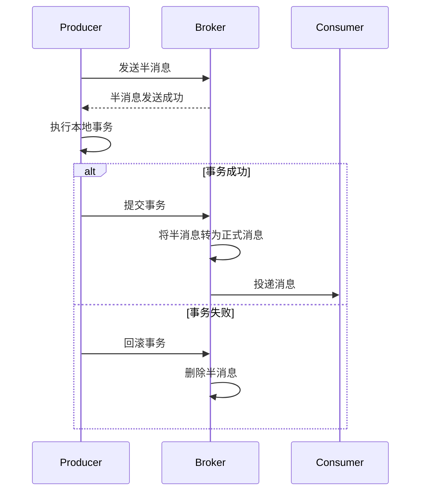

# RocketMQ事务消息

## 介绍

RocketMQ事务消息是RocketMQ提供的一种特殊消息类型，用于确保分布式系统中的事务一致性。在分布式系统中，事务消息可以帮助开发者在多个服务之间实现原子性操作，确保消息的发送和业务逻辑的执行要么全部成功，要么全部失败。

事务消息的核心思想是：**消息的发送和业务逻辑的执行是一个整体**。如果业务逻辑执行成功，消息会被正常发送；如果业务逻辑执行失败，消息则不会被发送。这种机制可以有效避免因网络抖动、服务宕机等问题导致的数据不一致。

## 事务消息的工作原理

RocketMQ事务消息的工作流程可以分为以下几个步骤：

1. **发送半消息**：生产者发送一条“半消息”到RocketMQ Broker。半消息对消费者不可见，只有当事务提交后，消息才会对消费者可见。
2. **执行本地事务**：生产者执行本地业务逻辑。如果业务逻辑执行成功，生产者会向Broker发送“提交事务”的请求；如果业务逻辑执行失败，生产者会发送“回滚事务”的请求。
3. **Broker处理事务状态**：Broker根据生产者的请求，决定是否将半消息转为正式消息（提交事务）或删除半消息（回滚事务）。
4. **消息投递**：如果事务提交成功，消息会被投递给消费者；如果事务回滚，消息会被删除。



## 代码示例

以下是一个使用RocketMQ事务消息的简单示例：

```java
import org.apache.rocketmq.client.producer.LocalTransactionState;
import org.apache.rocketmq.client.producer.TransactionListener;
import org.apache.rocketmq.client.producer.TransactionMQProducer;
import org.apache.rocketmq.common.message.Message;
import org.apache.rocketmq.common.message.MessageExt;

public class TransactionMessageExample {

    public static void main(String[] args) throws Exception {
        // 创建事务消息生产者
        TransactionMQProducer producer = new TransactionMQProducer("TransactionProducerGroup");
        producer.setNamesrvAddr("localhost:9876");

        // 设置事务监听器
        producer.setTransactionListener(new TransactionListener() {
            @Override
            public LocalTransactionState executeLocalTransaction(Message msg, Object arg) {
                // 执行本地事务
                try {
                    // 模拟业务逻辑
                    System.out.println("Executing local transaction...");
                    // 如果业务逻辑执行成功，返回COMMIT_MESSAGE
                    return LocalTransactionState.COMMIT_MESSAGE;
                } catch (Exception e) {
                    // 如果业务逻辑执行失败，返回ROLLBACK_MESSAGE
                    return LocalTransactionState.ROLLBACK_MESSAGE;
                }
            }

            @Override
            public LocalTransactionState checkLocalTransaction(MessageExt msg) {
                // 检查本地事务状态
                return LocalTransactionState.COMMIT_MESSAGE;
            }
        });

        // 启动生产者
        producer.start();

        // 创建消息
        Message msg = new Message("TransactionTopic", "TagA", "Hello RocketMQ Transaction Message".getBytes());

        // 发送事务消息
        producer.sendMessageInTransaction(msg, null);

        // 关闭生产者
        producer.shutdown();
    }
}
```

### 代码解释

1. **TransactionMQProducer**：用于发送事务消息的生产者。
2. **TransactionListener**：用于监听事务的执行状态。`executeLocalTransaction`方法用于执行本地事务，`checkLocalTransaction`方法用于检查本地事务的状态。
3. **LocalTransactionState**：表示本地事务的状态，可以是`COMMIT_MESSAGE`（提交事务）、`ROLLBACK_MESSAGE`（回滚事务）或`UNKNOW`（未知状态）。

## 实际应用场景

### 电商订单系统

在电商系统中，用户下单后需要同时完成库存扣减和订单创建两个操作。这两个操作需要保证原子性，否则可能会导致库存扣减成功但订单创建失败，或者订单创建成功但库存扣减失败。

使用RocketMQ事务消息可以确保这两个操作要么全部成功，要么全部失败：

1. 发送半消息到RocketMQ Broker。
2. 执行本地事务（扣减库存和创建订单）。
3. 如果本地事务成功，提交事务，消息会被投递给消费者（如通知用户下单成功）。
4. 如果本地事务失败，回滚事务，消息会被删除。

### 金融转账系统

在金融系统中，转账操作需要确保资金从一个账户转移到另一个账户。如果转账失败，资金需要回滚到原账户。

使用RocketMQ事务消息可以确保转账操作的原子性：

1. 发送半消息到RocketMQ Broker。
2. 执行本地事务（扣减转出账户余额和增加转入账户余额）。
3. 如果本地事务成功，提交事务，消息会被投递给消费者（如通知用户转账成功）。
4. 如果本地事务失败，回滚事务，消息会被删除。

## 总结

RocketMQ事务消息是分布式系统中实现事务一致性的重要工具。通过半消息、本地事务和事务状态检查的机制，RocketMQ可以确保消息的发送和业务逻辑的执行是一个整体，从而避免数据不一致的问题。

在实际应用中，事务消息可以广泛应用于电商、金融、物流等需要强一致性的场景。通过合理使用事务消息，开发者可以大大简化分布式事务的处理逻辑。

## 附加资源

- [RocketMQ官方文档](https://rocketmq.apache.org/docs/)
- [RocketMQ事务消息源码解析](https://github.com/apache/rocketmq)
- [分布式事务解决方案](https://en.wikipedia.org/wiki/Distributed_transaction)

## 练习

1. 尝试在本地搭建一个RocketMQ环境，并运行上述代码示例。
2. 修改代码，模拟本地事务失败的情况，观察消息是否会被回滚。
3. 设计一个简单的电商系统，使用RocketMQ事务消息确保订单创建和库存扣减的原子性。