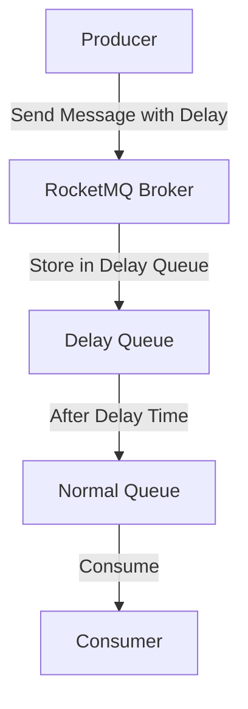

# RocketMQ延时消息

RocketMQ 是一个分布式消息中间件，广泛应用于异步通信、解耦系统、流量削峰等场景。延时消息是 RocketMQ 提供的一个重要功能，允许消息在发送后延迟一段时间再被消费者消费。本文将详细介绍 RocketMQ 延时消息的概念、使用方法以及实际应用场景。

## 什么是延时消息？

延时消息是指消息在发送到 RocketMQ 后，不会立即被消费者消费，而是会在指定的延迟时间之后才被投递给消费者。这种机制在需要延迟处理某些任务的场景中非常有用，例如订单超时取消、定时通知等。

RocketMQ 支持多种延迟级别，每个级别对应一个固定的延迟时间。例如，延迟级别 `1` 表示延迟 `1s`，延迟级别 `2` 表示延迟 `5s`，依此类推。

## 延时消息的工作原理

RocketMQ 的延时消息是通过将消息存储到特定的延迟队列中实现的。当消息到达指定的延迟时间后，RocketMQ 会将其从延迟队列转移到正常的消费队列中，供消费者消费。



## 如何使用延时消息

### 1. 设置延时级别

在发送消息时，可以通过设置 `delayTimeLevel` 属性来指定消息的延迟级别。RocketMQ 提供了 18 个预定义的延迟级别，分别对应不同的延迟时间。

```java
Message message = new Message("TopicTest", "TagA", "Hello RocketMQ".getBytes());
// 设置延迟级别为 3，表示延迟 10s
message.setDelayTimeLevel(3);
SendResult sendResult = producer.send(message);
System.out.println("Message sent: " + sendResult);
```

### 2. 延迟级别对应的时间

以下是 RocketMQ 预定义的延迟级别及其对应的延迟时间：

| 延迟级别 | 延迟时间 |
|----------|----------|
| 1        | 1s       |
| 2        | 5s       |
| 3        | 10s      |
| 4        | 30s      |
| 5        | 1m       |
| 6        | 2m       |
| 7        | 3m       |
| 8        | 4m       |
| 9        | 5m       |
| 10       | 6m       |
| 11       | 7m       |
| 12       | 8m       |
| 13       | 9m       |
| 14       | 10m      |
| 15       | 20m      |
| 16       | 30m      |
| 17       | 1h       |
| 18       | 2h       |

:::tip
如果需要自定义延迟时间，可以通过修改 RocketMQ 的配置文件来实现，但这需要重新启动 Broker。
:::

## 实际应用场景

### 1. 订单超时取消

在电商系统中，用户下单后如果未在规定时间内支付，订单会被自动取消。使用 RocketMQ 的延时消息可以轻松实现这一功能。

```java
// 用户下单
Order order = createOrder();
// 发送延时消息，延迟 30 分钟
Message message = new Message("OrderTopic", "CancelOrder", order.getId().getBytes());
message.setDelayTimeLevel(16); // 30 分钟
producer.send(message);
```

### 2. 定时通知

在某些场景中，需要在一定时间后向用户发送通知。例如，用户注册后 24 小时发送欢迎邮件。

```java
// 用户注册
User user = registerUser();
// 发送延时消息，延迟 24 小时
Message message = new Message("NotificationTopic", "WelcomeEmail", user.getEmail().getBytes());
message.setDelayTimeLevel(18); // 2 小时
producer.send(message);
```

## 总结

RocketMQ 的延时消息功能为开发者提供了一种简单而强大的工具，用于处理需要延迟执行的任务。通过设置延迟级别，可以轻松实现订单超时取消、定时通知等场景。希望本文能帮助你理解并掌握 RocketMQ 延时消息的使用方法。

## 附加资源与练习

- **官方文档**: [RocketMQ 官方文档](https://rocketmq.apache.org/docs/)
- **练习**: 尝试在自己的项目中实现一个延时消息的场景，例如订单超时取消或定时通知。

:::caution
在实际生产环境中使用延时消息时，请确保延迟级别的设置符合业务需求，并注意 RocketMQ 的延迟级别是固定的，无法动态调整。
:::