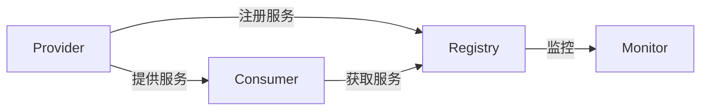

# Dubbo基础概念

## 介绍

Dubbo 是一款高性能的 Java RPC（远程过程调用）框架，由阿里巴巴开源并贡献给 Apache 基金会。它主要用于构建分布式服务架构，帮助开发者轻松实现服务之间的通信。Dubbo 提供了丰富的功能，如服务注册与发现、负载均衡、容错机制等，是构建微服务架构的重要工具之一。

## 核心组件

Dubbo 的核心组件包括以下几个部分：

1. **Provider（服务提供者）**：提供具体服务的实现，并将服务注册到注册中心。
2. **Consumer（服务消费者）**：从注册中心获取服务提供者的地址，并调用其服务。
3. **Registry（注册中心）**：负责服务提供者和消费者之间的地址发现与注册。
4. **Monitor（监控中心）**：监控服务的调用次数和调用时间，帮助开发者了解系统运行状态。
5. **Container（容器）**：负责启动、加载和运行服务提供者。



## 工作原理

Dubbo 的工作流程可以分为以下几个步骤：

1. **服务提供者启动**：服务提供者启动时，会将自己的服务信息注册到注册中心。
2. **服务消费者启动**：服务消费者启动时，会从注册中心获取服务提供者的地址。
3. **服务调用**：消费者根据获取到的地址，调用服务提供者的具体实现。
4. **监控与统计**：Dubbo 会将服务调用的信息发送到监控中心，供开发者分析。

## 代码示例

以下是一个简单的 Dubbo 服务提供者和消费者的代码示例。

### 服务提供者

```java
// 定义服务接口
public interface GreetingService {
    String sayHello(String name);
}

// 实现服务接口
public class GreetingServiceImpl implements GreetingService {
    @Override
    public String sayHello(String name) {
        return "Hello, " + name;
    }
}

// 配置服务提供者
public class Provider {
    public static void main(String[] args) throws Exception {
        // 服务实现
        GreetingService greetingService = new GreetingServiceImpl();

        // 服务配置
        ServiceConfig<GreetingService> service = new ServiceConfig<>();
        service.setInterface(GreetingService.class);
        service.setRef(greetingService);
        service.setRegistry(new RegistryConfig("zookeeper://127.0.0.1:2181"));

        // 暴露服务
        service.export();
    }
}
```

### 服务消费者

```java
// 配置服务消费者
public class Consumer {
    public static void main(String[] args) {
        // 引用远程服务
        ReferenceConfig<GreetingService> reference = new ReferenceConfig<>();
        reference.setInterface(GreetingService.class);
        reference.setRegistry(new RegistryConfig("zookeeper://127.0.0.1:2181"));

        // 获取代理对象
        GreetingService greetingService = reference.get();

        // 调用远程服务
        String result = greetingService.sayHello("Dubbo");
        System.out.println(result);  // 输出: Hello, Dubbo
    }
}
```

:::tip
在实际开发中，Dubbo 的配置通常会通过 XML 或注解的方式进行，上述代码仅为简化示例。
:::

## 实际应用场景

Dubbo 广泛应用于各种分布式系统中，特别是在微服务架构中。以下是一些常见的应用场景：

1. **电商系统**：在电商系统中，Dubbo 可以用于处理订单、库存、支付等模块之间的通信。
2. **社交网络**：在社交网络中，Dubbo 可以用于处理用户关系、消息推送等服务。
3. **金融系统**：在金融系统中，Dubbo 可以用于处理交易、风控等核心业务。

## 总结

Dubbo 是一个功能强大的 RPC 框架，能够帮助开发者轻松构建分布式服务架构。通过本文的介绍，你应该已经了解了 Dubbo 的核心组件、工作原理以及如何在实际项目中应用它。希望这些内容能够帮助你更好地理解 Dubbo，并为你的分布式系统开发提供帮助。

## 附加资源与练习

- **官方文档**：访问 [Dubbo 官方文档](https://dubbo.apache.org/zh/docs/) 获取更多详细信息。
- **练习**：尝试在自己的项目中集成 Dubbo，并实现一个简单的服务调用。

:::caution
在集成 Dubbo 时，请确保你的注册中心（如 Zookeeper）已经正确配置并运行。
:::