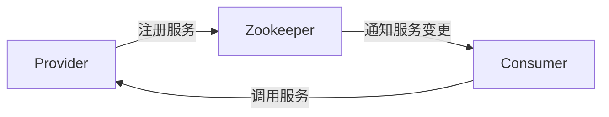

# Dubbo服务注册与发现

## 介绍

在分布式系统中，服务注册与发现是一个核心概念。它允许服务提供者（Provider）将自己的服务注册到注册中心，而服务消费者（Consumer）则可以通过注册中心发现并调用这些服务。Dubbo作为一个高性能的RPC框架，提供了强大的服务注册与发现功能，帮助开发者轻松构建分布式应用。

### 什么是服务注册与发现？

服务注册与发现是分布式系统中的一种机制，用于管理服务的动态变化。服务提供者将自己的服务信息（如IP地址、端口、服务名称等）注册到注册中心，而服务消费者则从注册中心获取这些信息，从而能够调用服务。这种机制使得服务之间的调用更加灵活和高效。

## Dubbo中的服务注册与发现

Dubbo支持多种注册中心，如Zookeeper、Nacos、Consul等。下面我们将以Zookeeper为例，详细介绍Dubbo的服务注册与发现机制。

### 1. 服务注册

服务提供者在启动时，会将自己的服务信息注册到注册中心。Dubbo通过`ServiceConfig`类来配置服务提供者，并将其注册到注册中心。

```java
@Service
public class DemoServiceImpl implements DemoService {
    @Override
    public String sayHello(String name) {
        return "Hello, " + name;
    }
}

public class Provider {
    public static void main(String[] args) throws Exception {
        ServiceConfig<DemoService> service = new ServiceConfig<>();
        service.setInterface(DemoService.class);
        service.setRef(new DemoServiceImpl());
        service.setRegistry(new RegistryConfig("zookeeper://127.0.0.1:2181"));
        service.export();
    }
}
```

在上面的代码中，`ServiceConfig`配置了服务提供者的接口和实现类，并通过`RegistryConfig`指定了Zookeeper作为注册中心。`service.export()`方法将服务注册到Zookeeper。

### 2. 服务发现

服务消费者在启动时，会从注册中心获取服务提供者的信息。Dubbo通过`ReferenceConfig`类来配置服务消费者，并从注册中心获取服务提供者的地址。

```java
public class Consumer {
    public static void main(String[] args) {
        ReferenceConfig<DemoService> reference = new ReferenceConfig<>();
        reference.setInterface(DemoService.class);
        reference.setRegistry(new RegistryConfig("zookeeper://127.0.0.1:2181"));
        DemoService demoService = reference.get();
        String result = demoService.sayHello("Dubbo");
        System.out.println(result);
    }
}
```

在上面的代码中，`ReferenceConfig`配置了服务消费者的接口，并通过`RegistryConfig`指定了Zookeeper作为注册中心。`reference.get()`方法从Zookeeper获取服务提供者的地址，并创建代理对象，消费者可以通过该代理对象调用服务。

### 3. 注册中心的作用

注册中心在Dubbo中扮演着重要的角色，它不仅负责存储服务提供者的信息，还负责监控服务的健康状态。当服务提供者下线或发生故障时，注册中心会及时通知服务消费者，确保服务调用的可靠性。



## 实际应用场景

### 场景1：电商系统中的订单服务

在一个电商系统中，订单服务（OrderService）需要调用用户服务（UserService）来获取用户信息。通过Dubbo的服务注册与发现机制，订单服务可以动态发现用户服务的地址，并在用户服务发生变更时自动更新调用地址。

### 场景2：微服务架构中的服务治理

在微服务架构中，服务数量众多，服务之间的调用关系复杂。Dubbo的服务注册与发现机制可以帮助开发者轻松管理这些服务，确保服务调用的高效性和可靠性。

## 总结

Dubbo的服务注册与发现机制是分布式系统中的重要组成部分。通过注册中心，服务提供者和消费者可以动态地注册和发现服务，从而实现灵活的服务调用。本文通过代码示例和实际应用场景，详细介绍了Dubbo的服务注册与发现机制，希望能够帮助初学者更好地理解和使用Dubbo。

## 附加资源与练习

- **练习1**：尝试使用Nacos作为注册中心，配置Dubbo的服务注册与发现。
- **练习2**：在Dubbo中实现一个简单的服务调用，并观察注册中心中的服务信息变化。
- **资源**：Dubbo官方文档（https://dubbo.apache.org/zh/docs/）提供了更多关于服务注册与发现的详细信息，建议深入学习。
