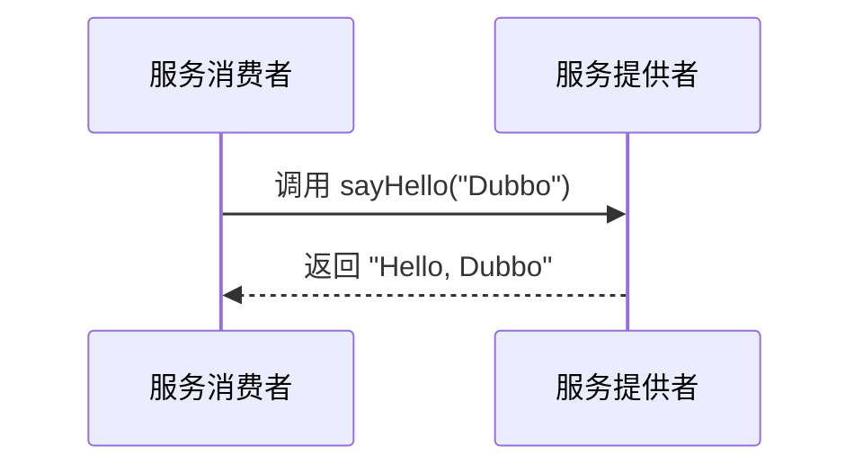

# Dubbo服务调用过程

Dubbo 是一款高性能的 Java RPC 框架，广泛应用于分布式服务架构中。理解 Dubbo 的服务调用过程是掌握其工作原理的关键。本文将逐步讲解 Dubbo 服务调用的核心流程，并通过代码示例和实际案例帮助你更好地理解。

## 1. 什么是Dubbo服务调用？

Dubbo 服务调用是指客户端通过 Dubbo 框架调用远程服务的过程。Dubbo 通过封装底层的网络通信细节，使得开发者可以像调用本地方法一样调用远程服务。这种调用方式极大地简化了分布式系统的开发。

## 2. Dubbo服务调用的核心流程

Dubbo 服务调用的核心流程可以分为以下几个步骤：

1. **服务暴露**：服务提供者将服务注册到注册中心。
2. **服务发现**：服务消费者从注册中心获取服务提供者的地址。
3. **远程调用**：服务消费者通过网络调用服务提供者的方法。
4. **结果返回**：服务提供者处理请求并将结果返回给服务消费者。

下面我们将逐步讲解这些步骤。

### 2.1 服务暴露

服务提供者通过 Dubbo 框架将服务暴露给外部。具体来说，服务提供者会将服务的接口、实现类以及服务地址等信息注册到注册中心（如 Zookeeper）。

```java
// 服务提供者配置
@Service
public class HelloServiceImpl implements HelloService {
    @Override
    public String sayHello(String name) {
        return "Hello, " + name;
    }
}
```

在 Dubbo 的配置文件中，服务提供者会指定服务的接口和实现类：

```xml
<dubbo:service interface="com.example.HelloService" ref="helloService" />
```

### 2.2 服务发现

服务消费者在启动时，会从注册中心获取服务提供者的地址列表。Dubbo 支持多种负载均衡策略，消费者可以根据策略选择合适的服务提供者进行调用。

```java
// 服务消费者配置
@Reference
private HelloService helloService;

public void callService() {
    String result = helloService.sayHello("Dubbo");
    System.out.println(result);
}
```

在 Dubbo 的配置文件中，服务消费者会指定需要调用的服务接口：

```xml
<dubbo:reference id="helloService" interface="com.example.HelloService" />
```

### 2.3 远程调用

服务消费者通过网络调用服务提供者的方法。Dubbo 使用 Netty 或 Mina 等高性能网络框架进行通信，确保调用的高效性和可靠性。



### 2.4 结果返回

服务提供者处理请求后，将结果返回给服务消费者。Dubbo 支持同步和异步调用，开发者可以根据需求选择合适的调用方式。

## 3. 实际案例

假设我们有一个简单的电商系统，用户服务（UserService）和订单服务（OrderService）分别部署在不同的服务器上。用户服务需要调用订单服务来获取用户的订单信息。

```java
// 用户服务调用订单服务
@Reference
private OrderService orderService;

public List<Order> getUserOrders(String userId) {
    return orderService.getOrdersByUserId(userId);
}
```

在这个案例中，Dubbo 负责处理用户服务和订单服务之间的通信，开发者无需关心底层的网络细节。

## 4. 总结

Dubbo 服务调用过程是 Dubbo 框架的核心功能之一。通过服务暴露、服务发现、远程调用和结果返回等步骤，Dubbo 实现了高效的分布式服务调用。理解这些过程有助于开发者更好地使用 Dubbo 构建分布式系统。

## 5. 附加资源与练习

- **官方文档**：阅读 [Dubbo 官方文档](https://dubbo.apache.org/zh/docs/) 以获取更多详细信息。
- **练习**：尝试在一个简单的项目中实现 Dubbo 服务调用，并观察调用过程中的日志输出。

:::tip
如果你在实践过程中遇到问题，可以参考 Dubbo 的社区论坛或 GitHub 仓库中的 issue 部分，寻找解决方案。
:::