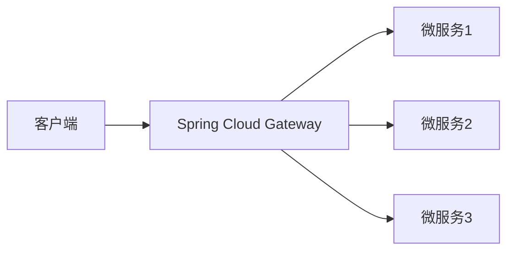

## 什么是Spring Cloud Gateway？

Spring Cloud Gateway是Spring Cloud生态系统中的一个API网关服务。它旨在为微服务架构提供一种简单、高效的方式来路由请求、过滤请求以及执行其他与请求相关的操作。作为微服务架构的入口，Spring Cloud Gateway负责将外部请求路由到内部服务，同时提供负载均衡、安全控制、限流等功能。

与传统的Zuul网关相比，Spring Cloud Gateway基于Spring WebFlux构建，支持异步非阻塞模型，能够更好地处理高并发场景。

## 核心功能

Spring Cloud Gateway的核心功能包括：

1. **路由（Routing）**：根据请求的路径、方法、头部等信息将请求路由到相应的微服务。
2. **过滤器（Filter）**：在请求被路由之前或之后执行某些操作，例如修改请求头、记录日志、限流等。
3. **负载均衡**：通过与Spring Cloud LoadBalancer集成，支持对后端服务的负载均衡。
4. **限流与熔断**：通过与Resilience4j或Hystrix集成，支持限流和熔断机制，防止服务雪崩。
5. **安全控制**：支持OAuth2、JWT等安全机制，确保请求的安全性。

## 基本架构

Spring Cloud Gateway的核心组件包括：

- **Route（路由）**：定义请求如何被路由到目标服务。
- **Predicate（断言）**：定义路由的条件，例如路径匹配、请求方法匹配等。
- **Filter（过滤器）**：在请求被路由之前或之后执行的操作。

以下是一个简单的架构图：



## 快速入门

### 1. 创建Spring Cloud Gateway项目

首先，使用Spring Initializr创建一个Spring Boot项目，并添加`Spring Cloud Gateway`依赖。

```xml
<dependency>
    <groupId>org.springframework.cloud</groupId>
    <artifactId>spring-cloud-starter-gateway</artifactId>
</dependency>
```

### 2. 配置路由

在`application.yml`中配置路由规则。以下是一个简单的配置示例：

```yaml
spring:
  cloud:
    gateway:
      routes:
        - id: service1_route
          uri: http://localhost:8081
          predicates:
            - Path=/service1/**
        - id: service2_route
          uri: http://localhost:8082
          predicates:
            - Path=/service2/**
```

在这个配置中，所有以`/service1`开头的请求将被路由到`http://localhost:8081`，而以`/service2`开头的请求将被路由到`http://localhost:8082`。

### 3. 添加过滤器

Spring Cloud Gateway允许你自定义过滤器来修改请求或响应。以下是一个简单的过滤器示例，它在请求被路由之前添加一个自定义的请求头：

```java
import org.springframework.cloud.gateway.filter.GatewayFilter;
import org.springframework.cloud.gateway.filter.factory.AbstractGatewayFilterFactory;
import org.springframework.stereotype.Component;

@Component
public class AddCustomHeaderFilter extends AbstractGatewayFilterFactory<AddCustomHeaderFilter.Config> {

    public AddCustomHeaderFilter() {
        super(Config.class);
    }

    @Override
    public GatewayFilter apply(Config config) {
        return (exchange, chain) -> {
            exchange.getRequest().mutate().header("X-Custom-Header", "CustomValue").build();
            return chain.filter(exchange);
        };
    }

    public static class Config {
        // 配置属性
    }
}
```

### 4. 启动网关

启动Spring Boot应用程序后，Spring Cloud Gateway将根据配置的路由规则和过滤器处理请求。

## 实际应用场景

### 场景1：微服务路由

在一个典型的微服务架构中，可能有多个服务提供不同的功能。Spring Cloud Gateway可以作为统一的入口，将外部请求路由到相应的服务。例如：

- `/user/**` 请求路由到用户服务。
- `/order/**` 请求路由到订单服务。

### 场景2：限流与熔断

在高并发场景下，为了防止某个服务被过多的请求压垮，可以使用Spring Cloud Gateway的限流和熔断功能。例如，限制每秒最多处理100个请求，超过限制的请求将被拒绝。

### 场景3：安全控制

Spring Cloud Gateway可以与OAuth2或JWT集成，确保只有经过身份验证的请求才能访问后端服务。例如，可以在网关层验证JWT令牌，并根据令牌中的角色信息决定是否允许访问某个服务。

## 总结

Spring Cloud Gateway是一个功能强大的API网关，适用于微服务架构中的请求路由、过滤、负载均衡、限流和安全控制等场景。通过简单的配置和自定义过滤器，你可以轻松地构建一个高效、可靠的网关服务。

## 附加资源与练习

- **官方文档**：[Spring Cloud Gateway Documentation](https://spring.io/projects/spring-cloud-gateway)
- **练习**：尝试配置一个Spring Cloud Gateway项目，并实现以下功能：
  1. 将请求路由到不同的微服务。
  2. 添加一个自定义过滤器，记录请求的日志。
  3. 配置限流规则，限制每秒最多处理50个请求。

通过实践，你将更好地理解Spring Cloud Gateway的工作原理和应用场景。