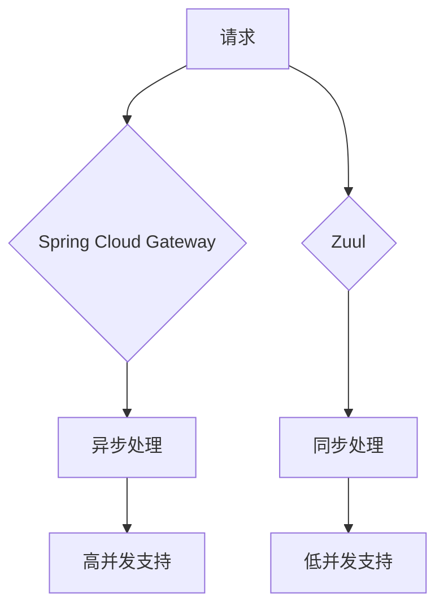

## 介绍

在微服务架构中，API网关是一个关键组件，用于处理请求路由、负载均衡、安全认证等功能。Spring Cloud Gateway和Zuul是两种常见的API网关解决方案。本文将从功能、性能和应用场景等方面对比这两者，帮助初学者更好地理解它们的差异。

## Spring Cloud Gateway

Spring Cloud Gateway是Spring Cloud生态系统中的新一代API网关，基于Spring 5、Spring Boot 2和Project Reactor构建。它提供了强大的路由功能、过滤器链以及对WebSocket的支持。

### 主要特性

- **异步非阻塞模型**：基于Project Reactor，支持高并发场景。
- **灵活的路由配置**：支持基于路径、请求头、请求参数等多种路由规则。
- **过滤器链**：支持请求和响应的预处理和后处理。
- **集成Spring Cloud生态系统**：与Eureka、Consul等服务发现组件无缝集成。

### 示例代码

以下是一个简单的Spring Cloud Gateway配置示例：

```yaml
spring:
  cloud:
    gateway:
      routes:
        - id: example_route
          uri: http://example.org
          predicates:
            - Path=/example/**
```

## Zuul

Zuul是Netflix开源的API网关，最初是为Netflix的微服务架构设计的。它基于Servlet 2.5构建，采用同步阻塞模型。

### 主要特性

- **同步阻塞模型**：适用于传统的同步请求处理。
- **路由和过滤**：支持基于路径的路由和过滤器链。
- **与Netflix OSS集成**：与Eureka、Ribbon等Netflix OSS组件集成良好。

### 示例代码

以下是一个简单的Zuul配置示例：

```yaml
zuul:
  routes:
    example:
      path: /example/**
      url: http://example.org
```

## 对比分析

### 性能

Spring Cloud Gateway基于异步非阻塞模型，适合高并发场景，而Zuul基于同步阻塞模型，性能相对较低。



### 功能

- **Spring Cloud Gateway**：支持WebSocket、更灵活的路由配置、更强大的过滤器链。
- **Zuul**：功能相对简单，适合传统同步请求处理。

### 生态系统

- **Spring Cloud Gateway**：与Spring Cloud生态系统无缝集成。
- **Zuul**：与Netflix OSS集成良好，但与Spring Cloud的集成相对较弱。

## 实际应用场景

### Spring Cloud Gateway

- **高并发场景**：如电商平台的秒杀活动。
- **需要WebSocket支持的场景**：如实时聊天应用。

### Zuul

- **传统同步请求处理**：如企业内部管理系统。
- **与Netflix OSS集成的场景**：如Netflix的微服务架构。

## 总结

Spring Cloud Gateway和Zuul各有优缺点，选择哪种网关取决于具体的应用场景和需求。对于高并发和需要WebSocket支持的场景，Spring Cloud Gateway是更好的选择；而对于传统同步请求处理和与Netflix OSS集成的场景，Zuul可能更适合。

## 附加资源

- [Spring Cloud Gateway官方文档](https://spring.io/projects/spring-cloud-gateway)
- [Zuul官方文档](https://github.com/Netflix/zuul)
- [微服务架构中的API网关设计](https://example.com/api-gateway-design)

## 练习

1. 配置一个Spring Cloud Gateway，实现基于路径的路由。
2. 配置一个Zuul，实现基于路径的路由。
3. 对比两者的性能，记录响应时间。

:::tip
建议初学者从Spring Cloud Gateway入手，因为它更符合现代微服务架构的需求。
:::