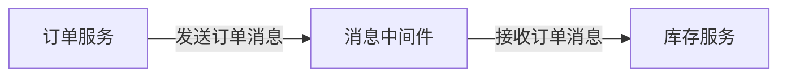

# Stream Binder概念

在Spring Cloud Stream中，**Stream Binder**是一个核心概念，它负责将应用程序与消息中间件（如Kafka、RabbitMQ等）连接起来。通过Stream Binder，开发者可以专注于业务逻辑，而无需关心底层消息中间件的具体实现细节。

## 什么是Stream Binder？

Stream Binder是Spring Cloud Stream框架中的一个抽象层，它定义了如何将消息生产者（Producer）和消费者（Consumer）与消息中间件进行绑定。简单来说，Stream Binder充当了应用程序与消息中间件之间的桥梁。

:::note
**Binder**一词来源于“绑定”的意思，它负责将消息通道（Channel）与具体的消息中间件实现绑定。
:::

### Stream Binder的核心作用

1. **解耦应用程序与消息中间件**：通过Stream Binder，应用程序无需直接与特定的消息中间件交互，从而实现了业务逻辑与基础设施的解耦。
2. **提供统一的编程模型**：无论底层使用的是Kafka还是RabbitMQ，开发者都可以使用相同的API进行消息的发送和接收。
3. **简化配置**：Stream Binder封装了与消息中间件相关的配置，开发者只需通过简单的配置即可完成消息的发送和接收。

## Stream Binder的工作原理

Stream Binder通过以下步骤实现消息的发送和接收：

1. **定义消息通道**：在Spring Cloud Stream中，消息通道是消息的入口和出口。开发者可以通过`@Input`和`@Output`注解定义输入和输出通道。
2. **绑定消息通道**：Stream Binder将定义的消息通道与具体的消息中间件绑定。例如，如果使用Kafka作为消息中间件，Stream Binder会将消息通道与Kafka的Topic进行绑定。
3. **发送和接收消息**：应用程序通过消息通道发送和接收消息，Stream Binder负责将消息路由到正确的消息中间件。

### 代码示例

以下是一个简单的Spring Cloud Stream应用程序示例，展示了如何使用Stream Binder发送和接收消息。

```java
import org.springframework.cloud.stream.annotation.EnableBinding;
import org.springframework.cloud.stream.annotation.StreamListener;
import org.springframework.cloud.stream.messaging.Sink;
import org.springframework.cloud.stream.messaging.Source;
import org.springframework.messaging.support.MessageBuilder;
import org.springframework.stereotype.Component;

@EnableBinding({Source.class, Sink.class})
public class StreamExample {

    private final Source source;

    public StreamExample(Source source) {
        this.source = source;
    }

    public void sendMessage(String message) {
        source.output().send(MessageBuilder.withPayload(message).build());
    }

    @StreamListener(Sink.INPUT)
    public void receiveMessage(String message) {
        System.out.println("Received message: " + message);
    }
}
```

在这个示例中，`Source`和`Sink`是Spring Cloud Stream提供的默认消息通道。`sendMessage`方法用于发送消息，而`receiveMessage`方法用于接收消息。

:::tip
在实际开发中，您可以通过配置文件（如`application.yml`）来指定使用的Binder类型（如Kafka或RabbitMQ）。
:::

## Stream Binder的实际应用场景

Stream Binder在微服务架构中有着广泛的应用，以下是几个典型的应用场景：

1. **事件驱动架构**：在微服务之间通过消息传递实现松耦合的通信。例如，订单服务在创建订单后，通过消息通知库存服务进行库存扣减。
2. **数据流处理**：在实时数据处理场景中，Stream Binder可以将数据流从消息中间件传递到数据处理服务，进行实时分析和处理。
3. **日志收集与分发**：通过Stream Binder，可以将日志消息发送到消息中间件，再由日志收集服务进行统一处理和存储。

### 实际案例：订单处理系统

假设我们有一个订单处理系统，包含以下两个微服务：

1. **订单服务**：负责创建订单，并将订单信息发送到消息中间件。
2. **库存服务**：监听订单消息，并根据订单信息进行库存扣减。

通过Stream Binder，订单服务和库存服务可以通过消息中间件进行通信，而无需直接调用对方的API。这种方式不仅提高了系统的可扩展性，还降低了服务之间的耦合度。



## 总结

Stream Binder是Spring Cloud Stream框架中的核心组件，它简化了应用程序与消息中间件的集成，提供了统一的编程模型和配置方式。通过Stream Binder，开发者可以更专注于业务逻辑，而无需关心底层消息中间件的具体实现。

在实际应用中，Stream Binder广泛应用于事件驱动架构、数据流处理和日志收集等场景。通过合理使用Stream Binder，您可以构建出高效、可扩展的微服务系统。

## 附加资源与练习

- **官方文档**：阅读[Spring Cloud Stream官方文档](https://spring.io/projects/spring-cloud-stream)以深入了解Stream Binder的更多细节。
- **练习**：尝试在本地环境中搭建一个简单的Spring Cloud Stream应用程序，使用Kafka或RabbitMQ作为消息中间件，并实现消息的发送和接收。

:::caution
在配置Stream Binder时，请确保正确配置消息中间件的连接信息，否则可能导致消息无法正常发送或接收。
:::