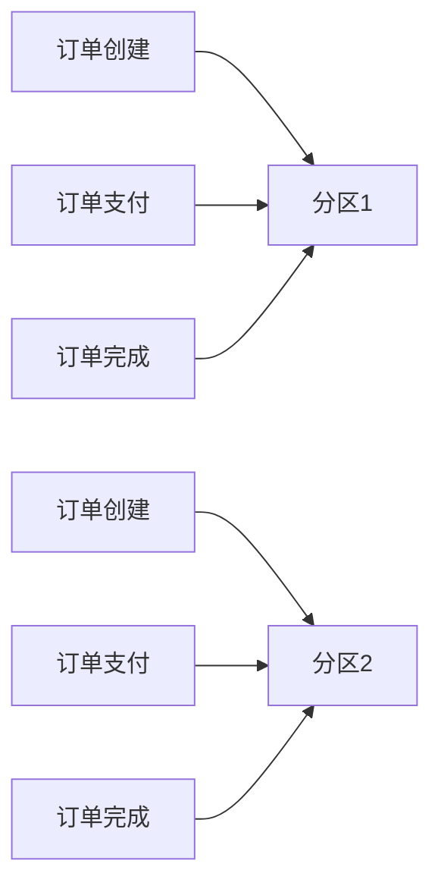

# Stream消息分区

在分布式系统中，消息的分区（Partitioning）是一种常见的机制，用于将消息分发到不同的消费者实例，从而实现负载均衡和有序处理。Spring Cloud Stream 提供了对消息分区的支持，使得开发者可以轻松地配置和管理消息的分区策略。

## 什么是消息分区？

消息分区是指将消息根据某种规则（如消息的键值）分配到不同的分区中。每个分区可以由一个或多个消费者实例处理。通过分区，我们可以确保具有相同键值的消息被发送到同一个分区，从而保证消息的有序性。

:::note
**注意**：消息分区通常用于需要保证消息顺序的场景，例如订单处理、日志聚合等。
:::

## 为什么需要消息分区？

在分布式系统中，消息的并发处理可能会导致消息的顺序混乱。例如，如果多个消费者实例同时处理同一个订单的消息，可能会导致订单状态的不一致。通过消息分区，我们可以确保同一个订单的所有消息都被发送到同一个分区，并由同一个消费者实例处理，从而保证消息的有序性。

## 如何配置消息分区？

在Spring Cloud Stream中，消息分区的配置非常简单。我们可以通过配置文件或代码来指定分区的数量和分区键。

### 1. 配置文件方式

在 `application.yml` 中配置分区：

```yaml
spring:
  cloud:
    stream:
      bindings:
        input:
          destination: myTopic
          group: myGroup
          consumer:
            partitioned: true
            instanceCount: 3
            instanceIndex: 0
        output:
          destination: myTopic
          producer:
            partitionKeyExpression: headers['partitionKey']
            partitionCount: 3
```

- `partitioned: true`：启用分区。
- `instanceCount: 3`：指定消费者实例的总数。
- `instanceIndex: 0`：指定当前消费者实例的索引。
- `partitionKeyExpression: headers['partitionKey']`：指定分区键的表达式。
- `partitionCount: 3`：指定分区的总数。

### 2. 代码方式

在代码中配置分区：

```java
@Bean
public Supplier<Message<String>> producer() {
    return () -> {
        String payload = "Hello, Partition!";
        return MessageBuilder.withPayload(payload)
                .setHeader("partitionKey", "key1")
                .build();
    };
}

@Bean
public Consumer<Message<String>> consumer() {
    return message -> {
        String payload = message.getPayload();
        System.out.println("Received: " + payload);
    };
}
```

- `setHeader("partitionKey", "key1")`：设置分区键。
- `MessageBuilder`：用于构建消息。

## 实际案例

假设我们有一个订单处理系统，订单的状态更新需要保证顺序。我们可以使用消息分区来确保同一个订单的所有状态更新消息都被发送到同一个分区，并由同一个消费者实例处理。



在这个案例中，订单ID被用作分区键。同一个订单的所有消息都会被发送到同一个分区，从而保证消息的有序性。

## 总结

消息分区是Spring Cloud Stream中一个强大的功能，它可以帮助我们在分布式系统中实现消息的有序处理和负载均衡。通过合理的配置，我们可以确保具有相同键值的消息被发送到同一个分区，并由同一个消费者实例处理。

:::tip
**提示**：在实际应用中，建议根据业务需求选择合适的分区键，并合理设置分区数量，以达到最佳的性能和可扩展性。
:::

## 附加资源

- [Spring Cloud Stream 官方文档](https://spring.io/projects/spring-cloud-stream)
- [消息分区与负载均衡](https://docs.spring.io/spring-cloud-stream/docs/current/reference/html/spring-cloud-stream.html#partitioning)

## 练习

1. 尝试在本地环境中配置一个简单的消息分区示例，观察消息的分区行为。
2. 修改分区键的表达式，看看消息的分区行为如何变化。
3. 增加消费者实例的数量，观察分区如何分配消息。

通过以上练习，你将更深入地理解消息分区的机制和应用场景。