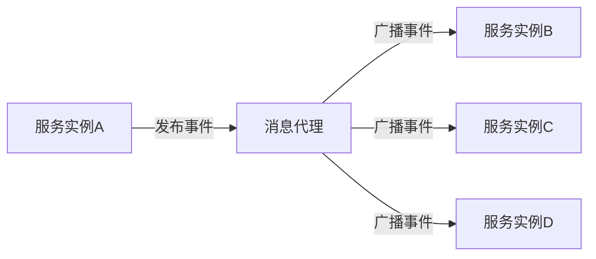

# Spring Cloud Bus概述

Spring Cloud Bus是Spring Cloud生态系统中的一个重要组件，它通过轻量级的消息代理（如RabbitMQ或Kafka）将分布式系统中的服务实例连接起来，从而实现配置的动态更新和事件的广播。本文将详细介绍Spring Cloud Bus的核心概念、工作原理以及实际应用场景。

## 什么是Spring Cloud Bus？

Spring Cloud Bus是一个事件总线，用于在分布式系统中传播状态变化或配置更新。它通过消息代理（如RabbitMQ或Kafka）将微服务实例连接起来，使得当一个服务实例的状态发生变化时，其他服务实例可以自动感知并同步更新。

:::note
Spring Cloud Bus通常与Spring Cloud Config配合使用，用于在配置更新时动态刷新所有微服务的配置。
:::

## 核心概念

### 1. 事件总线
事件总线是Spring Cloud Bus的核心，它负责在微服务之间传递消息。当一个服务实例发布一个事件时，事件总线会将该事件广播给所有订阅了该事件的服务实例。

### 2. 消息代理
Spring Cloud Bus依赖于消息代理（如RabbitMQ或Kafka）来实现事件的传递。消息代理负责将事件从发布者传递到订阅者。

### 3. 事件类型
Spring Cloud Bus支持多种事件类型，例如配置更新事件、服务状态变化事件等。这些事件可以通过消息代理在微服务之间传播。

## 工作原理

Spring Cloud Bus的工作原理可以概括为以下几个步骤：

1. **发布事件**：当一个服务实例的状态发生变化时（例如配置更新），它会通过消息代理发布一个事件。
2. **广播事件**：消息代理将该事件广播给所有订阅了该事件的服务实例。
3. **处理事件**：订阅了该事件的服务实例接收到事件后，会根据事件内容执行相应的操作（例如刷新配置）。



## 实际应用场景

### 1. 动态配置更新
在微服务架构中，配置通常存储在配置中心（如Spring Cloud Config）。当配置发生变化时，Spring Cloud Bus可以自动将配置更新广播给所有相关的微服务实例，从而实现配置的动态刷新。

:::tip
使用Spring Cloud Bus可以避免手动重启服务实例来应用新的配置，从而提高系统的可用性和灵活性。
:::

### 2. 服务状态同步
在分布式系统中，服务实例的状态可能会发生变化（例如服务上线或下线）。通过Spring Cloud Bus，可以将这些状态变化广播给其他服务实例，从而实现服务状态的同步。

## 代码示例

以下是一个简单的Spring Cloud Bus配置示例，展示了如何使用Spring Cloud Bus实现配置的动态刷新。

### 1. 添加依赖
首先，在`pom.xml`中添加Spring Cloud Bus的依赖：

```xml
<dependency>
    <groupId>org.springframework.cloud</groupId>
    <artifactId>spring-cloud-starter-bus-amqp</artifactId>
</dependency>
```

### 2. 配置消息代理
在`application.yml`中配置RabbitMQ作为消息代理：

```yaml
spring:
  rabbitmq:
    host: localhost
    port: 5672
    username: guest
    password: guest
```

### 3. 发布配置更新事件
在配置中心更新配置后，可以通过发送HTTP请求来触发配置更新事件：

```bash
curl -X POST http://localhost:8080/actuator/bus-refresh
```

### 4. 处理配置更新事件
在微服务中，可以通过`@RefreshScope`注解来实现配置的动态刷新：

```java
@RestController
@RefreshScope
public class ConfigController {

    @Value("${config.property}")
    private String configProperty;

    @GetMapping("/config")
    public String getConfig() {
        return configProperty;
    }
}
```

## 总结

Spring Cloud Bus是Spring Cloud生态系统中一个强大的工具，它通过事件总线机制实现了微服务之间的动态配置更新和状态同步。通过本文的介绍，你应该对Spring Cloud Bus的基本概念、工作原理以及实际应用场景有了初步的了解。

:::caution
在实际生产环境中，使用Spring Cloud Bus时需要注意消息代理的性能和可靠性，以确保事件能够及时、准确地传递。
:::

## 附加资源

- [Spring Cloud Bus官方文档](https://spring.io/projects/spring-cloud-bus)
- [RabbitMQ官方文档](https://www.rabbitmq.com/documentation.html)
- [Kafka官方文档](https://kafka.apache.org/documentation/)

## 练习

1. 尝试在本地环境中搭建一个Spring Cloud Bus的示例项目，并使用RabbitMQ作为消息代理。
2. 修改配置中心的配置，并通过Spring Cloud Bus实现配置的动态刷新。
3. 探索如何使用Kafka作为Spring Cloud Bus的消息代理，并比较其与RabbitMQ的异同。