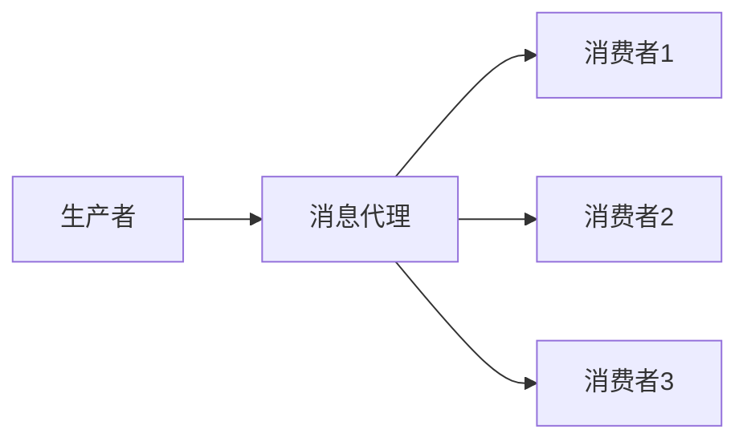

# Bus架构设计

Spring Cloud Bus是Spring Cloud生态系统中的一个重要组件，它通过轻量级的消息代理（如RabbitMQ或Kafka）将分布式系统中的服务实例连接在一起，从而实现配置的自动刷新、事件广播等功能。本文将详细介绍Spring Cloud Bus的架构设计，帮助初学者理解其核心概念和工作原理。

## 什么是Spring Cloud Bus？

Spring Cloud Bus是一个事件总线，用于在分布式系统中传播状态变化或事件。它通过消息代理将多个服务实例连接在一起，使得这些实例能够共享配置更新、状态变化等信息。Spring Cloud Bus通常与Spring Cloud Config配合使用，用于在配置更新时自动刷新所有相关服务实例的配置。

## 核心概念

### 1. 消息代理（Message Broker）
Spring Cloud Bus依赖于消息代理来传递消息。常见的消息代理包括RabbitMQ和Kafka。消息代理负责将消息从生产者传递到消费者，确保消息的可靠传递。

### 2. 事件（Event）
事件是Spring Cloud Bus中传递的基本单位。事件可以是配置更新、服务状态变化等。每个事件都有一个特定的类型，消费者可以根据事件类型来决定如何处理。

### 3. 生产者（Producer）和消费者（Consumer）
生产者是生成事件的组件，通常是Spring Cloud Config Server或其他服务。消费者是接收并处理事件的组件，通常是各个微服务实例。

## 架构设计

Spring Cloud Bus的架构设计可以分为以下几个部分：

1. **消息代理**：负责消息的传递和存储。
2. **生产者**：生成事件并将其发送到消息代理。
3. **消费者**：从消息代理接收事件并处理。



### 1. 消息代理
消息代理是Spring Cloud Bus的核心组件，它负责将消息从生产者传递到消费者。Spring Cloud Bus支持多种消息代理，如RabbitMQ和Kafka。

### 2. 生产者
生产者是生成事件的组件。例如，当Spring Cloud Config Server检测到配置文件的更新时，它会生成一个配置更新事件，并将其发送到消息代理。

### 3. 消费者
消费者是接收并处理事件的组件。每个微服务实例都可以作为消费者，从消息代理接收事件并根据事件类型执行相应的操作。

## 实际应用场景

### 配置自动刷新
Spring Cloud Bus最常见的应用场景是配置自动刷新。当Spring Cloud Config Server检测到配置文件的更新时，它会通过Spring Cloud Bus广播一个配置更新事件。所有订阅了该事件的微服务实例都会接收到该事件，并自动刷新其配置。

```java
@RefreshScope
@RestController
public class MyController {
    @Value("${my.config}")
    private String config;

    @GetMapping("/config")
    public String getConfig() {
        return config;
    }
}
```

在上面的代码中，`@RefreshScope`注解使得该Controller在接收到配置更新事件时自动刷新其配置。

### 服务状态同步
另一个常见的应用场景是服务状态同步。例如，当某个服务的状态发生变化时，它可以通过Spring Cloud Bus广播一个状态变化事件。其他服务实例接收到该事件后，可以更新其内部状态。

## 总结

Spring Cloud Bus通过消息代理将分布式系统中的服务实例连接在一起，实现了配置自动刷新、事件广播等功能。它的核心组件包括消息代理、生产者和消费者。通过Spring Cloud Bus，开发者可以轻松实现分布式系统中的状态同步和配置管理。

## 附加资源

- [Spring Cloud Bus官方文档](https://spring.io/projects/spring-cloud-bus)
- [RabbitMQ官方文档](https://www.rabbitmq.com/documentation.html)
- [Kafka官方文档](https://kafka.apache.org/documentation/)

## 练习

1. 尝试在本地环境中搭建一个Spring Cloud Bus应用，使用RabbitMQ作为消息代理。
2. 编写一个简单的Spring Boot应用，使用Spring Cloud Bus实现配置自动刷新。
3. 探索Spring Cloud Bus的其他应用场景，如服务状态同步。

:::tip
在学习和实践过程中，如果遇到问题，可以参考Spring Cloud Bus的官方文档或社区论坛，获取更多帮助。
:::