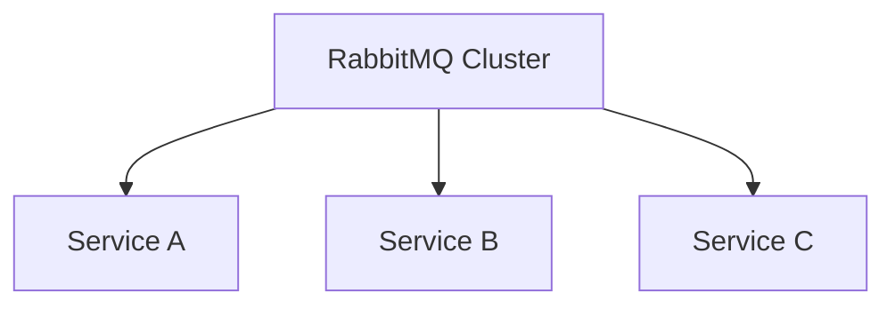

# Bus集群配置

## 介绍

在分布式系统中，Spring Cloud Bus 是一个用于连接分布式服务节点的事件总线。它通过轻量级的消息代理（如 RabbitMQ 或 Kafka）在微服务之间广播事件，从而实现配置的同步、服务的刷新等功能。Bus集群配置是指将多个服务节点连接到一个消息代理集群中，以确保高可用性和负载均衡。

在本教程中，我们将逐步讲解如何配置 Spring Cloud Bus 集群，并通过实际案例展示其应用场景。

## 前提条件

在开始之前，请确保您已经具备以下条件：

- 熟悉 Spring Boot 和 Spring Cloud 的基本概念。
- 已安装 RabbitMQ 或 Kafka 作为消息代理。
- 了解基本的微服务架构。

## 配置步骤

### 1. 添加依赖

首先，在您的 Spring Boot 项目中添加 `spring-cloud-starter-bus-amqp` 或 `spring-cloud-starter-bus-kafka` 依赖，具体取决于您使用的消息代理。

```xml
<dependency>
    <groupId>org.springframework.cloud</groupId>
    <artifactId>spring-cloud-starter-bus-amqp</artifactId>
</dependency>
```

### 2. 配置消息代理

在 `application.yml` 或 `application.properties` 中配置 RabbitMQ 或 Kafka 的连接信息。

```yaml
spring:
  rabbitmq:
    host: localhost
    port: 5672
    username: guest
    password: guest
```

### 3. 启用 Spring Cloud Bus

在 Spring Boot 应用程序的主类上添加 `@EnableBus` 注解以启用 Spring Cloud Bus。

```java
@SpringBootApplication
@EnableBus
public class MyApplication {
    public static void main(String[] args) {
        SpringApplication.run(MyApplication.class, args);
    }
}
```

### 4. 配置集群

为了配置 Bus 集群，您需要确保所有服务节点都连接到同一个消息代理集群。您可以通过以下方式实现：

- **RabbitMQ 集群**：在 RabbitMQ 中配置多个节点，并在 `application.yml` 中指定多个主机。

```yaml
spring:
  rabbitmq:
    addresses: rabbit1:5672,rabbit2:5672,rabbit3:5672
    username: guest
    password: guest
```

- **Kafka 集群**：在 Kafka 中配置多个 broker，并在 `application.yml` 中指定多个 broker 地址。

```yaml
spring:
  kafka:
    bootstrap-servers: kafka1:9092,kafka2:9092,kafka3:9092
```

### 5. 测试集群配置

启动多个服务实例，并确保它们都连接到同一个消息代理集群。您可以通过发送一个配置更新事件来测试集群是否正常工作。

```bash
curl -X POST http://localhost:8080/bus/refresh
```

如果所有服务实例都成功接收到事件并刷新了配置，则说明集群配置成功。

## 实际案例

假设我们有一个微服务架构，包含三个服务实例：`service-a`、`service-b` 和 `service-c`。这些服务实例都连接到同一个 RabbitMQ 集群。当我们在 `service-a` 上更新配置并发送刷新事件时，`service-b` 和 `service-c` 也会自动刷新配置。



在这个案例中，RabbitMQ 集群作为消息代理，确保所有服务实例都能接收到配置更新事件。

## 总结

通过配置 Spring Cloud Bus 集群，您可以确保分布式系统中的所有服务实例都能同步配置更新。这不仅提高了系统的可用性，还简化了配置管理的复杂性。

## 附加资源

- [Spring Cloud Bus 官方文档](https://spring.io/projects/spring-cloud-bus)
- [RabbitMQ 集群配置指南](https://www.rabbitmq.com/clustering.html)
- [Kafka 集群配置指南](https://kafka.apache.org/documentation/#basic_ops_cluster)

## 练习

1. 尝试在本地环境中配置一个 RabbitMQ 集群，并连接多个 Spring Boot 服务实例。
2. 使用 Kafka 作为消息代理，重复上述配置步骤。
3. 编写一个简单的 Spring Boot 应用程序，通过 Spring Cloud Bus 实现配置的自动刷新。

通过完成这些练习，您将更深入地理解 Spring Cloud Bus 集群配置的工作原理和应用场景。