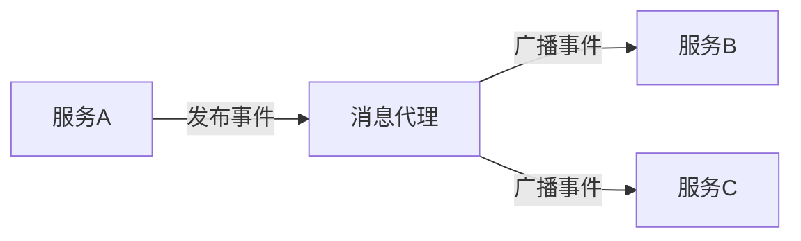

# Bus性能调优

Spring Cloud Bus 是一个用于在分布式系统中传播状态更改的事件总线。它通过消息代理（如 RabbitMQ 或 Kafka）连接微服务实例，使得配置更新、服务重启等操作能够快速传播到整个系统。然而，随着系统规模的扩大，Bus 的性能可能会成为瓶颈。本文将介绍如何通过性能调优来提升 Spring Cloud Bus 的效率。

## 1. 理解 Spring Cloud Bus 的工作原理

在开始调优之前，首先需要理解 Spring Cloud Bus 的基本工作原理。Spring Cloud Bus 通过消息代理（如 RabbitMQ 或 Kafka）在微服务实例之间传递事件。当一个服务实例发布事件时，其他订阅了该事件的服务实例会接收到消息并执行相应的操作。



## 2. 性能调优的关键点

### 2.1 消息代理的选择

Spring Cloud Bus 支持多种消息代理，如 RabbitMQ 和 Kafka。选择合适的消息代理对性能至关重要。

- **RabbitMQ**：适合中小型系统，延迟较低，但吞吐量有限。
- **Kafka**：适合大型系统，吞吐量高，但延迟相对较高。

:::tip
如果你的系统需要高吞吐量，Kafka 是更好的选择；如果更注重低延迟，RabbitMQ 可能更适合。
:::

### 2.2 消息序列化优化

消息序列化是影响性能的另一个重要因素。Spring Cloud Bus 默认使用 JSON 序列化，但你可以根据需求选择更高效的序列化方式，如 Avro 或 Protobuf。

```java
// 使用 Protobuf 序列化
@Bean
public MessageConverter protobufMessageConverter() {
    return new ProtobufMessageConverter();
}
```

### 2.3 批量消息处理

在某些场景下，批量处理消息可以显著提升性能。你可以通过配置消息代理来支持批量消息处理。

```yaml
spring:
  cloud:
    stream:
      bindings:
        input:
          consumer:
            batch-mode: true
```

### 2.4 消息压缩

对于大型消息，压缩可以显著减少网络传输的开销。Spring Cloud Bus 支持多种压缩算法，如 GZIP 和 Snappy。

```yaml
spring:
  cloud:
    stream:
      bindings:
        output:
          producer:
            compression-type: gzip
```

## 3. 实际案例

假设你有一个包含 100 个微服务实例的系统，每个实例都需要接收配置更新。通过以下优化措施，你可以显著提升性能：

1. **选择 Kafka 作为消息代理**：由于系统规模较大，Kafka 的高吞吐量特性更适合。
2. **使用 Protobuf 序列化**：减少消息大小，提升传输效率。
3. **启用批量消息处理**：减少网络请求次数，提升处理速度。
4. **启用消息压缩**：减少网络传输的开销。

## 4. 总结

通过合理选择消息代理、优化消息序列化、启用批量处理和消息压缩，你可以显著提升 Spring Cloud Bus 的性能。这些优化措施不仅适用于大型系统，也可以帮助中小型系统在未来的扩展中保持高效。

## 5. 附加资源与练习

- **练习**：尝试在你的 Spring Cloud 项目中启用批量消息处理，并观察性能变化。
- **资源**：
  - [Spring Cloud Bus 官方文档](https://spring.io/projects/spring-cloud-bus)
  - [Kafka 性能调优指南](https://kafka.apache.org/documentation/#performance)
  - [RabbitMQ 性能调优指南](https://www.rabbitmq.com/performance.html)

通过不断实践和优化，你将能够更好地掌握 Spring Cloud Bus 的性能调优技巧，确保你的分布式系统始终保持高效运行。