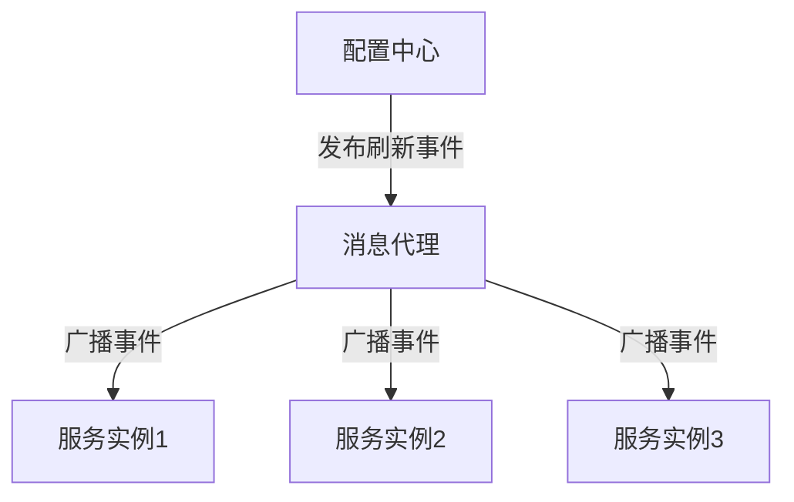

## 介绍

Spring Cloud Bus 是 Spring Cloud 生态系统中的一个重要组件，它通过轻量级的消息代理（如 RabbitMQ 或 Kafka）将分布式系统中的各个微服务连接起来，实现配置的动态刷新和事件的广播。通过 Spring Cloud Bus，开发者可以在不重启服务的情况下，动态更新配置或触发某些操作。

然而，在实际使用过程中，开发者可能会遇到一些常见问题。本文将逐一介绍这些问题，并提供相应的解决方案。

## 常见问题与解决方案

### 1. 事件未广播到所有服务

**问题描述**：当你通过 `/bus/refresh` 端点发送刷新事件时，发现只有部分服务接收到了事件，而其他服务没有响应。

**解决方案**：
- **检查配置**：确保所有服务都正确配置了 Spring Cloud Bus 的依赖和消息代理（如 RabbitMQ 或 Kafka）。
- **检查网络连接**：确保所有服务都能正常连接到消息代理。
- **检查服务注册**：确保所有服务都已正确注册到服务发现组件（如 Eureka 或 Consul）。

```yaml
# application.yml
spring:
  cloud:
    bus:
      enabled: true
      destination: my-bus
```

### 2. 事件广播延迟

**问题描述**：事件广播后，服务接收事件的延迟较高，导致配置更新不及时。

**解决方案**：
- **优化消息代理**：检查消息代理的性能，确保其能够处理高并发的事件广播。
- **调整消息队列配置**：增加消息队列的消费者数量，或者调整消息队列的容量。
- **减少网络延迟**：确保服务与消息代理之间的网络连接稳定且低延迟。

```yaml
# application.yml
spring:
  rabbitmq:
    host: localhost
    port: 5672
    username: guest
    password: guest
```

### 3. 事件重复处理

**问题描述**：某些服务可能会多次处理同一个事件，导致重复操作。

**解决方案**：
- **幂等性设计**：确保事件处理逻辑是幂等的，即多次处理同一个事件不会产生副作用。
- **消息去重**：在消息代理中配置去重机制，或者在服务端实现消息去重逻辑。

```java
@EventListener
public void handleRefreshEvent(RefreshEvent event) {
    if (!processedEvents.contains(event.getId())) {
        // 处理事件
        processedEvents.add(event.getId());
    }
}
```

### 4. 事件丢失

**问题描述**：某些事件在广播过程中丢失，导致部分服务未能接收到事件。

**解决方案**：
- **消息持久化**：确保消息代理配置了持久化机制，防止消息丢失。
- **重试机制**：在服务端实现重试机制，确保即使消息丢失也能重新获取。

```yaml
# application.yml
spring:
  rabbitmq:
    publisher-confirms: true
    publisher-returns: true
```

### 5. 事件广播失败

**问题描述**：事件广播失败，导致所有服务都未能接收到事件。

**解决方案**：
- **检查消息代理状态**：确保消息代理正常运行，并且服务能够正常连接到消息代理。
- **检查事件广播逻辑**：确保事件广播的逻辑正确，并且事件能够正确发送到消息代理。

```java
@Autowired
private ApplicationEventPublisher eventPublisher;

public void broadcastEvent() {
    eventPublisher.publishEvent(new RefreshEvent(this));
}
```

## 实际案例

假设我们有一个微服务架构的系统，包含多个服务实例。当我们需要更新某个配置时，可以通过 Spring Cloud Bus 广播一个刷新事件，所有服务实例都会接收到该事件并更新配置。



在这个案例中，如果某个服务实例未能接收到事件，我们可以通过上述解决方案逐一排查问题。

## 总结

Spring Cloud Bus 是一个非常强大的工具，能够帮助我们在分布式系统中实现配置的动态刷新和事件的广播。然而，在实际使用过程中，可能会遇到各种问题。通过本文的介绍，希望你能更好地理解和解决这些问题。

## 附加资源

- [Spring Cloud Bus 官方文档](https://spring.io/projects/spring-cloud-bus)
- [RabbitMQ 官方文档](https://www.rabbitmq.com/documentation.html)
- [Kafka 官方文档](https://kafka.apache.org/documentation/)

## 练习

1. 尝试在你的本地环境中配置 Spring Cloud Bus，并使用 RabbitMQ 作为消息代理。
2. 编写一个简单的微服务，并通过 `/bus/refresh` 端点触发配置刷新事件。
3. 模拟事件丢失的场景，并尝试通过消息持久化和重试机制解决问题。
