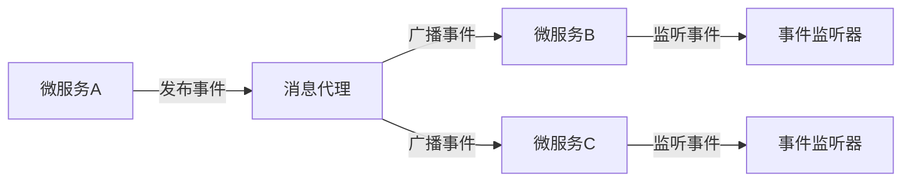

# Bus事件监听器

在分布式系统中，Spring Cloud Bus 提供了一种机制，用于在多个微服务实例之间传播事件。通过使用 **Bus事件监听器**，您可以监听这些事件并执行相应的操作。本文将详细介绍 Bus 事件监听器的概念、实现方式以及实际应用场景。

## 什么是 Bus 事件监听器？

Spring Cloud Bus 是一个轻量级的事件总线，用于在分布式系统中传播状态更改或配置更新等事件。**Bus事件监听器** 是一种特殊的组件，用于监听这些事件并执行相应的逻辑。当某个微服务实例发布一个事件时，所有订阅了该事件的监听器都会收到通知并执行相应的操作。

### 事件监听器的工作原理

Spring Cloud Bus 使用消息代理（如 RabbitMQ 或 Kafka）来传播事件。当一个事件被发布时，消息代理会将事件广播给所有订阅了该事件的微服务实例。每个实例中的事件监听器会接收到事件并执行相应的逻辑。



## 实现 Bus 事件监听器

在 Spring Cloud Bus 中，事件监听器通常通过 `@EventListener` 注解来实现。以下是一个简单的示例，展示了如何创建一个事件监听器来监听配置更新事件。

### 示例代码

```java
import org.springframework.cloud.bus.event.RefreshRemoteApplicationEvent;
import org.springframework.context.event.EventListener;
import org.springframework.stereotype.Component;

@Component
public class ConfigChangeListener {

    @EventListener
    public void handleRefreshEvent(RefreshRemoteApplicationEvent event) {
        System.out.println("收到配置更新事件: " + event.getOriginService());
        // 在这里执行配置更新的逻辑
    }
}
```

### 代码解释

- `@Component`：将该类标记为 Spring 组件，使其成为 Spring 上下文的一部分。
- `@EventListener`：标记该方法为事件监听器，当 `RefreshRemoteApplicationEvent` 事件被触发时，该方法会被调用。
- `RefreshRemoteApplicationEvent`：这是一个 Spring Cloud Bus 事件，表示配置更新事件。

### 输入与输出

假设您有一个微服务集群，其中包含三个实例：`service-a`、`service-b` 和 `service-c`。当 `service-a` 发布一个配置更新事件时，`service-b` 和 `service-c` 中的 `ConfigChangeListener` 都会收到该事件并打印以下消息：

```
收到配置更新事件: service-a
```

## 实际应用场景

### 场景 1：动态配置更新

在微服务架构中，配置通常存储在配置中心（如 Spring Cloud Config）。当配置发生变化时，您可以使用 Spring Cloud Bus 来通知所有微服务实例重新加载配置。通过监听 `RefreshRemoteApplicationEvent` 事件，您可以在配置更新时自动刷新应用程序的配置。

### 场景 2：服务状态同步

在某些情况下，您可能需要同步多个微服务实例的状态。例如，当某个实例的状态发生变化时，您可以通过 Spring Cloud Bus 发布一个自定义事件，其他实例可以通过监听该事件来同步状态。

## 总结

Bus 事件监听器是 Spring Cloud Bus 中的一个重要组件，它允许您在分布式系统中监听和响应事件。通过使用 `@EventListener` 注解，您可以轻松地创建事件监听器来处理各种事件，如配置更新、状态同步等。

在实际应用中，Bus 事件监听器可以帮助您实现动态配置更新、服务状态同步等功能，从而提高系统的灵活性和可维护性。

## 附加资源

- [Spring Cloud Bus 官方文档](https://spring.io/projects/spring-cloud-bus)
- [Spring 事件监听机制](https://docs.spring.io/spring-framework/docs/current/reference/html/core.html#context-functionality-events)

## 练习

1. 创建一个自定义事件 `CustomEvent`，并在多个微服务实例之间传播该事件。
2. 实现一个事件监听器，监听 `CustomEvent` 并打印事件内容。
3. 使用 Spring Cloud Bus 和 RabbitMQ 实现配置更新的自动刷新功能。

通过完成这些练习，您将更深入地理解 Bus 事件监听器的工作原理及其在分布式系统中的应用。