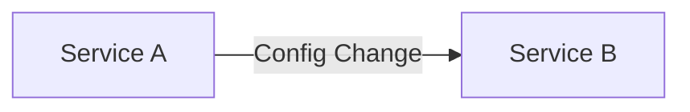

## 介绍

在微服务架构中，Spring Cloud Bus 是一个用于连接分布式系统中各个节点的轻量级消息总线。它通过消息代理（如 RabbitMQ 或 Kafka）在服务之间传播状态更改或配置更新。Bus事件追踪是监控和分析这些事件的关键技术，帮助开发者理解事件的传播路径和影响范围。

## 什么是Bus事件追踪？

Bus事件追踪是指通过记录和分析Spring Cloud Bus中传播的事件，来监控和调试分布式系统中的状态变化。它可以帮助开发者了解事件的来源、传播路径以及最终的影响。

## 如何实现Bus事件追踪？

### 1. 配置Spring Cloud Bus

首先，确保你的项目中已经集成了Spring Cloud Bus。通常，这需要在`pom.xml`中添加以下依赖：

```xml
<dependency>
    <groupId>org.springframework.cloud</groupId>
    <artifactId>spring-cloud-starter-bus-amqp</artifactId>
</dependency>
```

### 2. 启用事件追踪

在Spring Boot应用中，你可以通过配置`spring.cloud.bus.trace.enabled=true`来启用事件追踪功能。这将自动记录所有通过Bus传播的事件。

```yaml
spring:
  cloud:
    bus:
      trace:
        enabled: true
```

### 3. 查看事件追踪日志

启用事件追踪后，Spring Cloud Bus会将事件的详细信息记录在日志中。你可以通过查看日志来了解事件的传播路径。

```plaintext
2023-10-01 12:00:00.000  INFO 12345 --- [nio-8080-exec-1] o.s.c.b.event.TraceListener              : Received event: RefreshRemoteApplicationEvent
```

### 4. 自定义事件追踪

如果你需要更详细的事件追踪信息，可以通过实现`ApplicationListener`接口来自定义事件处理逻辑。

```java
import org.springframework.cloud.bus.event.RefreshRemoteApplicationEvent;
import org.springframework.context.ApplicationListener;
import org.springframework.stereotype.Component;

@Component
public class CustomTraceListener implements ApplicationListener<RefreshRemoteApplicationEvent> {

    @Override
    public void onApplicationEvent(RefreshRemoteApplicationEvent event) {
        System.out.println("Custom Trace: " + event.getOriginService() + " -> " + event.getDestinationService());
    }
}
```

## 实际案例

假设你有一个微服务架构，包含两个服务：`Service A`和`Service B`。当`Service A`的配置发生变化时，Spring Cloud Bus会将配置更新事件传播到`Service B`。



通过事件追踪，你可以看到事件的传播路径：

```plaintext
Custom Trace: Service A -> Service B
```

## 总结

Bus事件追踪是Spring Cloud Bus中一个强大的工具，它帮助开发者监控和调试分布式系统中的事件传播。通过启用和自定义事件追踪，你可以更好地理解系统的运行状态，快速定位和解决问题。

## 附加资源

- [Spring Cloud Bus官方文档](https://spring.io/projects/spring-cloud-bus)
- [Spring Cloud Bus与RabbitMQ集成指南](https://spring.io/guides/gs/messaging-rabbitmq/)

## 练习

1. 在你的Spring Boot项目中启用Spring Cloud Bus，并配置事件追踪。
2. 实现一个自定义事件监听器，记录所有通过Bus传播的事件。
3. 模拟一个配置更新事件，观察事件追踪日志的输出。
