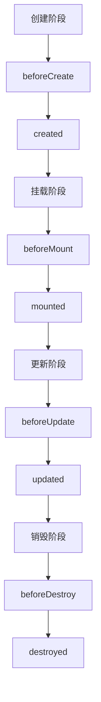

# Vue.js生命周期钩子

Vue.js 是一个流行的前端框架，它通过生命周期钩子（Lifecycle Hooks）提供了在组件生命周期的不同阶段执行代码的能力。理解这些钩子函数对于开发高效、可维护的 Vue.js 应用程序至关重要。

## 什么是生命周期钩子？

生命周期钩子是 Vue.js 组件在创建、更新和销毁过程中自动调用的函数。它们允许开发者在组件的不同阶段执行特定的逻辑，例如初始化数据、监听事件、清理资源等。

Vue.js 的生命周期可以分为以下几个阶段：

1. **创建阶段（Creation）**：组件实例被创建并初始化。
2. **挂载阶段（Mounting）**：组件被挂载到 DOM 中。
3. **更新阶段（Updating）**：组件的数据发生变化，导致 DOM 重新渲染。
4. **销毁阶段（Destruction）**：组件从 DOM 中移除并销毁。

每个阶段都有对应的生命周期钩子函数，开发者可以在这些函数中编写代码以响应组件的生命周期事件。

## 生命周期钩子函数

以下是 Vue.js 的主要生命周期钩子函数及其执行顺序：



### 1. 创建阶段

- **beforeCreate**：在实例初始化之后，数据观测（data observation）和事件/侦听器配置之前被调用。
- **created**：在实例创建完成后被调用。此时，数据观测已完成，但 DOM 还未挂载。

```javascript
export default {
  beforeCreate() {
    console.log('beforeCreate: 实例初始化完成，但数据观测尚未开始');
  },
  created() {
    console.log('created: 实例创建完成，数据观测已开始');
  }
};
```

### 2. 挂载阶段

- **beforeMount**：在挂载开始之前被调用，此时模板编译已完成，但尚未将 DOM 插入页面。
- **mounted**：在实例挂载到 DOM 后被调用。此时，组件已经插入到页面中，可以访问 DOM 元素。

```javascript
export default {
  beforeMount() {
    console.log('beforeMount: 模板编译完成，但尚未挂载到 DOM');
  },
  mounted() {
    console.log('mounted: 组件已挂载到 DOM');
  }
};
```

### 3. 更新阶段

- **beforeUpdate**：在数据变化导致 DOM 重新渲染之前被调用。
- **updated**：在数据变化导致 DOM 重新渲染之后被调用。

```javascript
export default {
  data() {
    return {
      message: 'Hello Vue!'
    };
  },
  beforeUpdate() {
    console.log('beforeUpdate: 数据变化，DOM 即将重新渲染');
  },
  updated() {
    console.log('updated: 数据变化，DOM 已重新渲染');
  }
};
```

### 4. 销毁阶段

- **beforeDestroy**：在实例销毁之前被调用。此时，实例仍然完全可用。
- **destroyed**：在实例销毁之后被调用。此时，所有的事件监听器和子组件都已被移除。

```javascript
export default {
  beforeDestroy() {
    console.log('beforeDestroy: 实例即将销毁');
  },
  destroyed() {
    console.log('destroyed: 实例已销毁');
  }
};
```

## 实际应用场景

### 1. 数据初始化

在 `created` 钩子中，通常会进行数据的初始化操作，例如从 API 获取数据。

```javascript
export default {
  data() {
    return {
      posts: []
    };
  },
  async created() {
    const response = await fetch('https://api.example.com/posts');
    this.posts = await response.json();
  }
};
```

### 2. DOM 操作

在 `mounted` 钩子中，可以访问 DOM 元素并进行操作，例如初始化第三方库。

```javascript
export default {
  mounted() {
    this.$refs.myElement.style.color = 'red';
  }
};
```

### 3. 清理资源

在 `beforeDestroy` 钩子中，可以清理定时器、取消事件监听器等，以防止内存泄漏。

```javascript
export default {
  data() {
    return {
      timer: null
    };
  },
  created() {
    this.timer = setInterval(() => {
      console.log('Timer tick');
    }, 1000);
  },
  beforeDestroy() {
    clearInterval(this.timer);
  }
};
```

## 总结

Vue.js 的生命周期钩子为开发者提供了在组件生命周期的不同阶段执行代码的能力。通过合理使用这些钩子函数，可以优化组件的性能、管理资源并确保应用程序的稳定性。

:::tip 提示
- 尽量在 `created` 钩子中进行数据初始化，而不是 `beforeCreate`，因为此时数据观测已经完成。
- 在 `mounted` 钩子中进行 DOM 操作，确保 DOM 已经挂载。
- 在 `beforeDestroy` 钩子中清理资源，防止内存泄漏。
:::

## 附加资源

- [Vue.js 官方文档 - 生命周期钩子](https://v3.vuejs.org/guide/instance.html#lifecycle-hooks)
- [Vue.js 生命周期钩子详解](https://www.digitalocean.com/community/tutorials/vuejs-component-lifecycle)

## 练习

1. 创建一个 Vue 组件，并在 `created` 钩子中从 API 获取数据并显示在页面上。
2. 在 `mounted` 钩子中，使用 `this.$refs` 访问 DOM 元素并修改其样式。
3. 在 `beforeDestroy` 钩子中，清理一个定时器并验证其是否被正确清除。

通过以上练习，你将更深入地理解 Vue.js 生命周期钩子的使用场景和实际应用。