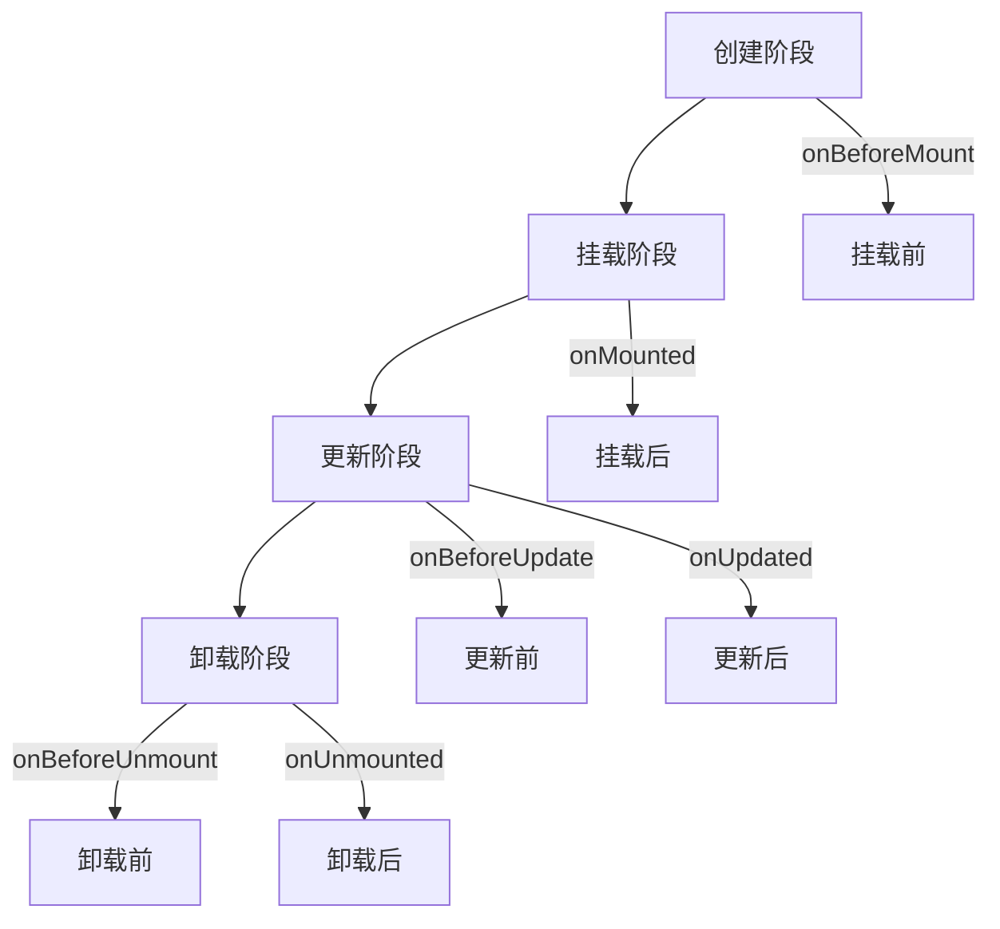

# Vue.js生命周期钩子

在 Vue.js 中，生命周期钩子是组件从创建到销毁过程中触发的一系列函数。这些钩子允许我们在组件的不同阶段执行特定的逻辑，例如初始化数据、监听事件、更新 DOM 或清理资源。理解生命周期钩子是掌握 Vue.js 开发的关键之一。

在组合式 API 中，生命周期钩子通过 `onMounted`、`onUpdated` 等函数来实现。接下来，我们将详细介绍这些钩子，并通过代码示例和实际案例帮助你更好地理解它们。

---

## 生命周期钩子概述

Vue.js 组件的生命周期可以分为以下几个主要阶段：

1. **创建阶段**：组件实例被创建并初始化。
2. **挂载阶段**：组件被挂载到 DOM 中。
3. **更新阶段**：组件的数据发生变化，导致 DOM 更新。
4. **卸载阶段**：组件从 DOM 中移除。

每个阶段都有对应的生命周期钩子，允许我们在特定时刻执行代码。

---

## 组合式 API 中的生命周期钩子

在组合式 API 中，生命周期钩子是通过以下函数来使用的：

- `onBeforeMount`：在组件挂载到 DOM 之前调用。
- `onMounted`：在组件挂载到 DOM 之后调用。
- `onBeforeUpdate`：在组件更新之前调用。
- `onUpdated`：在组件更新之后调用。
- `onBeforeUnmount`：在组件卸载之前调用。
- `onUnmounted`：在组件卸载之后调用。

这些钩子函数需要在 `setup` 函数中调用。

---

### 代码示例：基本用法

以下是一个简单的示例，展示了如何在组合式 API 中使用生命周期钩子：

```javascript
<script setup>
import { onMounted, onUpdated, onUnmounted } from 'vue';

onMounted(() => {
  console.log('组件已挂载');
});

onUpdated(() => {
  console.log('组件已更新');
});

onUnmounted(() => {
  console.log('组件已卸载');
});
</script>

<template>
  <div>
    <p>这是一个生命周期钩子示例</p>
  </div>
</template>
```

**输出：**
- 当组件挂载时，控制台会打印 `组件已挂载`。
- 当组件更新时，控制台会打印 `组件已更新`。
- 当组件卸载时，控制台会打印 `组件已卸载`。

---

## 生命周期钩子的实际应用

### 案例 1：数据初始化

在 `onMounted` 钩子中，我们可以执行一些初始化操作，例如从 API 获取数据：

```javascript
<script setup>
import { ref, onMounted } from 'vue';

const data = ref(null);

onMounted(async () => {
  const response = await fetch('https://api.example.com/data');
  data.value = await response.json();
});
</script>

<template>
  <div>
    <p v-if="data">数据加载成功：{{ data }}</p>
    <p v-else>加载中...</p>
  </div>
</template>
```

**说明：**
- 组件挂载后，会从 API 获取数据并更新 `data` 的值。
- 如果数据尚未加载完成，页面会显示 `加载中...`。

---

### 案例 2：事件监听与清理

在 `onMounted` 钩子中，我们可以添加事件监听器，并在 `onUnmounted` 钩子中清理它们，以避免内存泄漏：

```javascript
<script setup>
import { onMounted, onUnmounted } from 'vue';

const handleResize = () => {
  console.log('窗口大小已改变');
};

onMounted(() => {
  window.addEventListener('resize', handleResize);
});

onUnmounted(() => {
  window.removeEventListener('resize', handleResize);
});
</script>

<template>
  <div>
    <p>调整窗口大小以查看控制台输出</p>
  </div>
</template>
```

**说明：**
- 组件挂载后，会监听窗口的 `resize` 事件。
- 组件卸载后，会移除事件监听器。

---

## 生命周期钩子的顺序

以下是一个完整的生命周期钩子顺序图：



---

## 总结

Vue.js 的生命周期钩子为我们提供了在组件不同阶段执行代码的能力。通过组合式 API 中的 `onMounted`、`onUpdated` 等函数，我们可以轻松管理组件的生命周期逻辑。

在实际开发中，生命周期钩子常用于以下场景：
- 数据初始化。
- 事件监听与清理。
- DOM 操作。
- 资源释放。

---

## 附加资源与练习

1. **官方文档**：阅读 [Vue.js 生命周期钩子文档](https://vuejs.org/guide/essentials/lifecycle.html) 以深入了解。
2. **练习**：尝试在一个 Vue.js 项目中实现以下功能：
   - 在 `onMounted` 钩子中获取用户输入并显示在页面上。
   - 在 `onUnmounted` 钩子中清理一个定时器。

通过实践，你将更好地掌握生命周期钩子的使用！