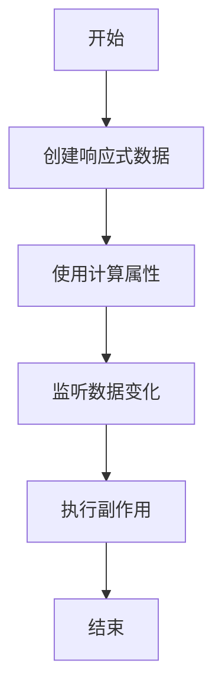

# Vue.js响应式工具函数

Vue.js 的组合式 API 提供了一系列强大的响应式工具函数，帮助开发者更高效地管理组件的状态和逻辑。这些工具函数不仅简化了代码结构，还提升了代码的可读性和可维护性。本文将详细介绍这些工具函数的使用方法，并通过实际案例展示它们的应用场景。

## 什么是响应式工具函数？

在 Vue.js 中，响应式工具函数是一组用于创建和管理响应式数据的函数。它们允许开发者以声明式的方式定义状态，并自动跟踪状态的变化，从而在状态更新时自动更新视图。这些工具函数是 Vue.js 组合式 API 的核心部分，适用于构建复杂的组件逻辑。

## 常用的响应式工具函数

Vue.js 提供了以下几个常用的响应式工具函数：

1. **`ref`**: 用于创建一个响应式的引用值。
2. **`reactive`**: 用于创建一个响应式的对象。
3. **`computed`**: 用于创建一个计算属性。
4. **`watch`**: 用于监听响应式数据的变化。
5. **`watchEffect`**: 用于自动追踪依赖并执行副作用。

接下来，我们将逐一介绍这些工具函数的使用方法。

---

### 1. `ref` 函数

`ref` 函数用于创建一个响应式的引用值。它接受一个初始值，并返回一个包含 `.value` 属性的对象，该属性指向初始值。

```javascript
import { ref } from 'vue';

const count = ref(0);

console.log(count.value); // 输出: 0
count.value++; // 修改值
console.log(count.value); // 输出: 1
```

:::note
`ref` 通常用于基本类型（如数字、字符串、布尔值），但也可以用于对象和数组。
:::

---

### 2. `reactive` 函数

`reactive` 函数用于创建一个响应式的对象。它接受一个普通对象，并返回该对象的响应式代理。

```javascript
import { reactive } from 'vue';

const state = reactive({
  count: 0,
  message: 'Hello, Vue!'
});

console.log(state.count); // 输出: 0
state.count++; // 修改值
console.log(state.count); // 输出: 1
```

:::tip
`reactive` 适用于复杂对象，因为它会自动递归地将所有嵌套属性转换为响应式数据。
:::

---

### 3. `computed` 函数

`computed` 函数用于创建一个计算属性。它接受一个 getter 函数，并返回一个只读的响应式引用。

```javascript
import { ref, computed } from 'vue';

const count = ref(0);
const doubleCount = computed(() => count.value * 2);

console.log(doubleCount.value); // 输出: 0
count.value++;
console.log(doubleCount.value); // 输出: 2
```

:::caution
计算属性是惰性求值的，只有在依赖的响应式数据发生变化时才会重新计算。
:::

---

### 4. `watch` 函数

`watch` 函数用于监听响应式数据的变化。它接受一个响应式数据源和一个回调函数，当数据源发生变化时，回调函数会被触发。

```javascript
import { ref, watch } from 'vue';

const count = ref(0);

watch(count, (newValue, oldValue) => {
  console.log(`count 从 ${oldValue} 变为 ${newValue}`);
});

count.value++; // 输出: count 从 0 变为 1
```

:::warning
`watch` 可以监听多个数据源，但需要显式指定依赖。
:::

---

### 5. `watchEffect` 函数

`watchEffect` 函数用于自动追踪依赖并执行副作用。它接受一个函数，并在函数内的响应式数据发生变化时重新执行。

```javascript
import { ref, watchEffect } from 'vue';

const count = ref(0);

watchEffect(() => {
  console.log(`count 的值是: ${count.value}`);
});

count.value++; // 输出: count 的值是: 1
```

:::tip
`watchEffect` 会自动追踪所有依赖，适合用于不需要显式指定依赖的场景。
:::

---

## 实际案例：计数器组件

以下是一个使用响应式工具函数实现的简单计数器组件：

```javascript
<template>
  <div>
    <p>当前计数: {{ count }}</p>
    <button @click="increment">增加</button>
    <p>双倍计数: {{ doubleCount }}</p>
  </div>
</template>

<script setup>
import { ref, computed } from 'vue';

const count = ref(0);
const doubleCount = computed(() => count.value * 2);

function increment() {
  count.value++;
}
</script>
```

在这个案例中，我们使用 `ref` 创建了一个响应式的计数器，并使用 `computed` 计算了双倍计数的值。

---

## 总结

Vue.js 的响应式工具函数为开发者提供了强大的状态管理能力。通过 `ref`、`reactive`、`computed`、`watch` 和 `watchEffect`，我们可以轻松地创建和管理响应式数据，并实现复杂的组件逻辑。

:::note
建议初学者多加练习，熟悉这些工具函数的使用场景和注意事项。
:::

---

## 附加资源

1. [Vue.js 官方文档 - 组合式 API](https://vuejs.org/guide/introduction.html)
2. [Vue.js 响应式系统深入解析](https://vuejs.org/guide/reactivity.html)

---

## 练习

1. 使用 `ref` 和 `computed` 实现一个温度转换器，支持摄氏度和华氏度的相互转换。
2. 使用 `reactive` 和 `watch` 实现一个表单验证功能，监听表单字段的变化并实时显示错误信息。



通过以上内容，相信你已经对 Vue.js 的响应式工具函数有了全面的了解。继续深入学习，掌握更多高级用法吧！