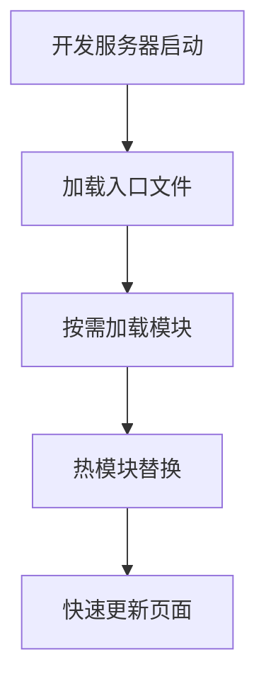

## 什么是 Vite？

Vite 是一个现代化的前端构建工具，旨在提供更快的开发体验。它由 Vue.js 的创始人尤雨溪开发，专注于利用现代浏览器的原生 ES 模块支持，实现快速的开发服务器启动和热模块替换（HMR）。与传统的构建工具（如 Webpack）相比，Vite 在开发环境中显著减少了构建时间，特别适合大型项目。

Vite 的核心优势在于：
- **快速启动**：利用浏览器原生 ES 模块，无需打包即可启动开发服务器。
- **高效的热更新**：仅更新修改的模块，而不是重新构建整个应用。
- **开箱即用的支持**：支持 TypeScript、JSX、CSS 预处理器等，无需额外配置。

## 为什么选择 Vite？

对于初学者来说，Vite 提供了更简单的配置和更快的开发体验。它减少了构建工具的复杂性，让你可以专注于编写代码，而不是花时间在配置上。此外，Vite 的插件系统与 Rollup 兼容，这意味着你可以轻松扩展其功能。

## 如何使用 Vite？

### 1. 安装 Vite

首先，你需要安装 Vite。可以通过以下命令创建一个新的 Vite 项目：

```bash
npm create vite@latest
```

按照提示选择项目名称和模板（例如 Vue.js），然后进入项目目录并安装依赖：

```bash
cd my-vite-project
npm install
```

### 2. 启动开发服务器

安装完成后，运行以下命令启动开发服务器：

```bash
npm run dev
```

Vite 会启动一个本地开发服务器，并在浏览器中打开你的应用。此时，你可以开始编写代码，Vite 会自动处理模块的加载和热更新。

### 3. 构建生产环境

当你准备好将应用部署到生产环境时，可以运行以下命令进行构建：

```bash
npm run build
```

Vite 会将你的代码打包并优化，生成静态文件，这些文件可以直接部署到任何静态文件服务器。

## Vite 的实际应用场景

### 案例：使用 Vite 构建一个 Vue.js 应用

假设你正在开发一个简单的 Vue.js 应用，以下是如何使用 Vite 进行开发和构建的步骤：

1. **创建项目**：使用 `npm create vite@latest` 创建一个新的 Vue.js 项目。
2. **编写代码**：在 `src` 目录下编写 Vue 组件和逻辑代码。
3. **启动开发服务器**：运行 `npm run dev`，Vite 会启动开发服务器并自动刷新页面。
4. **构建生产环境**：完成开发后，运行 `npm run build` 生成生产环境的静态文件。

### 代码示例

以下是一个简单的 Vue.js 组件示例：

```vue
<template>
  <div>
    <h1>Hello, Vite!</h1>
    <p>This is a simple Vue.js component.</p>
  </div>
</template>

<script>
export default {
  name: 'HelloWorld',
};
</script>

<style scoped>
h1 {
  color: #42b983;
}
</style>
```

在 Vite 中，你可以直接使用 ES 模块语法导入和使用这个组件，无需额外的配置。

## Vite 的工作原理

Vite 的核心思想是利用现代浏览器的原生 ES 模块支持。在开发环境中，Vite 不会将所有的代码打包成一个文件，而是将每个模块作为独立的文件加载。这种方式大大减少了构建时间，特别是在大型项目中。



## 总结

Vite 是一个强大的构建工具，特别适合初学者和需要快速开发体验的开发者。它简化了前端开发的配置流程，并提供了高效的开发服务器和热更新功能。通过 Vite，你可以更专注于编写代码，而不是花时间在构建工具的配置上。

## 附加资源

- [Vite 官方文档](https://vitejs.dev/)
- [Vue.js 官方文档](https://vuejs.org/)
- [Vite 插件生态系统](https://github.com/vitejs/awesome-vite)

## 练习

1. 使用 Vite 创建一个新的 Vue.js 项目，并添加一个简单的组件。
2. 尝试在 Vite 项目中使用 TypeScript，并观察 Vite 如何处理 TypeScript 文件。
3. 探索 Vite 的插件系统，安装并使用一个 Vite 插件（例如 `vite-plugin-pwa`）。

通过以上练习，你将更深入地理解 Vite 的工作原理和使用方法。