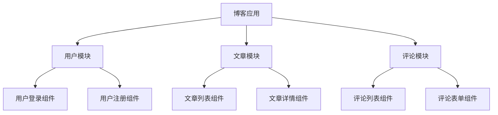

## 什么是模块化设计？

模块化设计是一种将复杂系统分解为更小、更易管理的部分（模块）的软件开发方法。每个模块都有明确的职责，并且可以独立开发、测试和维护。在 Vue.js 项目中，模块化设计可以帮助我们更好地组织代码，减少重复，并提高代码的可读性和可维护性。

## 为什么需要模块化设计？

随着项目规模的增大，代码量也会迅速增加。如果没有良好的组织结构，代码会变得难以维护和扩展。模块化设计通过将代码分解为独立的模块，使得每个模块只关注自己的功能，从而降低了代码的复杂性。

## Vue.js中的模块化设计

在 Vue.js 中，模块化设计通常通过以下方式实现：

1. **组件化**：将 UI 分解为多个可重用的组件。
2. **状态管理**：使用 Vuex 或 Pinia 来管理全局状态。
3. **路由模块化**：将路由配置分解为多个模块。
4. **服务模块化**：将 API 请求和业务逻辑封装到独立的服务模块中。

### 1. 组件化

Vue.js 的核心思想之一就是组件化。每个组件都是一个独立的模块，负责渲染一部分 UI 并处理相关的逻辑。通过将 UI 分解为多个组件，我们可以更容易地重用代码，并且每个组件都可以独立开发和测试。

```vue
<template>
  <div>
    <h1>{{ title }}</h1>
    <p>{{ content }}</p>
  </div>
</template>

<script>
export default {
  props: {
    title: String,
    content: String
  }
}
</script>
```

在上面的例子中，我们创建了一个简单的 `Article` 组件，它接收 `title` 和 `content` 作为 props，并在模板中渲染它们。

### 2. 状态管理

在大型应用中，组件之间可能需要共享状态。Vuex 或 Pinia 可以帮助我们集中管理这些状态，并将其分解为多个模块。

```javascript
// store/modules/user.js
export default {
  state: {
    userInfo: null
  },
  mutations: {
    SET_USER_INFO(state, userInfo) {
      state.userInfo = userInfo;
    }
  },
  actions: {
    fetchUserInfo({ commit }) {
      // 模拟 API 请求
      setTimeout(() => {
        commit('SET_USER_INFO', { name: 'John Doe' });
      }, 1000);
    }
  }
}
```

在这个例子中，我们将用户相关的状态和逻辑封装到一个独立的 `user` 模块中。这样，其他模块或组件可以通过 `store` 访问和修改用户信息。

### 3. 路由模块化

随着应用的增长，路由配置也会变得复杂。我们可以将路由配置分解为多个模块，每个模块负责一部分路由。

```javascript
// router/modules/home.js
export default {
  path: '/home',
  component: () => import('@/views/Home.vue')
}

// router/modules/about.js
export default {
  path: '/about',
  component: () => import('@/views/About.vue')
}

// router/index.js
import Vue from 'vue';
import Router from 'vue-router';
import homeRoutes from './modules/home';
import aboutRoutes from './modules/about';

Vue.use(Router);

export default new Router({
  routes: [
    homeRoutes,
    aboutRoutes
  ]
});
```

通过将路由配置模块化，我们可以更容易地管理和扩展路由。

### 4. 服务模块化

在 Vue.js 项目中，我们通常需要与后端 API 进行交互。将 API 请求封装到独立的服务模块中，可以使代码更加清晰和易于维护。

```javascript
// services/userService.js
import axios from 'axios';

export default {
  getUserInfo() {
    return axios.get('/api/user');
  },
  updateUserInfo(userInfo) {
    return axios.post('/api/user', userInfo);
  }
}
```

在这个例子中，我们将与用户相关的 API 请求封装到一个独立的 `userService` 模块中。这样，其他组件或模块可以通过调用 `userService` 的方法来获取或更新用户信息。

## 实际案例

假设我们正在开发一个博客应用，我们可以将应用分解为以下几个模块：

1. **用户模块**：负责用户登录、注册和个人信息管理。
2. **文章模块**：负责文章的创建、编辑和展示。
3. **评论模块**：负责文章的评论功能。

每个模块都有自己的组件、状态管理和服务模块。通过这种方式，我们可以更容易地开发和维护应用。



## 总结

模块化设计是 Vue.js 项目开发中的重要概念。通过将应用分解为多个独立的模块，我们可以提高代码的可维护性和可扩展性。在实际开发中，我们可以通过组件化、状态管理、路由模块化和服务模块化等方式来实现模块化设计。

## 附加资源

- [Vue.js 官方文档](https://vuejs.org/)
- [Vuex 官方文档](https://vuex.vuejs.org/)
- [Pinia 官方文档](https://pinia.vuejs.org/)

## 练习

1. 尝试将一个简单的 Vue.js 项目分解为多个模块，并实现组件化、状态管理和路由模块化。
2. 创建一个服务模块，封装与后端 API 的交互逻辑。