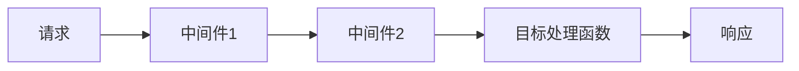

# 中间件设计

在 Vue.js 项目中，中间件（Middleware）是一种强大的设计模式，用于在请求和响应之间插入逻辑处理。中间件可以帮助我们在不修改核心业务逻辑的情况下，增强应用的功能和灵活性。本文将详细介绍中间件的概念、实现方式以及实际应用场景。

## 什么是中间件？

中间件是一种在请求和响应之间执行的函数或逻辑块。它允许我们在请求到达目标处理函数之前，或者在响应返回给客户端之前，执行一些额外的操作。中间件通常用于处理日志记录、身份验证、错误处理等任务。

在 Vue.js 中，中间件通常与路由（Vue Router）结合使用，用于在导航到某个路由之前或之后执行特定的逻辑。

## 中间件的基本结构

一个典型的中间件函数通常接收三个参数：`context`、`next` 和 `error`。其中：

- `context` 包含了当前请求的上下文信息，如路由、状态等。
- `next` 是一个函数，用于将控制权传递给下一个中间件或目标处理函数。
- `error` 是一个可选参数，用于处理中间件中可能出现的错误。

以下是一个简单的中间件示例：

```javascript
function loggerMiddleware(context, next) {
  console.log(`Navigating to: ${context.route.path}`);
  next();
}
```

在这个示例中，`loggerMiddleware` 会在每次导航时打印出当前的路由路径。

## 中间件的执行流程

中间件的执行流程通常是一个链式结构。每个中间件都可以选择调用 `next()` 来将控制权传递给下一个中间件，或者直接返回响应以终止链式调用。



在这个流程中，请求首先经过中间件1，然后中间件2，最后到达目标处理函数。每个中间件都可以在请求到达目标处理函数之前或之后执行一些操作。

## 中间件的实际应用

### 1. 身份验证

中间件常用于处理身份验证。例如，我们可以创建一个中间件来检查用户是否已登录，如果未登录则重定向到登录页面。

```javascript
function authMiddleware(context, next) {
  if (!context.store.state.isAuthenticated) {
    context.redirect('/login');
  } else {
    next();
  }
}
```

### 2. 日志记录

中间件还可以用于记录用户的操作日志。例如，我们可以创建一个中间件来记录用户访问的每个页面。

```javascript
function logMiddleware(context, next) {
  console.log(`User visited: ${context.route.path}`);
  next();
}
```

### 3. 错误处理

中间件还可以用于全局错误处理。例如，我们可以创建一个中间件来捕获并处理应用中可能出现的错误。

```javascript
function errorMiddleware(context, next) {
  try {
    next();
  } catch (error) {
    console.error('An error occurred:', error);
    context.redirect('/error');
  }
}
```

## 总结

中间件是 Vue.js 项目中一种非常有用的设计模式，它允许我们在不修改核心业务逻辑的情况下，增强应用的功能和灵活性。通过中间件，我们可以轻松地实现身份验证、日志记录、错误处理等功能。

## 附加资源与练习

- **练习**：尝试在你的 Vue.js 项目中实现一个中间件，用于记录用户访问的每个页面。
- **资源**：阅读 [Vue Router 官方文档](https://router.vuejs.org/) 了解更多关于中间件的使用方式。

:::tip
在实际项目中，合理使用中间件可以大大提高代码的可维护性和可扩展性。建议在项目中尝试使用中间件来处理常见的横切关注点（Cross-Cutting Concerns）。
:::