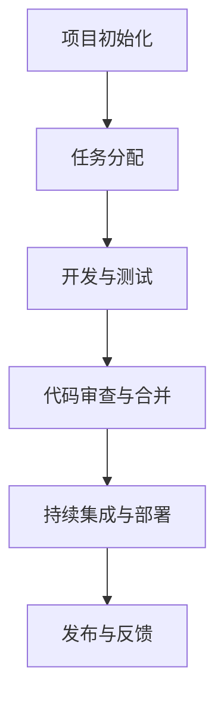

# 团队协作流程

在现代软件开发中，团队协作是确保项目成功的关键因素之一。特别是在 Vue.js 项目中，团队成员需要紧密合作，以确保代码质量、功能实现和项目进度。本文将详细介绍如何在 Vue.js 项目中建立高效的团队协作流程，帮助初学者快速上手。

## 1. 代码管理：Git 和 GitHub

### 1.1 版本控制的重要性

版本控制是团队协作的基础。通过使用 Git，团队成员可以轻松地跟踪代码的变更、合并代码以及解决冲突。GitHub 则提供了一个集中式的平台，用于代码托管、代码审查和问题跟踪。

### 1.2 基本 Git 工作流程

以下是一个典型的 Git 工作流程：

1. **克隆仓库**：首先，团队成员需要克隆远程仓库到本地。
   ```bash
   git clone https://github.com/your-username/your-repo.git
   ```

2. **创建分支**：每个新功能或修复都应该在一个新的分支上进行开发。
   ```bash
   git checkout -b feature/new-feature
   ```

3. **提交更改**：在完成代码更改后，提交更改到本地仓库。
   ```bash
   git add .
   git commit -m "Add new feature"
   ```

4. **推送分支**：将本地分支推送到远程仓库。
   ```bash
   git push origin feature/new-feature
   ```

5. **创建 Pull Request**：在 GitHub 上创建一个 Pull Request，请求将你的分支合并到主分支。

6. **代码审查**：团队成员对 Pull Request 进行审查，提出修改建议。

7. **合并代码**：一旦 Pull Request 被批准，代码将被合并到主分支。

:::tip
确保在每次提交时编写清晰的提交信息，这有助于团队成员理解你的更改。
:::

## 2. 任务分配：项目管理工具

### 2.1 使用项目管理工具

项目管理工具（如 Jira、Trello 或 Asana）可以帮助团队分配任务、跟踪进度和管理优先级。每个任务都应该有一个明确的描述、负责人和截止日期。

### 2.2 任务分配示例

假设我们有一个 Vue.js 项目，需要实现一个用户登录功能。我们可以将任务分解为以下几个子任务：

1. **设计登录页面**：负责 UI 设计。
2. **实现登录逻辑**：负责后端 API 调用和前端逻辑。
3. **测试登录功能**：负责编写单元测试和集成测试。

在项目管理工具中，这些任务可以被分配给不同的团队成员，并设置优先级和截止日期。

:::note
确保每个任务都有明确的验收标准，以便团队成员知道何时完成任务。
:::

## 3. 沟通工具：Slack 或 Microsoft Teams

### 3.1 实时沟通的重要性

在团队协作中，实时沟通是必不可少的。Slack 或 Microsoft Teams 等工具可以帮助团队成员快速交流、分享文件和解决问题。

### 3.2 创建专用频道

为不同的项目或功能创建专用频道，例如 `#vue-login-feature`，以便团队成员可以集中讨论相关话题。

:::caution
避免在公共频道中讨论与项目无关的内容，以保持频道的整洁和高效。
:::

## 4. 实际案例：Vue.js 项目中的团队协作

### 4.1 案例背景

假设我们正在开发一个电子商务网站，使用 Vue.js 作为前端框架。团队由 5 名成员组成，分别负责前端开发、后端开发、UI 设计和测试。

### 4.2 协作流程

1. **项目初始化**：团队使用 GitHub 创建一个新的仓库，并设置好分支策略（如 `main` 分支用于生产环境，`develop` 分支用于开发环境）。

2. **任务分配**：在 Jira 中创建任务，并将任务分配给相应的团队成员。

3. **开发与测试**：每个成员在自己的分支上开发功能，完成后提交 Pull Request 进行代码审查。

4. **代码审查与合并**：团队成员对 Pull Request 进行审查，确保代码质量。一旦通过审查，代码将被合并到 `develop` 分支。

5. **持续集成与部署**：使用 CI/CD 工具（如 GitHub Actions）自动构建和部署代码到测试环境。

6. **发布与反馈**：在测试通过后，代码将被合并到 `main` 分支，并发布到生产环境。团队收集用户反馈，并根据反馈进行迭代。



## 5. 总结

在 Vue.js 项目中，高效的团队协作流程是确保项目成功的关键。通过使用 Git 和 GitHub 进行代码管理、项目管理工具进行任务分配、以及沟通工具进行实时交流，团队可以更高效地协作，确保项目按时交付。

## 6. 附加资源与练习

- **Git 官方文档**：https://git-scm.com/doc
- **GitHub Guides**：https://guides.github.com/
- **Vue.js 官方文档**：https://vuejs.org/v2/guide/

:::warning
练习：尝试在一个小型 Vue.js 项目中实践上述团队协作流程，并记录你的经验和遇到的问题。
:::