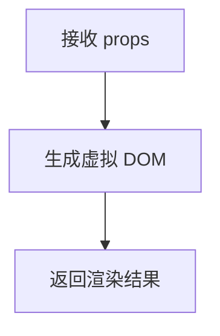

# Vue.js组件函数式渲染

在 Vue.js 中，组件是构建用户界面的核心单元。通常情况下，我们使用模板或渲染函数来定义组件的行为和结构。然而，在某些场景下，我们可能需要更轻量级的组件，这时**函数式组件**就派上了用场。本文将详细介绍 Vue.js 中的函数式组件及其渲染方式。

## 什么是函数式组件？

函数式组件是一种特殊的 Vue 组件，它没有状态（即没有 `data`），也没有实例（即没有 `this`）。它仅仅是一个接收 `props` 并返回渲染结果的函数。由于没有实例和状态，函数式组件的渲染开销更小，性能更高。

:::tip
函数式组件适用于以下场景：
- 组件只依赖于 `props`，不需要内部状态。
- 组件不需要生命周期钩子。
- 组件需要高性能渲染。
:::

## 函数式组件的基本语法

在 Vue 2 中，函数式组件可以通过 `functional: true` 选项来定义。而在 Vue 3 中，函数式组件的定义更加简洁，直接使用一个函数即可。

### Vue 2 中的函数式组件

```javascript
export default {
  functional: true,
  props: ['message'],
  render(h, context) {
    return h('div', context.props.message);
  }
};
```

### Vue 3 中的函数式组件

```javascript
export default function FunctionalComponent(props) {
  return <div>{props.message}</div>;
}
```

:::note
在 Vue 3 中，函数式组件的定义更加直观，直接使用一个函数即可。同时，Vue 3 支持 JSX 语法，使得函数式组件的编写更加简洁。
:::

## 函数式组件的渲染过程

函数式组件的渲染过程与普通组件类似，但由于没有实例和状态，它的渲染过程更加高效。以下是函数式组件的渲染流程：

1. **接收 `props`**：函数式组件通过 `props` 接收外部传递的数据。
2. **生成虚拟 DOM**：根据 `props` 和渲染逻辑，生成虚拟 DOM。
3. **返回渲染结果**：将生成的虚拟 DOM 返回给父组件。



## 实际应用场景

函数式组件非常适合用于以下场景：

### 1. 高性能列表渲染

当需要渲染大量列表项时，函数式组件可以显著提升性能，因为它没有实例和状态的开销。

```javascript
export default function ListItem(props) {
  return <li>{props.item}</li>;
}
```

### 2. 纯展示组件

如果组件仅用于展示数据，且不需要内部状态或生命周期钩子，函数式组件是一个理想的选择。

```javascript
export default function DisplayMessage(props) {
  return <p>{props.message}</p>;
}
```

### 3. 高阶组件（HOC）

函数式组件可以用于创建高阶组件，用于封装和复用逻辑。

```javascript
export default function withLoading(WrappedComponent) {
  return function (props) {
    return props.isLoading ? <div>Loading...</div> : <WrappedComponent {...props} />;
  };
}
```

## 总结

函数式组件是 Vue.js 中一种轻量级且高效的组件类型，适用于无状态、高性能的场景。通过函数式渲染，我们可以减少组件的开销，提升应用的性能。希望本文能帮助你理解并掌握 Vue.js 中的函数式组件。

## 附加资源与练习

- **官方文档**：[Vue.js 函数式组件](https://v3.vuejs.org/guide/render-function.html#functional-components)
- **练习**：尝试将你项目中的一个纯展示组件改写为函数式组件，并观察性能变化。
- **进一步学习**：探索 Vue 3 中的组合式 API，了解如何与函数式组件结合使用。

:::caution
虽然函数式组件性能优越，但并非所有场景都适合使用。请根据实际需求选择合适的组件类型。
:::