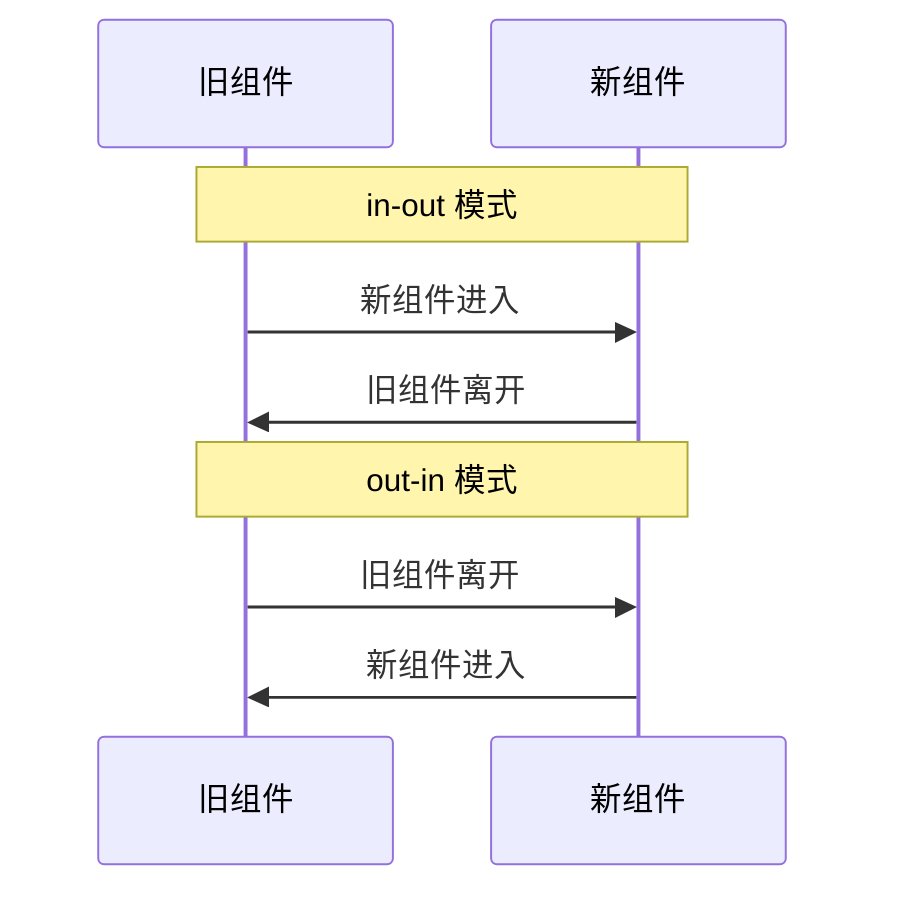

# Vue.js过渡模式

在Vue.js中，过渡（Transition）是一种在元素插入、更新或移除时应用动画效果的方式。Vue提供了强大的过渡系统，允许开发者通过简单的配置实现复杂的动画效果。其中，**过渡模式**（Transition Mode）是一个重要的概念，它决定了多个元素在过渡时的行为顺序。

## 什么是过渡模式？

过渡模式用于控制多个元素在过渡时的顺序和行为。Vue.js提供了两种过渡模式：

1. **`in-out`模式**：新元素先进入，旧元素再离开。
2. **`out-in`模式**：旧元素先离开，新元素再进入。

默认情况下，Vue.js会同时执行进入和离开的过渡效果。但在某些场景下，这种默认行为可能会导致视觉上的混乱。通过使用过渡模式，我们可以更好地控制过渡的顺序，确保动画效果更加流畅和自然。

## 过渡模式的使用

### 基本语法

在Vue.js中，我们可以通过`mode`属性来指定过渡模式。以下是一个简单的示例：

```vue
<template>
  <transition mode="out-in">
    <component :is="currentComponent" />
  </transition>
</template>

<script>
export default {
  data() {
    return {
      currentComponent: 'ComponentA'
    };
  }
};
</script>
```

在这个示例中，`mode="out-in"`表示旧组件会先离开，新组件再进入。这样可以避免两个组件同时出现在页面上的情况。

### 实际案例

假设我们有一个简单的应用，用户可以通过按钮在两个组件之间切换。我们希望切换时，旧组件先离开，新组件再进入。以下是完整的代码示例：

```vue
<template>
  <div>
    <button @click="toggleComponent">切换组件</button>
    <transition mode="out-in">
      <component :is="currentComponent" />
    </transition>
  </div>
</template>

<script>
export default {
  data() {
    return {
      currentComponent: 'ComponentA'
    };
  },
  methods: {
    toggleComponent() {
      this.currentComponent = this.currentComponent === 'ComponentA' ? 'ComponentB' : 'ComponentA';
    }
  },
  components: {
    ComponentA: {
      template: '<div>组件A</div>'
    },
    ComponentB: {
      template: '<div>组件B</div>'
    }
  }
};
</script>

<style>
.v-enter-active, .v-leave-active {
  transition: opacity 0.5s;
}
.v-enter, .v-leave-to {
  opacity: 0;
}
</style>
```

在这个示例中，当用户点击按钮时，当前组件会先淡出，然后新组件再淡入。这种过渡模式确保了动画的流畅性。

### 过渡模式的对比

为了更好地理解`in-out`和`out-in`模式的区别，我们可以通过以下图表来展示它们的行为：



从图表中可以看出，`in-out`模式会先让新组件进入，然后再让旧组件离开；而`out-in`模式则会先让旧组件离开，再让新组件进入。

## 总结

Vue.js的过渡模式为我们提供了更精细的控制，使得在多个元素之间切换时，动画效果更加自然和流畅。通过合理使用`in-out`和`out-in`模式，我们可以避免视觉上的混乱，提升用户体验。

:::tip 提示
在实际开发中，建议根据具体场景选择合适的过渡模式。例如，在组件切换时，通常使用`out-in`模式；而在某些特殊情况下，`in-out`模式可能会更适合。
:::

## 附加资源与练习

- **官方文档**：阅读Vue.js官方文档中关于[过渡与动画](https://v3.vuejs.org/guide/transitions.html)的部分，了解更多高级用法。
- **练习**：尝试在一个实际项目中使用过渡模式，观察不同模式下的动画效果，并思考如何优化用户体验。
