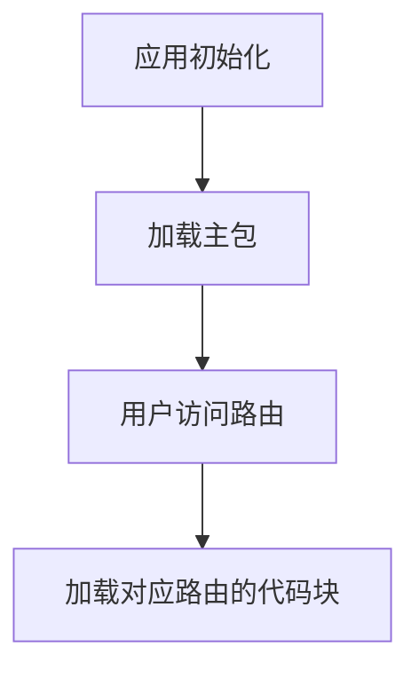

# Vue Router路由懒加载

在现代前端开发中，单页应用（SPA）的规模越来越大，JavaScript文件的体积也随之增加。为了优化应用的加载性能，Vue Router 提供了一种称为**路由懒加载**的技术。通过路由懒加载，我们可以将应用的代码分割成多个小块，只有在用户访问特定路由时，才会加载对应的代码块。这种方式可以显著减少初始加载时间，提升用户体验。

## 什么是路由懒加载？

路由懒加载是一种将路由对应的组件代码延迟加载的技术。在传统的路由配置中，所有组件的代码都会在应用初始化时一次性加载。这种方式虽然简单，但对于大型应用来说，可能会导致初始加载时间过长。

通过路由懒加载，我们可以将组件的加载推迟到用户实际访问该路由时。Vue Router 使用动态导入（Dynamic Import）来实现这一功能，动态导入是 JavaScript 的一个特性，允许我们在运行时异步加载模块。

## 如何实现路由懒加载？

在 Vue Router 中，实现路由懒加载非常简单。我们只需要将路由配置中的组件定义改为一个返回 `import()` 函数的箭头函数即可。

### 基本示例

以下是一个简单的路由懒加载示例：

```javascript
const routes = [
  {
    path: '/',
    component: () => import('@/views/Home.vue')
  },
  {
    path: '/about',
    component: () => import('@/views/About.vue')
  }
];
```

在这个示例中，`Home.vue` 和 `About.vue` 组件不会在应用初始化时加载，而是当用户访问 `/` 或 `/about` 路由时，才会异步加载对应的组件。

### 代码分割与性能优化

路由懒加载的核心优势在于它能够将应用的代码分割成多个小块。每个路由对应的组件会被打包成独立的 JavaScript 文件，只有在需要时才会加载。这种方式可以显著减少初始加载时间，尤其是在大型应用中。



通过这种方式，应用的初始加载时间会大大减少，因为主包只包含核心代码，而其他代码块则按需加载。

## 实际应用场景

### 大型应用中的路由懒加载

在大型应用中，路由懒加载尤为重要。假设我们有一个包含多个模块的应用，每个模块都有多个页面。如果所有页面的代码都在初始加载时加载，那么应用的初始加载时间会非常长。

通过路由懒加载，我们可以将每个模块的代码分割成独立的代码块，只有在用户访问该模块时才会加载对应的代码。这种方式可以显著提升应用的性能。

### 示例：电商网站

假设我们正在开发一个电商网站，包含以下路由：

- `/`：首页
- `/products`：产品列表页
- `/product/:id`：产品详情页
- `/cart`：购物车页
- `/checkout`：结算页

我们可以通过路由懒加载来优化这些页面的加载性能：

```javascript
const routes = [
  {
    path: '/',
    component: () => import('@/views/Home.vue')
  },
  {
    path: '/products',
    component: () => import('@/views/Products.vue')
  },
  {
    path: '/product/:id',
    component: () => import('@/views/ProductDetail.vue')
  },
  {
    path: '/cart',
    component: () => import('@/views/Cart.vue')
  },
  {
    path: '/checkout',
    component: () => import('@/views/Checkout.vue')
  }
];
```

在这个示例中，每个页面的代码都会在用户访问时异步加载，从而减少初始加载时间。

## 总结

路由懒加载是优化 Vue.js 应用性能的重要手段。通过将路由对应的组件代码延迟加载，我们可以显著减少应用的初始加载时间，提升用户体验。尤其是在大型应用中，路由懒加载可以帮助我们更好地管理代码分割和性能优化。

## 附加资源与练习

- **官方文档**：阅读 [Vue Router 官方文档](https://router.vuejs.org/) 以了解更多关于路由懒加载的细节。
- **练习**：尝试在你自己的 Vue.js 项目中实现路由懒加载，并观察应用的性能变化。

:::tip
在实际开发中，路由懒加载不仅可以用于组件，还可以用于其他资源，如图片、CSS 文件等。通过合理使用懒加载技术，可以进一步提升应用的性能。
:::