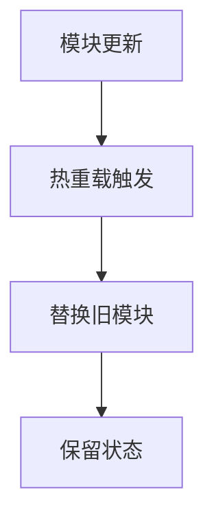

# Vuex热重载

## 介绍

在开发Vue.js应用时，Vuex作为状态管理工具，帮助我们集中管理应用的状态。然而，在开发过程中，频繁修改Vuex模块可能会导致状态丢失，从而影响开发效率。为了解决这个问题，Vuex提供了**热重载**（Hot Module Replacement, HMR）功能，允许我们在不丢失应用状态的情况下更新Vuex模块。

热重载是开发工具（如Webpack）提供的一种功能，它可以在运行时替换、添加或删除模块，而无需完全刷新页面。Vuex的热重载功能使得我们可以在开发过程中实时更新状态管理逻辑，而不会丢失当前的应用状态。

## 如何实现Vuex热重载

### 1. 基本配置

在Vuex中实现热重载非常简单。首先，确保你的项目使用了支持HMR的开发工具（如Webpack）。然后，在Vuex store的入口文件中添加热重载逻辑。

```javascript
import Vue from 'vue';
import Vuex from 'vuex';
import myModule from './modules/myModule';

Vue.use(Vuex);

const store = new Vuex.Store({
  modules: {
    myModule,
  },
});

// 热重载逻辑
if (module.hot) {
  module.hot.accept(['./modules/myModule'], () => {
    const newModule = require('./modules/myModule').default;
    store.hotUpdate({
      modules: {
        myModule: newModule,
      },
    });
  });
}

export default store;
```

在上面的代码中，我们使用了`module.hot.accept`方法来监听模块的变化。当`myModule`模块发生变化时，Vuex会通过`store.hotUpdate`方法更新模块，而不会丢失当前的状态。

### 2. 热重载的工作原理

热重载的核心在于`store.hotUpdate`方法。这个方法允许我们在运行时动态更新Vuex store中的模块。当模块发生变化时，Vuex会替换旧的模块，并保留当前的状态。



### 3. 实际案例

假设我们有一个简单的Vuex模块`myModule`，用于管理用户信息：

```javascript
// modules/myModule.js
export default {
  state: {
    user: {
      name: 'John Doe',
      age: 30,
    },
  },
  mutations: {
    updateUser(state, payload) {
      state.user = payload;
    },
  },
};
```

在开发过程中，我们可能会频繁修改`myModule`模块。例如，我们可能希望添加一个新的状态字段`email`：

```javascript
// modules/myModule.js
export default {
  state: {
    user: {
      name: 'John Doe',
      age: 30,
      email: 'john.doe@example.com', // 新增字段
    },
  },
  mutations: {
    updateUser(state, payload) {
      state.user = payload;
    },
  },
};
```

通过热重载，我们可以在不刷新页面的情况下更新`myModule`模块，并保留当前的用户信息。

### 4. 注意事项

- **状态保留**：热重载只会更新模块的定义，而不会重置状态。因此，确保在更新模块时，状态的结构与之前保持一致。
- **模块依赖**：如果模块之间存在依赖关系，热重载可能会导致依赖模块也需要更新。因此，确保所有相关模块都正确配置了热重载逻辑。

:::tip
在开发过程中，热重载可以显著提高开发效率。然而，在生产环境中，热重载功能通常会被禁用，因此请确保在构建生产版本时移除相关代码。
:::

## 总结

Vuex的热重载功能使得我们可以在开发过程中实时更新状态管理模块，而不会丢失当前的应用状态。通过简单的配置，我们可以充分利用这一功能，提高开发效率。

## 附加资源

- [Vuex官方文档](https://vuex.vuejs.org/)
- [Webpack HMR文档](https://webpack.js.org/concepts/hot-module-replacement/)

## 练习

1. 尝试在你的Vuex项目中配置热重载功能，并观察模块更新时的状态变化。
2. 修改一个现有的Vuex模块，添加新的状态字段，并验证热重载是否正常工作。