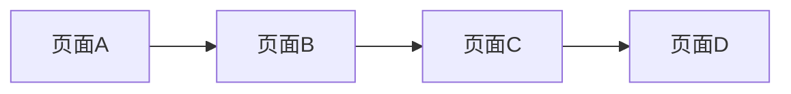

## 介绍

微信小程序是一种轻量级的应用程序，用户无需下载安装即可使用。小程序的运行机制是其核心之一，理解这些机制有助于开发者更好地构建和优化小程序。本文将详细介绍小程序的运行机制，包括生命周期、页面栈、数据绑定等关键概念。

## 小程序的生命周期

小程序的生命周期是指小程序从启动到销毁的整个过程。了解生命周期可以帮助开发者在合适的时机执行相应的操作。

### 应用生命周期

小程序的应用生命周期包括以下几个阶段：

1. **onLaunch**：小程序初始化时触发，全局只触发一次。
2. **onShow**：小程序启动或从后台进入前台时触发。
3. **onHide**：小程序从前台进入后台时触发。
4. **onError**：小程序发生脚本错误或 API 调用失败时触发。

```javascript
App({
  onLaunch(options) {
    console.log('小程序初始化完成');
  },
  onShow(options) {
    console.log('小程序显示');
  },
  onHide() {
    console.log('小程序隐藏');
  },
  onError(error) {
    console.log('小程序发生错误:', error);
  }
});
```

### 页面生命周期

每个页面也有自己的生命周期，主要包括以下几个阶段：

1. **onLoad**：页面加载时触发。
2. **onShow**：页面显示时触发。
3. **onReady**：页面初次渲染完成时触发。
4. **onHide**：页面隐藏时触发。
5. **onUnload**：页面卸载时触发。

```javascript
Page({
  onLoad(options) {
    console.log('页面加载完成');
  },
  onShow() {
    console.log('页面显示');
  },
  onReady() {
    console.log('页面初次渲染完成');
  },
  onHide() {
    console.log('页面隐藏');
  },
  onUnload() {
    console.log('页面卸载');
  }
});
```

:::tip
**提示**：在 `onLoad` 中，可以通过 `options` 参数获取页面跳转时传递的参数。
:::

## 页面栈

小程序的页面栈是一个后进先出（LIFO）的栈结构，用于管理页面的跳转和返回。每次打开一个新页面，该页面会被压入栈顶；返回时，栈顶的页面会被弹出。



:::note
**注意**：小程序最多只能有 10 层页面栈，超过这个限制后将无法打开新页面。
:::

### 页面跳转

小程序提供了多种页面跳转的方式，常用的 API 包括：

- `wx.navigateTo`：保留当前页面，跳转到新页面。
- `wx.redirectTo`：关闭当前页面，跳转到新页面。
- `wx.navigateBack`：返回上一页面或多级页面。

```javascript
// 跳转到新页面
wx.navigateTo({
  url: '/pages/newPage/newPage'
});

// 关闭当前页面，跳转到新页面
wx.redirectTo({
  url: '/pages/anotherPage/anotherPage'
});

// 返回上一页面
wx.navigateBack({
  delta: 1
});
```

## 数据绑定

小程序使用数据绑定来实现视图与数据的同步。数据绑定是通过 `Page` 中的 `data` 对象来实现的。

### 基本数据绑定

```javascript
Page({
  data: {
    message: 'Hello, 小程序!'
  }
});
```

在 WXML 中，可以通过双花括号 `{{}}` 来绑定数据：

```html
<view>{{message}}</view>
```

### 数据更新

通过 `setData` 方法可以更新数据，并自动触发视图的重新渲染。

```javascript
Page({
  data: {
    count: 0
  },
  increment() {
    this.setData({
      count: this.data.count + 1
    });
  }
});
```

在 WXML 中绑定事件：

```html
<view>{{count}}</view>
<button bindtap="increment">增加</button>
```

:::caution
**注意**：`setData` 是异步的，频繁调用可能会导致性能问题。
:::

## 实际案例

### 案例：计数器小程序

以下是一个简单的计数器小程序，展示了数据绑定和事件处理的基本用法。

```javascript
Page({
  data: {
    count: 0
  },
  increment() {
    this.setData({
      count: this.data.count + 1
    });
  },
  decrement() {
    this.setData({
      count: this.data.count - 1
    });
  }
});
```

```html
<view>{{count}}</view>
<button bindtap="increment">增加</button>
<button bindtap="decrement">减少</button>
```

## 总结

本文详细介绍了微信小程序的运行机制，包括生命周期、页面栈、数据绑定等核心概念。通过理解这些机制，开发者可以更好地构建和优化小程序。

## 附加资源

- [微信小程序官方文档](https://developers.weixin.qq.com/miniprogram/dev/framework/)
- [小程序开发指南](https://developers.weixin.qq.com/ebook?action=get_post_info&docid=0008aeea9a8978ab0086a685851c0a)

## 练习

1. 创建一个简单的小程序，实现一个待办事项列表，支持添加和删除任务。
2. 尝试在小程序中使用 `wx.navigateTo` 和 `wx.navigateBack` 实现页面跳转和返回功能。