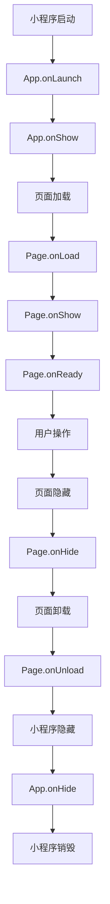

## 介绍

微信小程序的生命周期是指小程序从启动到销毁的整个过程。在这个过程中，小程序会经历多个阶段，每个阶段都有对应的生命周期函数（也称为钩子函数）。这些函数允许开发者在特定的时间点执行自定义逻辑，例如初始化数据、监听页面显示、处理页面隐藏等。

理解小程序的生命周期对于开发高效、稳定的小程序至关重要。本文将详细介绍小程序的生命周期及其各个阶段，并通过代码示例和实际案例帮助你更好地掌握这一概念。

---

## 小程序生命周期的阶段

小程序的生命周期可以分为 **应用生命周期** 和 **页面生命周期** 两部分。下面我们将分别介绍这两部分的内容。

### 1. 应用生命周期

应用生命周期是指整个小程序从启动到销毁的过程。以下是应用生命周期的主要阶段及其对应的钩子函数：

- **onLaunch**: 小程序初始化时触发，全局只触发一次。
- **onShow**: 小程序启动或从后台进入前台时触发。
- **onHide**: 小程序从前台进入后台时触发。
- **onError**: 小程序发生脚本错误或 API 调用失败时触发。

以下是一个简单的应用生命周期示例：

```javascript
// app.js
App({
  onLaunch(options) {
    console.log('小程序初始化完成');
  },
  onShow(options) {
    console.log('小程序显示');
  },
  onHide() {
    console.log('小程序隐藏');
  },
  onError(error) {
    console.error('小程序发生错误:', error);
  }
});
```

:::tip
- `onLaunch` 是小程序启动时第一个触发的生命周期函数，适合在这里初始化全局数据。
- `onShow` 和 `onHide` 可以用来监听小程序的显示和隐藏状态，例如暂停或恢复音视频播放。
:::

### 2. 页面生命周期

页面生命周期是指小程序中单个页面的生命周期。以下是页面生命周期的主要阶段及其对应的钩子函数：

- **onLoad**: 页面加载时触发，一个页面只会调用一次。
- **onShow**: 页面显示时触发，每次打开页面都会调用。
- **onReady**: 页面初次渲染完成时触发，一个页面只会调用一次。
- **onHide**: 页面隐藏时触发。
- **onUnload**: 页面卸载时触发。

以下是一个简单的页面生命周期示例：

```javascript
// pages/index/index.js
Page({
  onLoad(options) {
    console.log('页面加载完成');
  },
  onShow() {
    console.log('页面显示');
  },
  onReady() {
    console.log('页面初次渲染完成');
  },
  onHide() {
    console.log('页面隐藏');
  },
  onUnload() {
    console.log('页面卸载');
  }
});
```

:::note
- `onLoad` 是页面加载时触发的第一个生命周期函数，适合在这里获取页面参数并初始化数据。
- `onReady` 表示页面已经渲染完成，适合在这里操作页面 DOM 或执行动画。
:::

---

## 生命周期流程图

为了更好地理解小程序的生命周期，我们可以通过以下流程图来展示应用生命周期和页面生命周期的关系：



---

## 实际应用场景

### 场景 1: 页面跳转时传递参数

在小程序中，页面跳转时可以通过 URL 传递参数。我们可以在 `onLoad` 中获取这些参数并进行处理：

```javascript
// pages/detail/detail.js
Page({
  onLoad(options) {
    const id = options.id; // 获取 URL 参数
    console.log('商品 ID:', id);
    this.fetchProductDetail(id); // 根据 ID 获取商品详情
  },
  fetchProductDetail(id) {
    // 模拟网络请求
    setTimeout(() => {
      console.log('获取商品详情成功');
    }, 1000);
  }
});
```

### 场景 2: 监听页面显示和隐藏

在某些场景下，我们需要在页面显示或隐藏时执行特定操作。例如，当页面显示时开始播放视频，当页面隐藏时暂停视频：

```javascript
// pages/video/video.js
Page({
  onShow() {
    console.log('页面显示，开始播放视频');
    this.videoContext.play(); // 播放视频
  },
  onHide() {
    console.log('页面隐藏，暂停播放视频');
    this.videoContext.pause(); // 暂停视频
  },
  onReady() {
    this.videoContext = wx.createVideoContext('myVideo'); // 获取视频上下文
  }
});
```

---

## 总结

小程序的生命周期是开发微信小程序时必须掌握的核心概念之一。通过理解应用生命周期和页面生命周期，你可以在合适的时机执行初始化、数据加载、资源释放等操作，从而提升小程序的性能和用户体验。

- **应用生命周期**：关注整个小程序的启动、显示、隐藏和错误处理。
- **页面生命周期**：关注单个页面的加载、显示、渲染、隐藏和卸载。

---

## 附加资源与练习

1. **练习**：尝试在小程序中实现一个功能，当用户从后台切换回小程序时，显示一个欢迎弹窗。
2. **官方文档**：了解更多关于小程序生命周期的详细信息，请参考 [微信官方文档](https://developers.weixin.qq.com/miniprogram/dev/framework/app-service/app.html)。

:::caution
注意：在实际开发中，避免在生命周期函数中执行耗时操作，以免影响小程序的启动速度和用户体验。
:::