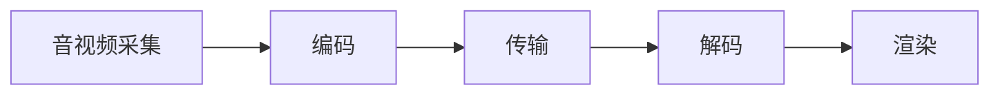

## 什么是实时音视频通话？

实时音视频通话是一种通过网络实时传输音频和视频数据的技术，允许用户在不同设备之间进行面对面的交流。这种技术广泛应用于视频会议、在线教育、远程医疗和社交娱乐等领域。

在小程序中，实时音视频通话通常通过集成第三方 SDK（如腾讯云 TRTC、声网 Agora 等）来实现。这些 SDK 提供了丰富的 API，帮助开发者快速构建高质量的实时音视频应用。

## 实时音视频通话的基本原理

实时音视频通话的核心技术包括音视频采集、编码、传输、解码和渲染。以下是其基本流程：

1. **音视频采集**：通过设备的摄像头和麦克风采集音视频数据。
2. **编码**：将采集到的音视频数据进行压缩编码，以减少传输带宽。
3. **传输**：通过网络将编码后的音视频数据传输到对方设备。
4. **解码**：对方设备接收到数据后，进行解码还原。
5. **渲染**：将解码后的音视频数据渲染到屏幕上，并播放音频。



## 在小程序中实现实时音视频通话

以下是一个简单的示例，展示如何在小程序中使用腾讯云 TRTC SDK 实现实时音视频通话。

### 1. 安装 SDK

首先，需要在项目中安装 TRTC SDK：

```bash
npm install trtc-js-sdk
```

### 2. 初始化 SDK

在页面中引入并初始化 TRTC SDK：

```javascript
import TRTC from 'trtc-js-sdk';

const client = TRTC.createClient({
  mode: 'rtc',
  sdkAppId: 'your-sdk-app-id',
  userId: 'your-user-id',
  userSig: 'your-user-sig'
});

client.on('stream-added', event => {
  const remoteStream = event.stream;
  client.subscribe(remoteStream);
});

client.on('stream-subscribed', event => {
  const remoteStream = event.stream;
  remoteStream.play('remote-video');
});

client.join({ roomId: 'your-room-id' })
  .then(() => {
    const localStream = TRTC.createStream({ userId: 'your-user-id', audio: true, video: true });
    return localStream.initialize();
  })
  .then(() => {
    client.publish(localStream);
    localStream.play('local-video');
  })
  .catch(error => {
    console.error('加入房间失败', error);
  });
```

### 3. 创建音视频流

在初始化 SDK 后，可以创建本地音视频流并将其发布到房间中：

```javascript
const localStream = TRTC.createStream({ userId: 'your-user-id', audio: true, video: true });
localStream.initialize().then(() => {
  client.publish(localStream);
  localStream.play('local-video');
});
```

### 4. 订阅远程音视频流

当有新的远程音视频流加入房间时，可以订阅并播放该流：

```javascript
client.on('stream-added', event => {
  const remoteStream = event.stream;
  client.subscribe(remoteStream);
});

client.on('stream-subscribed', event => {
  const remoteStream = event.stream;
  remoteStream.play('remote-video');
});
```

## 实际应用场景

实时音视频通话技术在许多领域都有广泛应用，以下是一些典型的应用场景：

1. **在线教育**：教师和学生可以通过实时音视频通话进行互动教学。
2. **远程医疗**：医生可以通过实时音视频通话为患者提供远程诊断和治疗建议。
3. **视频会议**：企业可以通过实时音视频通话进行远程会议，提高沟通效率。
4. **社交娱乐**：用户可以通过实时音视频通话与朋友进行视频聊天或在线游戏。

## 总结

实时音视频通话是一种强大的技术，能够为用户提供高质量的面对面交流体验。通过集成第三方 SDK，开发者可以快速在小程序中实现实时音视频通话功能。本文介绍了实时音视频通话的基本原理、实现步骤以及实际应用场景，希望能帮助你更好地理解和应用这一技术。

## 附加资源与练习

- **腾讯云 TRTC 官方文档**：[https://cloud.tencent.com/document/product/647](https://cloud.tencent.com/document/product/647)
- **声网 Agora 官方文档**：[https://docs.agora.io/cn/](https://docs.agora.io/cn/)

:::tip 练习
尝试在小程序中实现一个简单的实时音视频通话功能，并测试其在不同网络环境下的表现。
:::