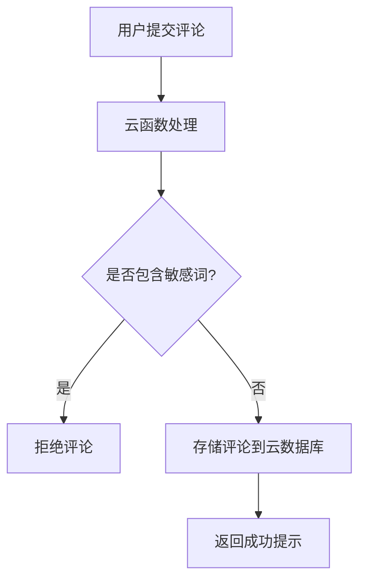

## 什么是云开发？

云开发（CloudBase）是一种基于云端的开发模式，开发者无需管理服务器，即可快速构建小程序、Web 应用等。它提供了一系列后端服务，包括云函数、云数据库、云存储等，帮助开发者专注于业务逻辑的实现，而无需关心底层基础设施的搭建和维护。

云开发的核心优势在于：
- **免运维**：无需管理服务器，所有后端服务由云平台自动托管。
- **快速开发**：提供开箱即用的功能模块，大幅缩短开发周期。
- **弹性扩展**：根据业务需求自动扩展资源，支持高并发场景。

---

## 云开发的核心组件

云开发主要由以下三个核心组件构成：

### 1. 云函数（Cloud Functions）
云函数是运行在云端的代码片段，开发者可以通过事件触发或手动调用来执行这些函数。云函数支持多种编程语言（如 JavaScript、Python 等），适合处理复杂的业务逻辑。

#### 示例：创建一个简单的云函数
以下是一个简单的云函数示例，用于返回当前时间：

```javascript
// 云函数入口文件
const cloud = require('wx-server-sdk')
cloud.init()

exports.main = async (event, context) => {
  const currentTime = new Date().toLocaleString()
  return {
    time: currentTime
  }
}
```

**调用云函数：**
```javascript
wx.cloud.callFunction({
  name: 'getTime',
  success: res => {
    console.log('当前时间：', res.result.time)
  }
})
```

**输出：**
```
当前时间：2023-10-05 14:30:00
```

:::tip
云函数适合处理需要复杂计算或与第三方服务交互的场景，例如支付接口调用、数据加密等。
:::

---

### 2. 云数据库（Cloud Database）
云数据库是一种基于 NoSQL 的文档型数据库，支持 JSON 格式的数据存储。它提供了简单易用的 API，开发者可以轻松实现数据的增删改查操作。

#### 示例：向云数据库插入一条数据
以下代码展示了如何向云数据库插入一条用户数据：

```javascript
const db = wx.cloud.database()
db.collection('users').add({
  data: {
    name: '小明',
    age: 18,
    city: '北京'
  },
  success: res => {
    console.log('数据插入成功，ID 为：', res._id)
  }
})
```

**输出：**
```
数据插入成功，ID 为：1234567890abcdef
```

:::note
云数据库支持实时数据同步，适合需要频繁更新数据的场景，例如聊天应用、实时排行榜等。
:::

---

### 3. 云存储（Cloud Storage）
云存储提供了文件上传、下载和管理的能力，开发者可以将图片、视频等文件存储在云端，并通过 URL 访问这些文件。

#### 示例：上传文件到云存储
以下代码展示了如何上传一张图片到云存储：

```javascript
wx.cloud.uploadFile({
  cloudPath: 'images/example.jpg',
  filePath: '本地文件路径',
  success: res => {
    console.log('文件上传成功，文件 ID 为：', res.fileID)
  }
})
```

**输出：**
```
文件上传成功，文件 ID 为：cloud://example.jpg
```

:::caution
云存储适合存储用户生成的内容（如头像、照片等），但需要注意文件大小和存储空间的限制。
:::

---

## 实际应用场景

### 案例：小程序中的用户评论功能
假设我们需要为一个小程序开发用户评论功能，以下是实现步骤：
1. **前端页面**：用户输入评论内容并提交。
2. **云函数**：接收评论数据，进行内容审核（如敏感词过滤）。
3. **云数据库**：将审核通过的评论存储到数据库中。
4. **云存储**：如果用户上传了图片，将图片存储到云存储中。



---

## 总结

云开发为小程序开发者提供了强大的后端支持，通过云函数、云数据库和云存储，开发者可以快速实现复杂的业务逻辑，而无需关心服务器的运维。无论是处理数据、存储文件，还是实现实时交互，云开发都能提供高效的解决方案。

---

## 附加资源与练习

### 资源
- [微信云开发官方文档](https://developers.weixin.qq.com/miniprogram/dev/wxcloud/basis/getting-started.html)
- [云函数开发指南](https://developers.weixin.qq.com/miniprogram/dev/wxcloud/guide/functions.html)

### 练习
1. 创建一个云函数，实现简单的加法运算，并返回结果。
2. 使用云数据库存储用户信息，并实现数据的查询和更新功能。
3. 尝试上传一张图片到云存储，并在小程序中显示该图片。

通过以上练习，你将更好地掌握云开发的核心概念和应用方法。祝你学习愉快！