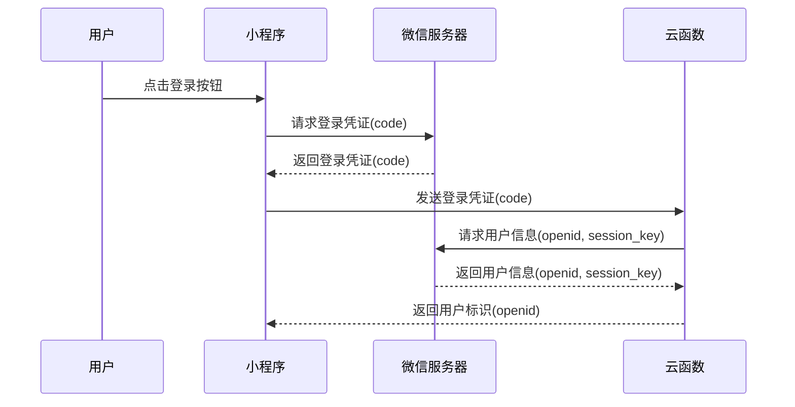

# 云开发身份认证

在小程序云开发中，身份认证是一个非常重要的功能。它允许开发者验证用户的身份，确保只有经过授权的用户才能访问特定的资源或执行特定的操作。本文将详细介绍云开发中的身份认证机制，并通过实际案例帮助你理解其应用场景。

## 什么是身份认证？

身份认证是验证用户身份的过程。在小程序中，用户通常通过微信登录，系统会生成一个唯一的用户标识（`openid`）来标识该用户。通过身份认证，开发者可以确保用户是合法的，并根据用户的身份提供相应的服务。

## 云开发中的身份认证机制

小程序云开发提供了多种身份认证方式，主要包括以下几种：

1. **微信登录**：用户通过微信登录小程序，系统会生成一个 `openid` 和 `session_key`，用于标识用户和维持会话。
2. **云函数调用**：通过云函数，开发者可以获取用户的 `openid` 并进行身份验证。
3. **云数据库权限控制**：云数据库支持基于用户身份的权限控制，确保用户只能访问自己有权限的数据。

### 微信登录流程

微信登录是小程序中最常见的身份认证方式。以下是微信登录的基本流程：



### 获取用户 `openid`

在小程序中，用户登录后会生成一个临时的登录凭证 `code`，开发者可以通过云函数调用微信服务器的接口，获取用户的 `openid` 和 `session_key`。

以下是一个获取 `openid` 的云函数示例：

```javascript
// 云函数入口文件
const cloud = require('wx-server-sdk')
cloud.init()

// 云函数入口函数
exports.main = async (event, context) => {
  const { code } = event

  // 通过 code 获取 openid 和 session_key
  const res = await cloud.getOpenData({
    code
  })

  return {
    openid: res.openid,
    session_key: res.session_key
  }
}
```

### 云数据库权限控制

云数据库支持基于用户身份的权限控制。开发者可以通过设置数据库的权限规则，确保用户只能访问自己有权限的数据。

例如，假设我们有一个 `users` 集合，其中每个文档都有一个 `_openid` 字段，表示该文档属于哪个用户。我们可以设置以下权限规则：

```json
{
  "read": "auth.openid == doc._openid",
  "write": "auth.openid == doc._openid"
}
```

这样，只有文档的创建者才能读取和修改该文档。

## 实际案例：用户信息管理

假设我们正在开发一个用户信息管理系统，用户可以通过小程序登录并查看自己的个人信息。以下是实现该功能的步骤：

1. **用户登录**：用户通过微信登录小程序，获取 `openid`。
2. **存储用户信息**：将用户的 `openid` 和其他信息存储到云数据库中。
3. **查询用户信息**：用户登录后，通过 `openid` 查询自己的信息。

### 存储用户信息

以下是一个存储用户信息的云函数示例：

```javascript
// 云函数入口文件
const cloud = require('wx-server-sdk')
cloud.init()

// 云函数入口函数
exports.main = async (event, context) => {
  const { openid, userInfo } = event

  // 将用户信息存储到云数据库
  const db = cloud.database()
  const res = await db.collection('users').add({
    data: {
      _openid: openid,
      ...userInfo
    }
  })

  return res
}
```

### 查询用户信息

以下是一个查询用户信息的云函数示例：

```javascript
// 云函数入口文件
const cloud = require('wx-server-sdk')
cloud.init()

// 云函数入口函数
exports.main = async (event, context) => {
  const { openid } = event

  // 查询用户信息
  const db = cloud.database()
  const res = await db.collection('users').where({
    _openid: openid
  }).get()

  return res.data
}
```

## 总结

通过本文，你已经了解了小程序云开发中的身份认证机制，并掌握了如何通过云函数和云数据库实现用户身份验证。身份认证是小程序开发中不可或缺的一部分，它确保了用户数据的安全性和隐私性。

## 附加资源与练习

- **练习**：尝试在你的小程序中实现一个简单的用户登录功能，并存储用户的 `openid` 和其他信息。
- **进一步学习**：阅读微信官方文档，了解更多关于微信登录和云数据库权限控制的内容。

:::tip
在实际开发中，确保正确处理用户的 `session_key`，避免泄露用户敏感信息。
:::

:::caution
云数据库的权限规则设置非常重要，务必仔细检查，确保用户只能访问自己有权限的数据。
:::