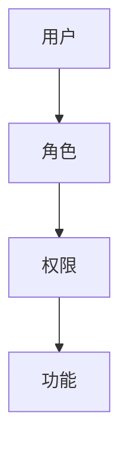

# 用户角色管理

在小程序开发中，用户角色管理是一个重要的功能，它允许开发者根据用户的角色来控制其访问权限和操作权限。通过合理的角色管理，可以确保系统的安全性和灵活性，同时为用户提供更好的体验。

## 什么是用户角色管理？

用户角色管理是指根据用户的身份和职责，为其分配不同的角色，并通过这些角色来控制其在小程序中的权限。例如，管理员可以访问所有功能，而普通用户只能访问部分功能。

### 角色与权限的关系

角色是权限的集合。每个角色可以拥有多个权限，而每个权限则对应一个具体的操作或功能。通过将用户分配到不同的角色，可以轻松地管理用户的权限。



## 如何实现用户角色管理？

### 1. 定义角色和权限

首先，我们需要定义系统中的角色和权限。例如，我们可以定义以下角色和权限：

- **角色**：
  - 管理员
  - 普通用户
- **权限**：
  - 查看所有数据
  - 编辑数据
  - 删除数据

### 2. 分配角色给用户

在用户注册或登录时，我们可以根据用户的身份为其分配相应的角色。例如，管理员用户会被分配为“管理员”角色，而普通用户会被分配为“普通用户”角色。

```javascript
const users = [
  { id: 1, name: 'Alice', role: 'admin' },
  { id: 2, name: 'Bob', role: 'user' }
];
```

### 3. 检查用户权限

在用户尝试执行某个操作时，我们需要检查其角色是否拥有相应的权限。例如，只有管理员才能删除数据。

```javascript
function canDeleteData(user) {
  return user.role === 'admin';
}

const user = { id: 1, name: 'Alice', role: 'admin' };
if (canDeleteData(user)) {
  console.log('允许删除数据');
} else {
  console.log('无权删除数据');
}
```

### 4. 动态权限管理

在实际应用中，权限管理可能需要更加灵活。我们可以通过数据库或配置文件来动态管理角色和权限，而不是硬编码在代码中。

```javascript
const roles = {
  admin: ['viewAllData', 'editData', 'deleteData'],
  user: ['viewAllData']
};

function hasPermission(user, permission) {
  return roles[user.role].includes(permission);
}

const user = { id: 2, name: 'Bob', role: 'user' };
if (hasPermission(user, 'deleteData')) {
  console.log('允许删除数据');
} else {
  console.log('无权删除数据');
}
```

## 实际案例

假设我们正在开发一个电商小程序，其中包含以下功能：

- 查看商品列表
- 添加商品
- 删除商品

我们可以定义以下角色和权限：

- **管理员**：可以查看、添加和删除商品。
- **普通用户**：只能查看商品。

```javascript
const roles = {
  admin: ['viewProducts', 'addProduct', 'deleteProduct'],
  user: ['viewProducts']
};

function checkPermission(user, action) {
  return roles[user.role].includes(action);
}

const adminUser = { id: 1, name: 'Alice', role: 'admin' };
const normalUser = { id: 2, name: 'Bob', role: 'user' };

console.log(checkPermission(adminUser, 'deleteProduct')); // 输出: true
console.log(checkPermission(normalUser, 'deleteProduct')); // 输出: false
```

## 总结

用户角色管理是小程序开发中不可或缺的一部分。通过合理的角色和权限分配，可以有效地控制用户的访问和操作权限，确保系统的安全性和灵活性。在实际开发中，建议使用动态的权限管理方式，以便于扩展和维护。

:::tip
在实际项目中，建议将角色和权限存储在数据库中，并通过 API 动态获取，以便于管理和扩展。
:::

## 附加资源与练习

- **练习**：尝试在你的小程序中实现一个简单的用户角色管理系统，定义不同的角色和权限，并测试其功能。
- **资源**：
  - [MDN Web Docs: JavaScript](https://developer.mozilla.org/zh-CN/docs/Web/JavaScript)
  - [小程序官方文档](https://developers.weixin.qq.com/miniprogram/dev/framework/)

通过学习和实践，你将能够更好地理解和应用用户角色管理的概念，为你的小程序开发打下坚实的基础。