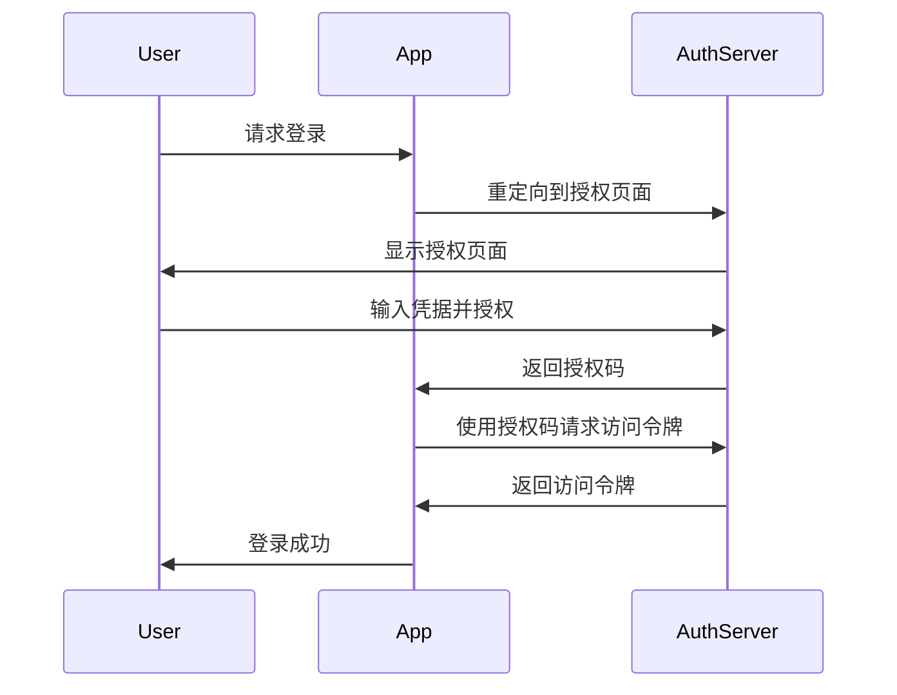

## 介绍

在小程序开发中，登录与授权是用户与应用程序交互的核心部分。然而，如果处理不当，可能会导致用户数据泄露、账户被盗等安全问题。因此，掌握登录安全的最佳实践至关重要。本文将详细介绍如何在小程序中实现安全的登录与授权机制，确保用户数据的安全性。

## 1. 使用 HTTPS 加密通信

所有与登录相关的请求都应通过 HTTPS 进行加密传输，以防止数据在传输过程中被窃取或篡改。确保你的服务器配置了有效的 SSL/TLS 证书。

```javascript
// 示例：使用 HTTPS 发送登录请求
fetch('https://your-api.com/login', {
  method: 'POST',
  headers: {
    'Content-Type': 'application/json',
  },
  body: JSON.stringify({
    username: 'user',
    password: 'password',
  }),
});
```

## 2. 使用强密码策略

强制用户使用强密码是防止账户被暴力破解的有效方法。强密码通常包括大小写字母、数字和特殊字符，并且长度至少为 8 个字符。

```javascript
// 示例：密码强度验证
function validatePassword(password) {
  const regex = /^(?=.*[a-z])(?=.*[A-Z])(?=.*\d)(?=.*[@$!%*?&])[A-Za-z\d@$!%*?&]{8,}$/;
  return regex.test(password);
}
```

## 3. 使用 OAuth 2.0 进行授权

OAuth 2.0 是一种广泛使用的授权框架，允许用户在不共享密码的情况下授权第三方应用访问其资源。通过使用 OAuth 2.0，你可以减少密码泄露的风险。



## 4. 使用多因素认证 (MFA)

多因素认证通过要求用户提供两种或更多种验证方式（如密码和短信验证码）来增强账户的安全性。即使密码泄露，攻击者也无法轻易访问账户。

```javascript
// 示例：发送短信验证码
function sendVerificationCode(phoneNumber) {
  // 调用短信服务 API 发送验证码
}
```

## 5. 定期更新和轮换密钥

定期更新和轮换用于加密和签名的密钥，以防止密钥泄露后被长期利用。确保密钥管理策略符合安全最佳实践。

```javascript
// 示例：密钥轮换
function rotateKeys() {
  // 生成新的密钥并更新系统配置
}
```

## 6. 防止暴力破解攻击

通过限制登录尝试次数和使用 CAPTCHA 来防止暴力破解攻击。例如，可以在用户连续多次输入错误密码后锁定账户或要求用户完成 CAPTCHA 验证。

```javascript
// 示例：限制登录尝试次数
let loginAttempts = 0;
function login(username, password) {
  if (loginAttempts >= 3) {
    throw new Error('Too many login attempts. Please try again later.');
  }
  // 验证用户名和密码
  if (validateCredentials(username, password)) {
    loginAttempts = 0;
    return 'Login successful';
  } else {
    loginAttempts++;
    throw new Error('Invalid credentials');
  }
}
```

## 7. 记录和监控登录活动

记录用户的登录活动并监控异常行为，如异地登录、频繁登录失败等。及时发现并响应潜在的安全威胁。

```javascript
// 示例：记录登录活动
function logLoginActivity(userId, ipAddress) {
  // 将登录活动记录到数据库
}
```

## 实际案例

假设你正在开发一个电商小程序，用户需要通过手机号和密码登录。为了确保登录安全，你采取了以下措施：

1. 使用 HTTPS 加密所有登录请求。
2. 强制用户设置强密码。
3. 使用 OAuth 2.0 进行第三方登录授权。
4. 在用户登录时发送短信验证码进行多因素认证。
5. 定期轮换用于加密用户数据的密钥。
6. 限制登录尝试次数，并在多次失败后锁定账户。
7. 记录用户的登录活动并监控异常行为。

通过这些措施，你的小程序能够有效防止账户被盗和数据泄露，确保用户数据的安全性。

## 总结

登录安全是小程序开发中不可忽视的重要环节。通过使用 HTTPS 加密通信、强密码策略、OAuth 2.0 授权、多因素认证、密钥轮换、防止暴力破解攻击以及记录和监控登录活动，你可以显著提高小程序的安全性，保护用户数据免受威胁。

## 附加资源

- [OAuth 2.0 官方文档](https://oauth.net/2/)
- [HTTPS 配置指南](https://letsencrypt.org/getting-started/)
- [多因素认证最佳实践](https://www.nist.gov/itl/tig/projects/multifactor-authentication)

## 练习

1. 实现一个密码强度验证函数，确保密码包含大小写字母、数字和特殊字符，并且长度至少为 8 个字符。
2. 使用 OAuth 2.0 实现一个第三方登录功能，允许用户通过微信登录你的小程序。
3. 编写一个函数，限制用户登录尝试次数，并在多次失败后锁定账户。

通过完成这些练习，你将更好地理解和掌握登录安全的最佳实践。