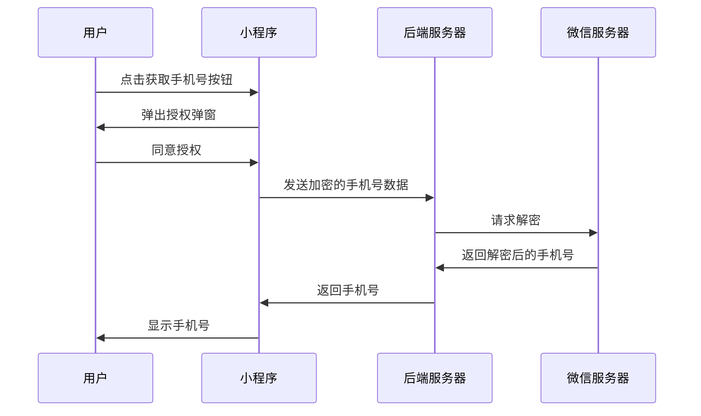

# 手机号获取

在小程序开发中，获取用户的手机号是一个常见的需求。通过获取用户的手机号，开发者可以为用户提供个性化的服务，例如发送验证码、绑定手机号等。本文将详细介绍如何在小程序中实现手机号获取功能，包括授权流程、代码实现以及实际应用场景。

## 1. 介绍

在小程序中，获取用户的手机号需要经过用户的授权。微信小程序提供了 `button` 组件的 `open-type` 属性，通过设置 `getPhoneNumber` 来触发获取手机号的事件。用户点击按钮后，会弹出授权弹窗，用户同意授权后，开发者可以通过事件回调获取加密的手机号数据，然后通过后端接口解密获取用户的手机号。

## 2. 授权流程

获取用户手机号的流程如下：

1. 用户点击获取手机号的按钮。
2. 弹出授权弹窗，用户同意授权。
3. 小程序前端获取加密的手机号数据。
4. 将加密数据发送到后端服务器。
5. 后端服务器通过微信提供的接口解密数据，获取用户手机号。



## 3. 代码实现

### 3.1 前端代码

在小程序的前端代码中，我们需要使用 `button` 组件，并设置 `open-type` 为 `getPhoneNumber`，同时绑定 `bindgetphonenumber` 事件来获取加密的手机号数据。

```jsx
<button open-type="getPhoneNumber" bindgetphonenumber="getPhoneNumber">
  获取手机号
</button>
```

在 `Page` 的 `js` 文件中，我们需要定义 `getPhoneNumber` 事件处理函数：

```javascript
Page({
  getPhoneNumber(e) {
    if (e.detail.errMsg === 'getPhoneNumber:ok') {
      const encryptedData = e.detail.encryptedData;
      const iv = e.detail.iv;

      // 将 encryptedData 和 iv 发送到后端服务器
      wx.request({
        url: 'https://your-backend-server.com/getPhoneNumber',
        method: 'POST',
        data: {
          encryptedData: encryptedData,
          iv: iv
        },
        success(res) {
          const phoneNumber = res.data.phoneNumber;
          console.log('获取到的手机号:', phoneNumber);
        }
      });
    } else {
      console.error('获取手机号失败:', e.detail.errMsg);
    }
  }
});
```

### 3.2 后端代码

在后端服务器中，我们需要使用微信提供的解密接口来解密手机号数据。以下是一个使用 Node.js 的示例代码：

```javascript
const crypto = require('crypto');
const axios = require('axios');

async function decryptPhoneNumber(encryptedData, iv, sessionKey) {
  const encryptedDataBuffer = Buffer.from(encryptedData, 'base64');
  const sessionKeyBuffer = Buffer.from(sessionKey, 'base64');
  const ivBuffer = Buffer.from(iv, 'base64');

  const decipher = crypto.createDecipheriv('aes-128-cbc', sessionKeyBuffer, ivBuffer);
  let decoded = decipher.update(encryptedDataBuffer, 'binary', 'utf8');
  decoded += decipher.final('utf8');

  const phoneNumber = JSON.parse(decoded).purePhoneNumber;
  return phoneNumber;
}

app.post('/getPhoneNumber', async (req, res) => {
  const { encryptedData, iv } = req.body;
  const sessionKey = await getSessionKey(req); // 获取用户的 sessionKey

  try {
    const phoneNumber = await decryptPhoneNumber(encryptedData, iv, sessionKey);
    res.json({ phoneNumber });
  } catch (error) {
    res.status(500).json({ error: '解密失败' });
  }
});
```

:::note
**注意**：在实际开发中，`sessionKey` 需要通过用户的 `code` 从微信服务器获取。确保 `sessionKey` 的安全性，避免泄露。
:::

## 4. 实际应用场景

获取用户手机号的功能在许多场景中都非常有用，例如：

- **用户注册**：用户可以通过手机号快速注册账号。
- **手机号绑定**：用户可以将手机号绑定到已有账号，方便后续登录和找回密码。
- **短信验证**：通过手机号发送验证码，验证用户身份。

## 5. 总结

通过本文的学习，你应该已经掌握了如何在小程序中获取用户手机号的方法。我们介绍了授权流程、前端和后端的代码实现，并探讨了实际应用场景。获取用户手机号是一个常见的需求，但在实现过程中需要注意用户隐私和数据安全。

## 6. 附加资源与练习

- **练习**：尝试在自己的小程序中实现手机号获取功能，并将获取到的手机号显示在页面上。
- **资源**：
  - [微信小程序官方文档 - 获取手机号](https://developers.weixin.qq.com/miniprogram/dev/framework/open-ability/getPhoneNumber.html)
  - [Node.js 加密模块文档](https://nodejs.org/api/crypto.html)

:::tip
**提示**：在实际开发中，建议对用户的手机号进行加密存储，并遵守相关隐私政策，确保用户数据的安全。
:::