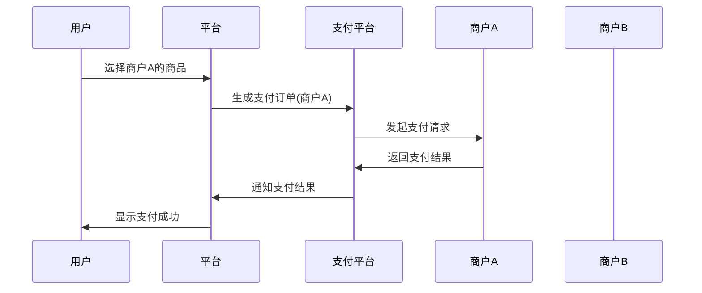

## 介绍

在小程序支付功能中，**多商户支付**是指一个平台支持多个商户同时接入支付功能，用户可以在同一个平台内完成对不同商户的支付操作。这种模式常见于电商平台、外卖平台等场景，允许用户在一个应用中购买不同商家的商品或服务。

多商户支付的核心在于如何管理多个商户的支付信息，确保支付流程的清晰和安全。接下来，我们将逐步讲解多商户支付的实现原理、代码示例以及实际应用场景。

---

## 多商户支付的实现原理

多商户支付的实现通常涉及以下几个关键步骤：

1. **商户注册与认证**：每个商户需要在支付平台注册并完成认证，获取唯一的商户标识（如 `merchant_id`）。
2. **支付订单生成**：用户下单时，平台根据商户标识生成对应的支付订单。
3. **支付请求分发**：平台将支付请求分发到对应的商户支付接口。
4. **支付结果回调**：支付完成后，支付平台将结果回调给平台和商户。

以下是一个简化的多商户支付流程示意图：



---

## 代码示例

以下是一个简单的多商户支付实现示例，假设我们使用微信小程序支付功能。

### 1. 商户注册与认证

每个商户在支付平台注册后，会获得一个唯一的 `merchant_id`。平台需要存储这些信息以便后续使用。

```javascript
const merchants = [
  { merchant_id: 'M001', name: '商户A', api_key: 'key_for_merchant_A' },
  { merchant_id: 'M002', name: '商户B', api_key: 'key_for_merchant_B' },
];
```

### 2. 生成支付订单

根据用户选择的商户生成支付订单。

```javascript
function createPaymentOrder(merchant_id, amount) {
  const merchant = merchants.find(m => m.merchant_id === merchant_id);
  if (!merchant) {
    throw new Error('商户不存在');
  }

  const order = {
    merchant_id: merchant.merchant_id,
    amount: amount,
    timestamp: Date.now(),
  };

  return order;
}
```

### 3. 发起支付请求

使用微信小程序的支付 API 发起支付请求。

```javascript
function requestPayment(order) {
  wx.requestPayment({
    timeStamp: order.timestamp.toString(),
    nonceStr: '随机字符串',
    package: `prepay_id=${order.prepay_id}`,
    signType: 'MD5',
    paySign: '签名',
    success(res) {
      console.log('支付成功', res);
    },
    fail(res) {
      console.log('支付失败', res);
    },
  });
}
```

### 4. 支付结果回调

支付完成后，支付平台会回调平台和商户的接口。

```javascript
app.post('/payment/callback', (req, res) => {
  const { merchant_id, order_id, status } = req.body;
  console.log(`商户 ${merchant_id} 的订单 ${order_id} 支付状态: ${status}`);
  res.send('OK');
});
```

---

## 实际应用场景

### 电商平台

在一个电商平台中，用户可以在不同商家的店铺中购买商品。平台需要支持多商户支付，确保每个商家的订单能够独立处理。

### 外卖平台

外卖平台通常有多个餐厅入驻。用户下单后，平台需要将支付请求分发到对应的餐厅支付接口，确保支付流程的顺畅。

---

## 总结

多商户支付是小程序支付功能中的重要组成部分，适用于需要支持多个商户的场景。通过合理的商户管理、订单生成和支付请求分发，可以实现高效且安全的支付流程。

---

## 附加资源与练习

- **练习**：尝试在一个小程序中实现多商户支付功能，支持至少两个商户。
- **资源**：
  - [微信小程序支付文档](https://developers.weixin.qq.com/miniprogram/dev/api/payment/wx.requestPayment.html)
  - [支付平台商户管理 API 文档](https://example.com/merchant-api)
