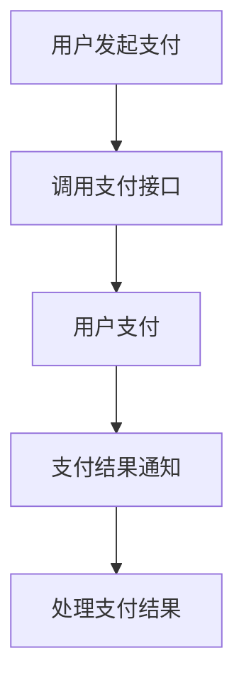

## 介绍

在小程序开发中，支付功能是一个非常重要的环节。用户完成支付后，小程序需要及时处理支付结果，以确保支付流程的完整性和用户体验的流畅性。支付结果处理不仅包括支付成功和支付失败的处理，还涉及到支付状态的查询、订单状态的更新等操作。

本文将详细介绍如何在小程序中处理支付结果，包括支付成功、支付失败、支付状态查询等操作，并通过实际案例展示这些概念的应用。

## 支付结果处理的基本流程

支付结果处理的基本流程如下：

1. **用户发起支付**：用户在小程序中选择商品并确认支付。
2. **调用支付接口**：小程序调用微信支付接口，生成支付订单。
3. **用户支付**：用户在微信支付页面完成支付。
4. **支付结果通知**：微信支付服务器将支付结果通知到小程序服务器。
5. **处理支付结果**：小程序服务器根据支付结果更新订单状态，并通知小程序前端。



## 支付结果通知

微信支付服务器会在用户支付完成后，向小程序服务器发送支付结果通知。小程序服务器需要接收并处理这些通知，以确保订单状态的及时更新。

### 接收支付结果通知

小程序服务器需要提供一个接口来接收微信支付服务器的支付结果通知。以下是一个简单的示例：

```javascript
app.post('/pay/notify', (req, res) => {
    const { out_trade_no, transaction_id, result_code } = req.body;

    if (result_code === 'SUCCESS') {
        // 支付成功，更新订单状态
        updateOrderStatus(out_trade_no, 'paid', transaction_id);
    } else {
        // 支付失败，更新订单状态
        updateOrderStatus(out_trade_no, 'failed');
    }

    // 返回成功响应
    res.send('<xml><return_code><![CDATA[SUCCESS]]></return_code><return_msg><![CDATA[OK]]></return_msg></xml>');
});
```

### 处理支付结果

在接收到支付结果通知后，小程序服务器需要根据支付结果更新订单状态。以下是一个简单的示例：

```javascript
function updateOrderStatus(orderId, status, transactionId = null) {
    // 根据订单ID查询订单
    const order = getOrderById(orderId);

    if (order) {
        // 更新订单状态
        order.status = status;
        if (transactionId) {
            order.transactionId = transactionId;
        }

        // 保存订单
        saveOrder(order);
    }
}
```

## 支付状态查询

在某些情况下，小程序可能需要主动查询支付状态，以确保支付结果的准确性。例如，当支付结果通知未能及时到达时，小程序可以通过查询接口获取支付状态。

### 查询支付状态

以下是一个简单的示例，展示如何通过微信支付接口查询支付状态：

```javascript
function queryPaymentStatus(orderId) {
    const url = `https://api.mch.weixin.qq.com/pay/orderquery`;
    const params = {
        appid: 'your-appid',
        mch_id: 'your-mch-id',
        out_trade_no: orderId,
        nonce_str: generateNonceStr(),
        sign_type: 'MD5',
    };

    // 生成签名
    params.sign = generateSign(params);

    // 发送请求
    axios.post(url, params).then(response => {
        const { return_code, result_code, trade_state } = response.data;

        if (return_code === 'SUCCESS' && result_code === 'SUCCESS') {
            if (trade_state === 'SUCCESS') {
                // 支付成功，更新订单状态
                updateOrderStatus(orderId, 'paid');
            } else {
                // 支付失败，更新订单状态
                updateOrderStatus(orderId, 'failed');
            }
        }
    });
}
```

## 实际案例

假设你正在开发一个电商小程序，用户可以在小程序中购买商品。在用户完成支付后，你需要处理支付结果，并更新订单状态。

### 案例场景

1. **用户支付成功**：用户支付成功后，微信支付服务器会发送支付结果通知到你的服务器。你需要在服务器端更新订单状态为“已支付”，并通知小程序前端支付成功。
2. **用户支付失败**：如果用户支付失败，你需要更新订单状态为“支付失败”，并通知小程序前端支付失败。
3. **支付状态查询**：如果支付结果通知未能及时到达，你可以通过查询接口获取支付状态，并更新订单状态。

### 案例代码

以下是一个简单的案例代码，展示如何处理支付结果：

```javascript
app.post('/pay/notify', (req, res) => {
    const { out_trade_no, transaction_id, result_code } = req.body;

    if (result_code === 'SUCCESS') {
        // 支付成功，更新订单状态
        updateOrderStatus(out_trade_no, 'paid', transaction_id);
        notifyFrontend(out_trade_no, '支付成功');
    } else {
        // 支付失败，更新订单状态
        updateOrderStatus(out_trade_no, 'failed');
        notifyFrontend(out_trade_no, '支付失败');
    }

    // 返回成功响应
    res.send('<xml><return_code><![CDATA[SUCCESS]]></return_code><return_msg><![CDATA[OK]]></return_msg></xml>');
});

function notifyFrontend(orderId, message) {
    // 通知小程序前端支付结果
    // 这里可以使用WebSocket或其他方式通知前端
}
```

## 总结

支付结果处理是小程序支付功能中非常重要的一环。通过正确处理支付结果，你可以确保支付流程的完整性和用户体验的流畅性。本文介绍了支付结果处理的基本流程、支付结果通知的接收与处理、支付状态的查询以及实际案例的应用。

希望本文能帮助你更好地理解小程序中的支付结果处理，并在实际开发中应用这些知识。

## 附加资源与练习

- **练习**：尝试在你的小程序中实现支付结果处理功能，并测试支付成功和支付失败的情况。
- **资源**：阅读微信支付官方文档，了解更多关于支付接口和支付结果处理的详细信息。

:::tip
在实际开发中，建议使用微信支付提供的SDK来简化支付接口的调用和支付结果的处理。
:::