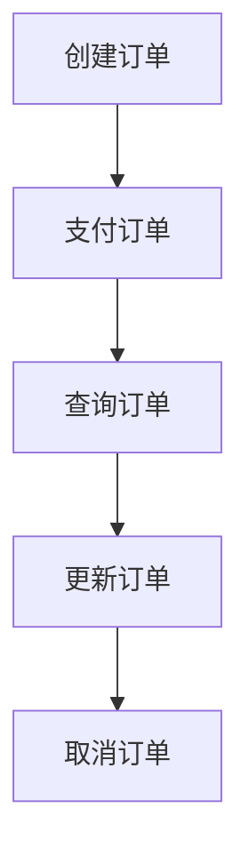

## 介绍

在小程序支付功能中，订单管理是一个至关重要的环节。它涉及从用户下单到支付完成的整个流程，包括订单的创建、查询、更新和取消等操作。订单管理不仅关系到用户体验，还直接影响到商家的业务运营。因此，掌握订单管理的基本概念和实现方法对于开发小程序支付功能至关重要。

## 订单的生命周期

订单的生命周期通常包括以下几个阶段：

1. **创建订单**：用户在小程序中选择商品并提交订单。
2. **支付订单**：用户完成支付操作。
3. **查询订单**：用户或商家可以查询订单的状态。
4. **更新订单**：商家可以根据订单的状态更新订单信息。
5. **取消订单**：用户或商家可以取消未支付的订单。



## 创建订单

创建订单是订单管理的第一步。通常，用户在小程序中选择商品并提交订单后，系统会生成一个唯一的订单号，并将订单信息存储在数据库中。

### 代码示例

```javascript
// 创建订单的示例代码
function createOrder(userId, productId, quantity) {
    const orderId = generateOrderId(); // 生成唯一订单号
    const order = {
        orderId,
        userId,
        productId,
        quantity,
        status: 'pending', // 订单状态：待支付
        createdAt: new Date()
    };
    saveOrderToDatabase(order); // 将订单保存到数据库
    return orderId;
}
```

### 输入与输出

- **输入**：`userId`（用户ID）、`productId`（商品ID）、`quantity`（数量）
- **输出**：`orderId`（订单ID）

## 支付订单

支付订单是订单管理中的关键步骤。用户完成支付后，订单状态会从“待支付”变为“已支付”。

### 代码示例

```javascript
// 支付订单的示例代码
function payOrder(orderId) {
    const order = getOrderFromDatabase(orderId); // 从数据库获取订单
    if (order.status === 'pending') {
        order.status = 'paid'; // 更新订单状态为已支付
        updateOrderInDatabase(order); // 更新数据库中的订单信息
        return true;
    }
    return false;
}
```

### 输入与输出

- **输入**：`orderId`（订单ID）
- **输出**：`true`（支付成功）或 `false`（支付失败）

## 查询订单

查询订单功能允许用户或商家查看订单的详细信息，包括订单状态、商品信息、支付状态等。

### 代码示例

```javascript
// 查询订单的示例代码
function getOrderDetails(orderId) {
    const order = getOrderFromDatabase(orderId); // 从数据库获取订单
    return order;
}
```

### 输入与输出

- **输入**：`orderId`（订单ID）
- **输出**：订单详细信息

## 更新订单

更新订单功能通常用于商家修改订单信息，例如更新订单状态、修改配送地址等。

### 代码示例

```javascript
// 更新订单的示例代码
function updateOrderStatus(orderId, newStatus) {
    const order = getOrderFromDatabase(orderId); // 从数据库获取订单
    order.status = newStatus; // 更新订单状态
    updateOrderInDatabase(order); // 更新数据库中的订单信息
    return true;
}
```

### 输入与输出

- **输入**：`orderId`（订单ID）、`newStatus`（新状态）
- **输出**：`true`（更新成功）

## 取消订单

取消订单功能允许用户或商家取消未支付的订单。取消订单后，订单状态会变为“已取消”。

### 代码示例

```javascript
// 取消订单的示例代码
function cancelOrder(orderId) {
    const order = getOrderFromDatabase(orderId); // 从数据库获取订单
    if (order.status === 'pending') {
        order.status = 'cancelled'; // 更新订单状态为已取消
        updateOrderInDatabase(order); // 更新数据库中的订单信息
        return true;
    }
    return false;
}
```

### 输入与输出

- **输入**：`orderId`（订单ID）
- **输出**：`true`（取消成功）或 `false`（取消失败）

## 实际案例

假设你正在开发一个电商小程序，用户可以在小程序中选择商品并下单。以下是一个简单的订单管理流程：

1. 用户选择商品并提交订单，系统生成一个订单号并保存订单信息。
2. 用户完成支付，系统更新订单状态为“已支付”。
3. 用户可以在“我的订单”页面查看订单详情。
4. 商家可以更新订单状态为“已发货”。
5. 如果用户未支付，可以取消订单。

:::tip
在实际开发中，订单管理可能涉及更多的细节，例如库存管理、物流跟踪等。建议根据业务需求逐步完善订单管理功能。
:::

## 总结

订单管理是小程序支付功能中的核心环节，涉及订单的创建、支付、查询、更新和取消等操作。通过本文的学习，你应该已经掌握了订单管理的基本概念和实现方法。接下来，你可以尝试在实际项目中应用这些知识，逐步完善订单管理功能。

## 附加资源与练习

- **练习**：尝试在小程序中实现一个简单的订单管理功能，包括订单的创建、支付、查询、更新和取消。
- **资源**：参考微信小程序官方文档，了解更多关于支付功能的实现细节。

:::caution
在实际开发中，务必注意订单管理的安全性，防止订单信息被篡改或泄露。
:::