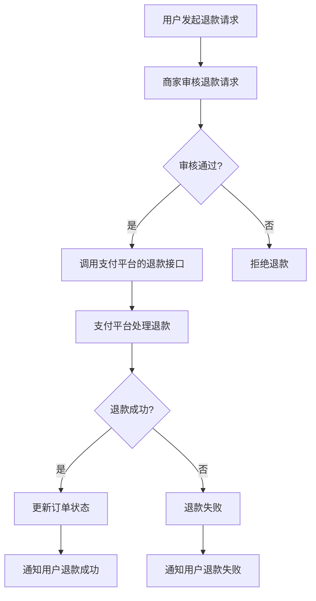

## 介绍

在小程序支付功能中，退款处理是一个重要的环节。当用户对购买的商品或服务不满意，或者订单出现问题时，退款功能可以帮助用户快速解决问题，提升用户体验。退款处理不仅仅是简单的资金返还，还涉及到订单状态的更新、退款记录的保存以及与支付平台的交互。

本文将逐步讲解小程序支付中的退款处理机制，并通过代码示例和实际案例帮助你更好地理解和实现这一功能。

## 退款处理的基本流程

退款处理通常包括以下几个步骤：

1. **用户发起退款请求**：用户在小程序中提交退款申请。
2. **商家审核退款请求**：商家根据用户的退款原因进行审核。
3. **调用支付平台的退款接口**：商家通过支付平台的API发起退款请求。
4. **支付平台处理退款**：支付平台验证退款请求并执行退款操作。
5. **更新订单状态**：退款成功后，更新订单状态并通知用户。

### 退款处理的流程图



## 代码示例

以下是一个简单的退款处理代码示例，假设你已经集成了微信支付的SDK。

```javascript
const wxpay = require('wxpay-sdk'); // 假设你已经安装了微信支付的SDK

async function processRefund(orderId, refundAmount) {
    try {
        // 1. 获取订单信息
        const order = await getOrderById(orderId);
        if (!order) {
            throw new Error('订单不存在');
        }

        // 2. 调用微信支付的退款接口
        const refundResult = await wxpay.refund({
            out_trade_no: order.outTradeNo, // 商户订单号
            out_refund_no: `REFUND_${Date.now()}`, // 退款单号
            total_fee: order.totalFee, // 订单总金额
            refund_fee: refundAmount, // 退款金额
        });

        // 3. 处理退款结果
        if (refundResult.return_code === 'SUCCESS' && refundResult.result_code === 'SUCCESS') {
            // 退款成功，更新订单状态
            await updateOrderStatus(orderId, 'REFUNDED');
            return { success: true, message: '退款成功' };
        } else {
            // 退款失败
            return { success: false, message: refundResult.err_code_des };
        }
    } catch (error) {
        console.error('退款处理失败:', error);
        return { success: false, message: '退款处理失败' };
    }
}
```

### 输入和输出

- **输入**：
  - `orderId`: 订单ID，用于标识需要退款的订单。
  - `refundAmount`: 退款金额，单位为分。

- **输出**：
  - 返回一个对象，包含 `success` 和 `message` 字段，表示退款是否成功以及相关信息。

## 实际案例

假设你运营一个电商小程序，用户购买了一件商品后，发现商品有质量问题，于是申请退款。以下是退款处理的步骤：

1. **用户发起退款请求**：用户在小程序的订单详情页点击“申请退款”按钮，填写退款原因并提交。
2. **商家审核退款请求**：商家后台收到退款申请后，审核用户的退款原因，确认无误后同意退款。
3. **调用支付平台的退款接口**：商家后台调用微信支付的退款接口，传入订单号和退款金额。
4. **支付平台处理退款**：微信支付验证退款请求后，将款项退回到用户的支付账户。
5. **更新订单状态**：退款成功后，商家后台更新订单状态为“已退款”，并通知用户退款成功。

## 总结

退款处理是小程序支付功能中不可或缺的一部分。通过本文的学习，你应该已经了解了退款处理的基本流程、代码实现以及实际应用场景。退款处理不仅仅是技术实现，还需要考虑到用户体验和业务流程的合理性。

## 附加资源与练习

- **练习**：尝试在你的小程序中实现一个简单的退款功能，模拟用户发起退款请求并处理退款。
- **资源**：
  - [微信支付官方文档](https://pay.weixin.qq.com/wiki/doc/apiv3/apis/chapter3_1_9.shtml)
  - [小程序开发文档](https://developers.weixin.qq.com/miniprogram/dev/framework/)

通过不断实践和学习，你将能够更好地掌握小程序支付中的退款处理功能。