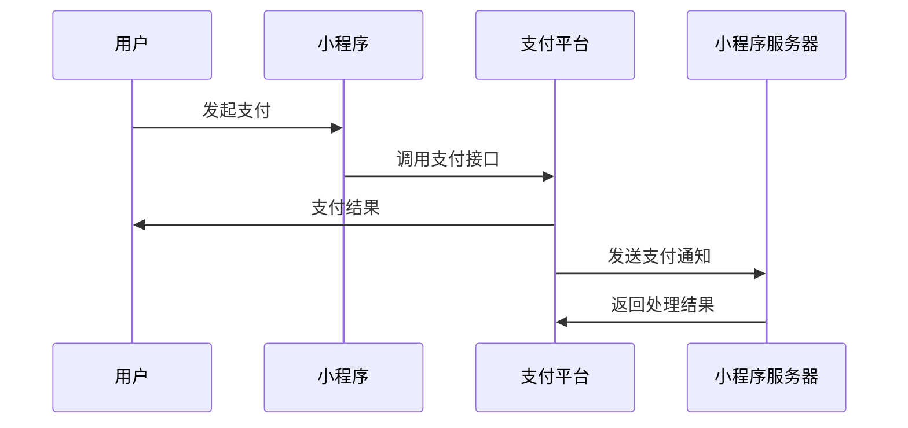

# 支付通知回调

在小程序支付功能中，支付通知回调是一个非常重要的环节。它允许小程序在用户完成支付后，接收来自支付平台的通知，以便及时更新订单状态或执行其他业务逻辑。本文将详细介绍支付通知回调的概念、实现方法以及实际应用场景。

## 什么是支付通知回调？

支付通知回调是指当用户完成支付后，支付平台会向小程序服务器发送一个通知，告知支付结果。这个通知通常以 HTTP POST 请求的形式发送，包含支付结果的相关信息，如订单号、支付金额、支付状态等。小程序服务器需要接收并处理这个通知，以确保订单状态的及时更新。

## 支付通知回调的工作流程

为了更好地理解支付通知回调的工作流程，我们可以通过以下步骤来描述：

1. **用户发起支付**：用户在小程序中选择商品并提交订单，小程序调用支付接口发起支付请求。
2. **支付平台处理支付**：支付平台处理用户的支付请求，并返回支付结果。
3. **支付平台发送通知**：支付平台向小程序服务器发送支付结果通知。
4. **小程序服务器处理通知**：小程序服务器接收并处理支付结果通知，更新订单状态。
5. **小程序服务器返回响应**：小程序服务器向支付平台返回处理结果，确认通知已接收。



## 实现支付通知回调

### 1. 配置回调地址

首先，你需要在支付平台的后台配置回调地址（也称为通知地址）。这个地址是小程序服务器的 URL，支付平台会将支付结果通知发送到这个地址。

### 2. 接收支付通知

当支付平台发送通知时，小程序服务器需要接收并解析这个通知。通常，通知是以 HTTP POST 请求的形式发送的，请求体中包含支付结果的相关信息。

以下是一个简单的示例，展示如何使用 Node.js 接收并处理支付通知：

```javascript
const express = require('express');
const bodyParser = require('body-parser');
const app = express();

app.use(bodyParser.json());

app.post('/payment/notify', (req, res) => {
    const paymentResult = req.body;

    // 处理支付结果
    if (paymentResult.status === 'SUCCESS') {
        // 更新订单状态为已支付
        updateOrderStatus(paymentResult.orderId, 'PAID');
    } else {
        // 处理支付失败的情况
        handlePaymentFailure(paymentResult.orderId);
    }

    // 返回成功响应
    res.status(200).send('SUCCESS');
});

function updateOrderStatus(orderId, status) {
    // 更新订单状态的逻辑
}

function handlePaymentFailure(orderId) {
    // 处理支付失败的逻辑
}

app.listen(3000, () => {
    console.log('Server is running on port 3000');
});
```

### 3. 验证通知的合法性

为了确保通知的安全性，支付平台通常会使用签名机制来验证通知的合法性。小程序服务器在接收到通知后，需要验证签名的正确性，以确保通知确实来自支付平台。

以下是一个简单的签名验证示例：

```javascript
const crypto = require('crypto');

function verifySignature(paymentResult, signKey) {
    const { orderId, amount, status, signature } = paymentResult;

    // 生成签名
    const expectedSignature = crypto
        .createHash('md5')
        .update(`${orderId}${amount}${status}${signKey}`)
        .digest('hex');

    // 验证签名
    return expectedSignature === signature;
}
```

### 4. 返回处理结果

在成功处理支付通知后，小程序服务器需要向支付平台返回一个响应，通常是 `SUCCESS` 或 `FAIL`。支付平台会根据这个响应决定是否需要重新发送通知。

## 实际应用场景

假设你正在开发一个电商小程序，用户可以在小程序中购买商品。当用户完成支付后，支付平台会向你的服务器发送支付结果通知。你需要根据通知更新订单状态，并通知用户支付结果。

以下是一个实际应用场景的示例：

1. **用户下单**：用户在小程序中选择商品并提交订单。
2. **发起支付**：小程序调用支付接口，用户完成支付。
3. **接收通知**：支付平台向你的服务器发送支付结果通知。
4. **更新订单状态**：你的服务器接收通知后，更新订单状态为“已支付”。
5. **通知用户**：你的服务器向用户发送支付成功的通知。

## 总结

支付通知回调是小程序支付功能中不可或缺的一部分。通过接收和处理支付结果通知，你可以及时更新订单状态，确保业务流程的顺利进行。本文介绍了支付通知回调的概念、实现方法以及实际应用场景，希望对你理解和实现支付通知回调有所帮助。

## 附加资源

- [微信支付开发文档](https://pay.weixin.qq.com/wiki/doc/apiv3/wxpay/pages/index.shtml)
- [支付宝开发文档](https://opendocs.alipay.com/apis)

## 练习

1. 尝试在你的小程序项目中实现支付通知回调功能。
2. 编写一个简单的签名验证函数，确保支付通知的安全性。
3. 模拟支付通知的发送和接收过程，测试你的回调处理逻辑。