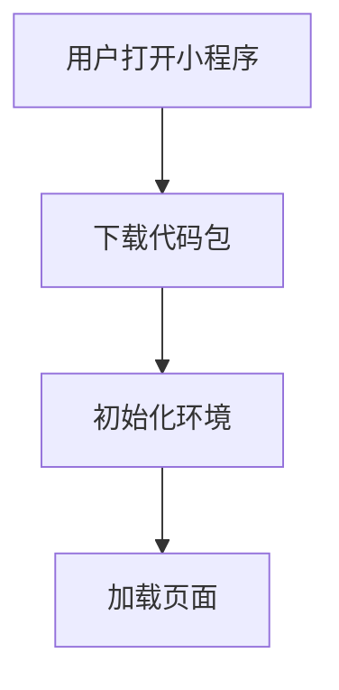

# 启动性能优化

## 介绍

小程序的启动性能是用户体验的关键因素之一。启动时间过长会导致用户流失，因此优化启动性能至关重要。启动性能优化主要关注的是减少小程序从启动到完全加载的时间，包括减少代码包大小、优化资源加载、减少不必要的初始化操作等。

## 启动流程概述

小程序的启动流程可以分为以下几个阶段：

1. **下载代码包**：用户打开小程序时，首先需要下载小程序的代码包。
2. **初始化环境**：下载完成后，小程序会初始化运行环境。
3. **加载页面**：初始化完成后，小程序会加载并渲染首页。



## 优化策略

### 1. 减少代码包大小

代码包大小直接影响下载时间。以下是一些减少代码包大小的策略：

- **代码分割**：将代码分割成多个模块，按需加载。
- **移除未使用的代码**：使用工具如 `Tree Shaking` 移除未使用的代码。
- **压缩资源**：压缩图片、字体等资源文件。

:::tip
使用 `webpack` 等构建工具可以自动进行代码分割和 Tree Shaking。
:::

### 2. 优化资源加载

资源加载是启动过程中的另一个瓶颈。以下是一些优化资源加载的策略：

- **延迟加载**：将非关键资源延迟加载，优先加载关键资源。
- **预加载**：预加载关键资源，减少用户等待时间。
- **使用 CDN**：使用内容分发网络（CDN）加速资源加载。

### 3. 减少初始化操作

初始化操作过多会延长启动时间。以下是一些减少初始化操作的策略：

- **懒加载**：将非必要的初始化操作延迟到页面加载完成后进行。
- **缓存数据**：缓存常用数据，减少重复初始化操作。

## 实际案例

### 案例 1：代码分割

假设我们有一个小程序，包含多个页面，每个页面的代码都打包在一个文件中。我们可以通过代码分割来优化启动性能。

```javascript
// 原始代码
import HomePage from './pages/HomePage';
import AboutPage from './pages/AboutPage';

// 优化后的代码
const HomePage = () => import('./pages/HomePage');
const AboutPage = () => import('./pages/AboutPage');
```

通过这种方式，只有在用户访问某个页面时，才会加载该页面的代码，从而减少初始代码包的大小。

### 案例 2：延迟加载非关键资源

假设我们有一个小程序，首页包含大量图片。我们可以将非关键图片延迟加载。

```javascript
// 原始代码


// 优化后的代码


<script>
document.addEventListener("DOMContentLoaded", function() {
    var lazyloadImages = document.querySelectorAll(".lazyload");
    lazyloadImages.forEach(function(img) {
        img.src = img.dataset.src;
    });
});
</script>
```

通过这种方式，只有在页面加载完成后，才会加载非关键图片，从而加快首页的加载速度。

## 总结

启动性能优化是提升小程序用户体验的关键。通过减少代码包大小、优化资源加载和减少初始化操作，可以显著提升小程序的启动速度。希望本文的内容能帮助你更好地理解和应用启动性能优化的策略。

## 附加资源

- [Webpack 官方文档](https://webpack.js.org/)
- [小程序性能优化指南](https://developers.weixin.qq.com/miniprogram/dev/framework/performance/)
- [Tree Shaking 详解](https://webpack.js.org/guides/tree-shaking/)

## 练习

1. 尝试在你的小程序中应用代码分割，观察启动时间的变化。
2. 使用延迟加载策略优化一个包含大量图片的页面，记录优化前后的加载时间。

:::note
如果你在练习中遇到问题，可以参考本文的案例或查阅附加资源。
:::