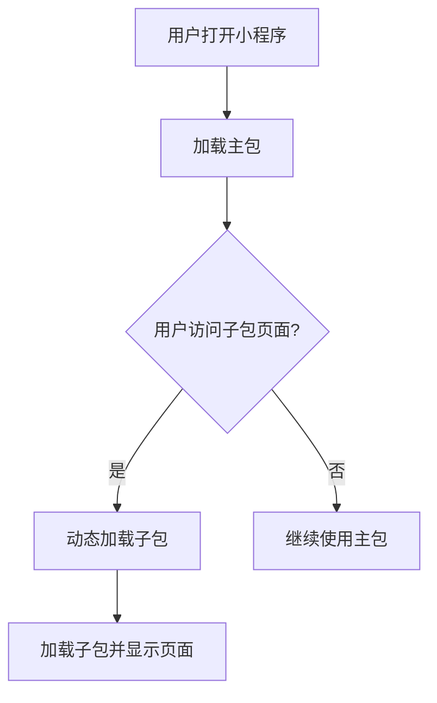

## 介绍

在小程序开发中，随着功能的增加，代码体积也会逐渐增大。如果所有代码都打包在一个主包中，会导致初始加载时间变长，影响用户体验。为了解决这个问题，小程序提供了**分包加载**的机制。通过将代码拆分为多个包，用户可以在需要时按需加载，从而减少初始加载时间。

## 什么是分包加载？

分包加载是指将小程序的代码按照功能模块拆分为多个子包，主包只包含核心功能，而其他功能模块则放在子包中。当用户访问某个功能时，小程序会动态加载对应的子包，而不是一次性加载所有代码。

### 分包加载的优势

1. **减少初始加载时间**：主包体积变小，用户打开小程序时加载速度更快。
2. **按需加载**：用户只有在使用某个功能时才会加载对应的子包，节省流量。
3. **提升用户体验**：减少卡顿和等待时间，提升用户满意度。

## 如何配置分包加载？

在小程序的 `app.json` 文件中，可以通过 `subPackages` 或 `subpackages` 字段来配置分包。以下是一个简单的配置示例：

```json
{
  "pages": [
    "pages/index/index",
    "pages/logs/logs"
  ],
  "subPackages": [
    {
      "root": "packageA",
      "pages": [
        "pages/cat/cat",
        "pages/dog/dog"
      ]
    },
    {
      "root": "packageB",
      "pages": [
        "pages/apple/apple",
        "pages/banana/banana"
      ]
    }
  ]
}
```

在这个配置中，`packageA` 和 `packageB` 是两个子包，分别包含不同的页面。主包只包含 `index` 和 `logs` 页面。

:::note
- `root`：子包的根目录。
- `pages`：子包中的页面路径，相对于子包根目录。
:::

## 分包加载的工作原理

当用户打开小程序时，主包会首先加载并运行。当用户访问某个子包中的页面时，小程序会动态下载并加载该子包。这个过程对用户是透明的，开发者只需要配置好分包即可。



## 实际案例

假设我们正在开发一个电商小程序，主包包含首页和购物车页面，而商品详情页和订单页面放在子包中。通过分包加载，用户在浏览首页时不会加载商品详情页的代码，只有在点击某个商品时才会加载对应的子包。

### 配置示例

```json
{
  "pages": [
    "pages/home/home",
    "pages/cart/cart"
  ],
  "subPackages": [
    {
      "root": "product",
      "pages": [
        "pages/detail/detail"
      ]
    },
    {
      "root": "order",
      "pages": [
        "pages/list/list",
        "pages/detail/detail"
      ]
    }
  ]
}
```

### 使用场景

- **首页**：用户打开小程序时，只加载主包中的首页和购物车页面。
- **商品详情页**：当用户点击某个商品时，动态加载 `product` 子包。
- **订单页面**：当用户查看订单时，动态加载 `order` 子包。

:::tip
在实际开发中，可以根据功能模块的使用频率来决定哪些页面放在主包，哪些页面放在子包。高频使用的页面可以放在主包中，而低频使用的页面可以放在子包中。
:::

## 分包加载的注意事项

1. **主包大小限制**：主包的大小不能超过 2MB，子包的大小不能超过 2MB，所有子包的总大小不能超过 8MB。
2. **页面跳转**：子包中的页面只能通过 `wx.navigateTo` 或 `wx.switchTab` 进行跳转，不能直接通过 URL 访问。
3. **资源引用**：子包中的资源（如图片、样式等）只能在该子包中使用，不能跨包引用。

:::caution
如果主包体积过大，可能会导致小程序无法正常加载。因此，合理规划分包非常重要。
:::

## 总结

分包加载是小程序性能优化的重要手段之一。通过将代码拆分为多个子包，可以有效减少初始加载时间，提升用户体验。在实际开发中，开发者需要根据功能模块的使用频率和代码体积来合理规划分包。

## 附加资源与练习

- **练习**：尝试在你的小程序项目中配置分包加载，并将一些低频使用的页面移动到子包中。
- **进一步学习**：阅读微信小程序官方文档中关于[分包加载](https://developers.weixin.qq.com/miniprogram/dev/framework/subpackages.html)的更多内容。

通过合理使用分包加载，你可以显著提升小程序的性能，为用户提供更流畅的使用体验。