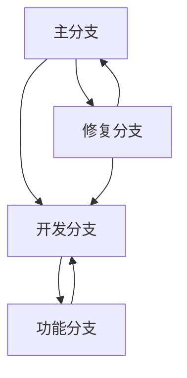

## 介绍

在小程序开发中，版本管理是一个至关重要的环节。它帮助开发者跟踪代码的变化、协作开发、回滚错误以及发布新功能。通过合理的版本管理策略，团队可以更高效地管理代码库，确保项目的稳定性和可维护性。

本文将介绍几种常见的版本管理策略，并通过实际案例展示如何在小程序开发中应用这些策略。

## 什么是版本管理？

版本管理（Version Control）是一种记录文件内容变化，以便将来查阅特定版本修订情况的系统。它允许多个开发者同时工作在一个项目上，而不会互相干扰。常见的版本管理工具包括 Git、SVN 等。

在小程序开发中，版本管理不仅用于代码，还用于管理配置文件、资源文件等。

## 常见的版本管理策略

### 1. 分支策略

分支策略是版本管理中最常用的策略之一。通过创建不同的分支，开发者可以在不影响主分支的情况下进行新功能的开发或修复错误。

#### 主分支（Main/Master Branch）
主分支是项目的稳定版本，通常用于发布生产环境。所有的新功能和修复最终都会合并到主分支。

#### 开发分支（Develop Branch）
开发分支是用于日常开发的分支。开发者从主分支创建开发分支，并在开发分支上进行新功能的开发。

#### 功能分支（Feature Branch）
功能分支是从开发分支创建的，用于开发单个功能。功能开发完成后，合并回开发分支。

#### 修复分支（Hotfix Branch）
修复分支是从主分支创建的，用于紧急修复生产环境中的问题。修复完成后，合并回主分支和开发分支。



### 2. 标签策略

标签（Tag）是用于标记特定版本的工具。通常用于标记发布版本，例如 `v1.0.0`、`v1.1.0` 等。通过标签，开发者可以快速定位到某个特定的版本。

```bash
# 创建标签
git tag v1.0.0

# 推送标签到远程仓库
git push origin v1.0.0
```

### 3. 语义化版本控制

语义化版本控制（Semantic Versioning）是一种版本号命名规范，格式为 `主版本号.次版本号.修订号`（例如 `1.2.3`）。

- **主版本号（Major）**：当你做了不兼容的 API 修改。
- **次版本号（Minor）**：当你做了向下兼容的功能性新增。
- **修订号（Patch）**：当你做了向下兼容的问题修正。

:::tip
使用语义化版本控制可以帮助开发者更好地理解版本之间的变化。
:::

## 实际案例

假设我们正在开发一个小程序，以下是我们的版本管理策略：

1. **主分支**：`main` 分支用于发布生产环境。
2. **开发分支**：`develop` 分支用于日常开发。
3. **功能分支**：每个新功能从 `develop` 分支创建，例如 `feature/login`。
4. **修复分支**：紧急修复从 `main` 分支创建，例如 `hotfix/bug-fix`。

```bash
# 创建功能分支
git checkout -b feature/login develop

# 开发完成后合并回开发分支
git checkout develop
git merge --no-ff feature/login

# 创建修复分支
git checkout -b hotfix/bug-fix main

# 修复完成后合并回主分支和开发分支
git checkout main
git merge --no-ff hotfix/bug-fix
git checkout develop
git merge --no-ff hotfix/bug-fix
```

## 总结

版本管理是小程序开发中不可或缺的一部分。通过合理的分支策略、标签策略和语义化版本控制，开发者可以更高效地管理代码库，确保项目的稳定性和可维护性。

## 附加资源

- [Git 官方文档](https://git-scm.com/doc)
- [语义化版本控制](https://semver.org/lang/zh-CN/)
- [Git 分支策略指南](https://nvie.com/posts/a-successful-git-branching-model/)

## 练习

1. 在你的小程序项目中创建一个新的功能分支，并尝试合并到开发分支。
2. 使用语义化版本控制为你的项目打一个标签。
3. 模拟一个紧急修复场景，创建一个修复分支并合并到主分支和开发分支。
