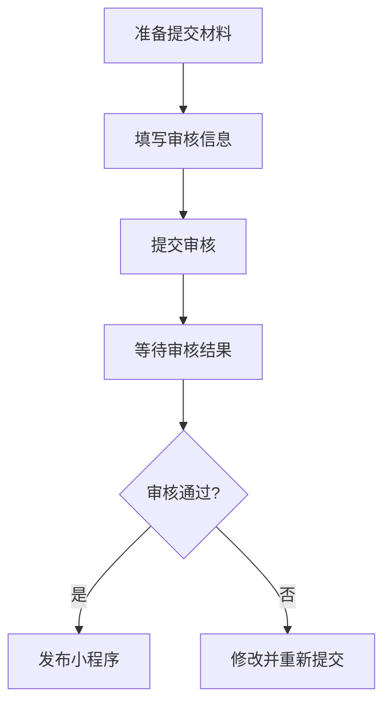

## 介绍

在小程序开发完成后，开发者需要将小程序提交至平台进行审核。审核通过后，小程序才能正式发布并供用户使用。提交审核流程是小程序发布与运维中至关重要的一环，它确保了小程序符合平台规范，并且能够为用户提供安全、稳定的服务。

本文将详细介绍小程序提交审核的流程，帮助初学者理解并掌握这一过程。

## 提交审核流程概述

小程序的提交审核流程通常包括以下几个步骤：

1. **准备提交材料**：包括小程序的代码包、版本信息、功能介绍等。
2. **填写审核信息**：在开发者工具或平台后台填写小程序的审核信息。
3. **提交审核**：将小程序提交至平台进行审核。
4. **等待审核结果**：平台会对小程序进行审核，审核时间通常为1-7个工作日。
5. **审核通过或驳回**：审核通过后，小程序可以发布；如果被驳回，开发者需要根据反馈进行修改并重新提交。

## 详细步骤

### 1. 准备提交材料

在提交审核之前，开发者需要准备好以下材料：

- **代码包**：确保小程序的代码已经打包并准备好上传。
- **版本信息**：包括小程序的版本号、更新日志等。
- **功能介绍**：简要描述小程序的功能和特点。

:::tip
在准备代码包时，确保代码已经经过充分的测试，避免因代码问题导致审核失败。
:::

### 2. 填写审核信息

在开发者工具或平台后台，开发者需要填写小程序的审核信息。这些信息通常包括：

- **小程序名称**：确保名称符合平台规范。
- **小程序简介**：简要描述小程序的功能和用途。
- **类目选择**：选择适合小程序的类目。
- **版本号**：填写当前提交的版本号。
- **更新日志**：描述本次更新的内容。

### 3. 提交审核

填写完审核信息后，开发者可以点击“提交审核”按钮，将小程序提交至平台进行审核。提交后，开发者可以在后台查看审核状态。

### 4. 等待审核结果

平台会对小程序进行审核，审核时间通常为1-7个工作日。审核内容包括但不限于：

- **功能完整性**：确保小程序的功能完整且符合描述。
- **安全性**：检查小程序是否存在安全隐患。
- **合规性**：确保小程序符合平台的政策和规范。

:::caution
在等待审核结果期间，开发者应保持联系方式畅通，以便平台在需要时能够及时联系。
:::

### 5. 审核通过或驳回

审核通过后，开发者可以发布小程序。如果审核被驳回，平台会提供详细的反馈信息，开发者需要根据反馈进行修改并重新提交。

:::note
如果审核被驳回，开发者应仔细阅读反馈信息，确保修改后的版本符合平台要求。
:::

## 实际案例

假设你开发了一个名为“每日健康打卡”的小程序，主要用于记录用户的每日健康数据。在提交审核时，你需要：

1. **准备提交材料**：打包代码，填写版本号为1.0.0，更新日志为“首次发布”。
2. **填写审核信息**：填写小程序名称为“每日健康打卡”，简介为“记录每日健康数据”，选择“健康”类目。
3. **提交审核**：点击“提交审核”按钮，等待审核结果。
4. **审核通过**：审核通过后，发布小程序。

如果审核被驳回，例如因为“健康”类目选择不当，你需要修改类目为“工具”并重新提交。

## 总结

小程序的提交审核流程是确保小程序能够顺利发布的重要步骤。通过本文的介绍，你应该已经掌握了如何准备提交材料、填写审核信息、提交审核以及处理审核结果。希望这些内容能够帮助你在小程序开发的道路上更加顺利。

## 附加资源

- [小程序开发文档](https://developers.weixin.qq.com/miniprogram/dev/framework/)
- [小程序审核规范](https://developers.weixin.qq.com/miniprogram/product/reject.html)

## 练习

1. 尝试为你的小程序准备提交材料，并填写审核信息。
2. 模拟提交审核流程，记录每个步骤的注意事项。
3. 如果审核被驳回，尝试根据反馈信息进行修改并重新提交。

通过以上练习，你将更加熟悉小程序的提交审核流程，并能够在实际开发中应用这些知识。