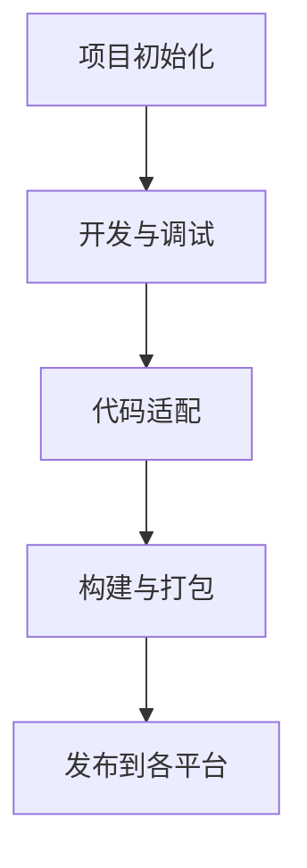

# 多端发布流程

在现代小程序开发中，**多端发布流程**是一个至关重要的环节。它允许开发者将同一套代码发布到多个平台，如微信小程序、支付宝小程序、百度小程序等。这不仅节省了开发时间，还确保了用户体验的一致性。本文将详细介绍多端发布流程的步骤、注意事项以及实际应用场景。

## 什么是多端发布流程？

多端发布流程是指将同一套代码适配并发布到多个小程序平台的过程。由于不同平台的小程序框架和 API 存在差异，开发者需要通过一些工具或框架来实现代码的跨平台兼容性。常见的多端开发框架包括 [Taro](https://taro.zone/) 和 [uni-app](https://uniapp.dcloud.io/)。

:::note
多端发布的核心目标是“一次开发，多端运行”，但实际开发中可能需要对不同平台进行一些适配工作。
:::

## 多端发布流程的步骤

以下是多端发布流程的主要步骤：

### 1. 项目初始化
首先，使用多端开发框架（如 Taro 或 uni-app）初始化项目。以 Taro 为例：

```bash
npx @tarojs/cli init myApp
cd myApp
```

### 2. 开发与调试
在开发过程中，可以使用框架提供的多端调试工具进行实时预览和调试。例如，Taro 提供了以下命令：

```bash
# 微信小程序
npm run dev:weapp

# 支付宝小程序
npm run dev:alipay

# 百度小程序
npm run dev:swan
```

### 3. 代码适配
由于不同平台的 API 和组件可能存在差异，开发者需要根据目标平台进行代码适配。例如，微信小程序的 `wx.request` 和支付宝小程序的 `my.request` 需要分别处理。

```javascript
// 微信小程序
wx.request({
  url: 'https://example.com/api',
  success(res) {
    console.log(res.data);
  }
});

// 支付宝小程序
my.request({
  url: 'https://example.com/api',
  success(res) {
    console.log(res.data);
  }
});
```

### 4. 构建与打包
完成开发后，使用框架提供的命令进行多端构建。以 Taro 为例：

```bash
# 微信小程序
npm run build:weapp

# 支付宝小程序
npm run build:alipay

# 百度小程序
npm run build:swan
```

### 5. 发布到各平台
将构建生成的代码分别上传到对应的小程序开发者平台，完成发布流程。每个平台的发布流程可能略有不同，但通常包括以下步骤：

1. 登录开发者平台。
2. 上传代码包。
3. 填写版本信息。
4. 提交审核。
5. 发布上线。

:::tip
在发布前，务必仔细阅读各平台的发布规范，确保符合要求。
:::

## 实际案例

假设你正在开发一个电商小程序，需要在微信、支付宝和百度三个平台上发布。以下是具体的发布流程：

1. **项目初始化**：使用 Taro 初始化项目。
2. **开发与调试**：在本地开发环境中完成页面和功能的开发。
3. **代码适配**：根据各平台的 API 差异进行适配。
4. **构建与打包**：分别生成微信、支付宝和百度小程序的代码包。
5. **发布**：将代码包上传到各平台的开发者后台，完成发布。



## 总结

多端发布流程是小程序开发中的重要环节，它帮助开发者高效地将同一套代码发布到多个平台。通过使用多端开发框架（如 Taro 或 uni-app），开发者可以显著减少重复工作，提升开发效率。然而，在实际开发中，仍需注意各平台的差异，并进行必要的适配。

## 附加资源与练习

- **练习**：尝试使用 Taro 或 uni-app 初始化一个多端项目，并发布到至少两个平台。
- **资源**：
  - [Taro 官方文档](https://taro.zone/)
  - [uni-app 官方文档](https://uniapp.dcloud.io/)
  - [微信小程序开发文档](https://developers.weixin.qq.com/miniprogram/dev/framework/)
  - [支付宝小程序开发文档](https://opendocs.alipay.com/mini/developer)

通过以上内容，你应该对多端发布流程有了全面的了解。接下来，动手实践吧！