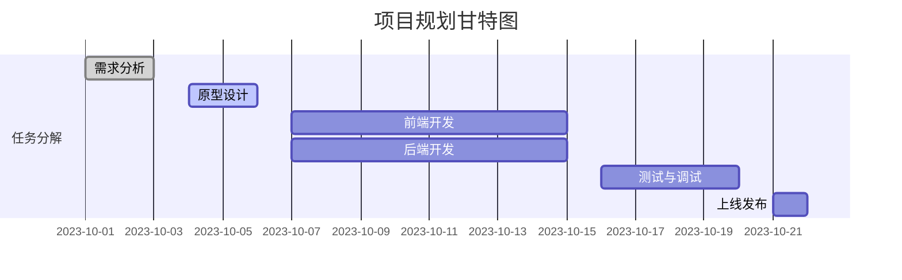

# 项目开发流程

在小程序开发中，项目开发流程是确保项目顺利进行并按时交付的关键。无论是个人项目还是团队协作，遵循一个清晰的开发流程都能帮助你更好地管理时间、资源和任务。本文将详细介绍小程序项目开发的完整流程，帮助你从零开始构建一个成功的小程序。

## 1. 需求分析

在开始开发之前，首先要明确项目的需求。需求分析是项目开发的第一步，也是最重要的一步。你需要与客户或团队成员沟通，明确以下几点：

- **目标用户**：谁是你的目标用户？他们的需求是什么？
- **功能需求**：小程序需要实现哪些功能？哪些是核心功能，哪些是附加功能？
- **技术需求**：需要用到哪些技术栈？是否有特殊的技术要求？

:::tip
在需求分析阶段，建议使用思维导图或流程图来梳理需求，确保每个功能点都被清晰地记录下来。
:::

## 2. 项目规划

在明确需求后，接下来是项目规划。项目规划包括以下几个步骤：

- **任务分解**：将项目分解为多个小任务，并为每个任务分配优先级。
- **时间安排**：为每个任务设定时间节点，确保项目按时完成。
- **资源分配**：确定团队成员的分工，明确每个人的职责。



## 3. 原型设计

在项目规划完成后，接下来是原型设计。原型设计是将需求转化为可视化的界面设计。你可以使用工具如 **Figma** 或 **Sketch** 来设计小程序的界面。

- **低保真原型**：快速绘制出界面的基本布局，明确每个页面的功能和交互。
- **高保真原型**：在低保真原型的基础上，添加细节和视觉效果，确保界面设计符合用户体验。

:::caution
在原型设计阶段，务必与客户或团队成员进行多次沟通，确保设计符合需求。
:::

## 4. 前端开发

前端开发是小程序开发的核心部分。你需要使用微信小程序提供的开发框架（如 WXML、WXSS、JavaScript）来实现界面和交互。

```javascript
// 示例：小程序页面逻辑
Page({
  data: {
    message: 'Hello, World!'
  },
  onLoad() {
    console.log('页面加载完成');
  }
});
```

- **WXML**：用于构建页面结构。
- **WXSS**：用于定义页面样式。
- **JavaScript**：用于处理页面逻辑和交互。

:::note
在前端开发过程中，建议使用版本控制工具（如 Git）来管理代码，确保代码的可维护性。
:::

## 5. 后端开发

如果小程序需要与服务器进行数据交互，那么后端开发也是必不可少的。你可以使用 Node.js、Python、Java 等语言来开发后端服务。

```javascript
// 示例：Node.js 后端 API
const express = require('express');
const app = express();

app.get('/api/data', (req, res) => {
  res.json({ message: 'Hello from the backend!' });
});

app.listen(3000, () => {
  console.log('Server is running on port 3000');
});
```

- **API 设计**：设计合理的 API 接口，确保前后端数据交互顺畅。
- **数据库设计**：根据需求设计数据库表结构，确保数据存储和查询的高效性。

## 6. 测试与调试

在开发完成后，测试与调试是确保小程序质量的关键步骤。你需要进行以下几类测试：

- **功能测试**：确保每个功能都能正常工作。
- **性能测试**：测试小程序的加载速度和响应时间。
- **兼容性测试**：确保小程序在不同设备和微信版本上都能正常运行。

:::warning
在测试过程中，务必记录并修复所有发现的 bug，确保小程序上线前的稳定性。
:::

## 7. 上线发布

在测试通过后，就可以将小程序提交到微信平台进行审核和发布了。你需要准备以下材料：

- **小程序简介**：简要描述小程序的功能和特点。
- **截图和图标**：提供小程序的截图和图标，确保符合微信平台的要求。
- **版本说明**：描述当前版本的新功能和修复的 bug。

:::tip
在上线发布前，建议进行一次全面的回归测试，确保所有功能都能正常工作。
:::

## 8. 维护与更新

小程序上线后，并不意味着开发工作的结束。你需要持续关注用户反馈，修复 bug，并根据用户需求进行功能更新。

- **用户反馈**：收集用户反馈，了解用户的需求和问题。
- **版本更新**：定期发布新版本，修复 bug 并添加新功能。

## 总结

小程序项目开发流程涵盖了从需求分析到上线发布的各个阶段。每个阶段都有其独特的任务和挑战，但通过合理的规划和执行，你可以顺利完成项目开发。希望本文能帮助你更好地理解小程序开发的流程，并为你的项目开发提供指导。

## 附加资源与练习

- **练习**：尝试从零开始开发一个简单的小程序，如待办事项列表，体验完整的开发流程。
- **资源**：参考微信小程序官方文档，了解更多开发细节和最佳实践。