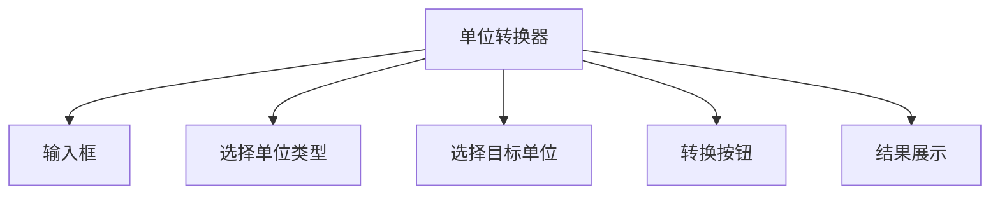

## 介绍

工具类小程序是一种专注于解决特定问题或提供特定功能的小程序。它们通常具有简洁的界面和明确的功能目标，例如计算器、单位转换器、待办事项列表等。这类小程序非常适合初学者学习，因为它们功能明确，开发难度较低，同时能够帮助开发者掌握小程序开发的核心概念。

在本教程中，我们将通过一个简单的“单位转换器”小程序项目，逐步讲解工具类小程序的开发流程。你将学习如何从需求分析开始，设计界面，编写逻辑代码，并最终完成一个可运行的小程序。

## 需求分析

在开发工具类小程序之前，首先需要明确小程序的功能需求。以“单位转换器”为例，我们需要支持以下功能：

1. **单位转换**：支持长度、重量、温度等常见单位的转换。
2. **用户输入**：用户可以输入需要转换的数值。
3. **结果展示**：转换后的结果应清晰展示给用户。

:::tip
需求分析是开发过程中非常重要的一步，它帮助你明确小程序的功能范围，避免在开发过程中迷失方向。
:::

## 界面设计

工具类小程序的界面设计应简洁明了，避免不必要的复杂元素。以下是一个简单的界面布局示例：



在这个布局中，用户可以通过输入框输入数值，选择单位类型和目标单位，点击转换按钮后，结果将显示在结果展示区域。

## 代码实现

接下来，我们将逐步实现“单位转换器”小程序的核心功能。

### 1. 创建页面结构

首先，我们需要在小程序中创建一个页面，用于展示单位转换器的界面。以下是一个简单的页面结构示例：

```html
<view class="container">
  <view class="input-group">
    <input type="number" placeholder="请输入数值" bindinput="onInput" />
  </view>
  <view class="picker-group">
    <picker mode="selector" range="{{unitTypes}}" bindchange="onUnitTypeChange">
      <view class="picker">选择单位类型</view>
    </picker>
    <picker mode="selector" range="{{targetUnits}}" bindchange="onTargetUnitChange">
      <view class="picker">选择目标单位</view>
    </picker>
  </view>
  <button bindtap="onConvert">转换</button>
  <view class="result">
    <text>转换结果: {{result}}</text>
  </view>
</view>
```

### 2. 编写逻辑代码

接下来，我们需要编写逻辑代码来处理用户的输入和单位转换。以下是一个简单的逻辑实现：

```javascript
Page({
  data: {
    inputValue: 0,
    unitTypes: ['长度', '重量', '温度'],
    targetUnits: [],
    selectedUnitType: '',
    selectedTargetUnit: '',
    result: ''
  },

  onInput(e) {
    this.setData({
      inputValue: e.detail.value
    });
  },

  onUnitTypeChange(e) {
    const unitType = this.data.unitTypes[e.detail.value];
    let targetUnits = [];
    if (unitType === '长度') {
      targetUnits = ['米', '千米', '英尺'];
    } else if (unitType === '重量') {
      targetUnits = ['千克', '克', '磅'];
    } else if (unitType === '温度') {
      targetUnits = ['摄氏度', '华氏度', '开尔文'];
    }
    this.setData({
      selectedUnitType: unitType,
      targetUnits: targetUnits
    });
  },

  onTargetUnitChange(e) {
    this.setData({
      selectedTargetUnit: this.data.targetUnits[e.detail.value]
    });
  },

  onConvert() {
    const { inputValue, selectedUnitType, selectedTargetUnit } = this.data;
    let result = 0;
    if (selectedUnitType === '长度') {
      if (selectedTargetUnit === '米') {
        result = inputValue;
      } else if (selectedTargetUnit === '千米') {
        result = inputValue / 1000;
      } else if (selectedTargetUnit === '英尺') {
        result = inputValue * 3.28084;
      }
    } else if (selectedUnitType === '重量') {
      if (selectedTargetUnit === '千克') {
        result = inputValue;
      } else if (selectedTargetUnit === '克') {
        result = inputValue * 1000;
      } else if (selectedTargetUnit === '磅') {
        result = inputValue * 2.20462;
      }
    } else if (selectedUnitType === '温度') {
      if (selectedTargetUnit === '摄氏度') {
        result = inputValue;
      } else if (selectedTargetUnit === '华氏度') {
        result = (inputValue * 9 / 5) + 32;
      } else if (selectedTargetUnit === '开尔文') {
        result = inputValue + 273.15;
      }
    }
    this.setData({
      result: result
    });
  }
});
```

### 3. 样式设计

最后，我们可以为页面添加一些简单的样式，使其更加美观：

```css
.container {
  display: flex;
  flex-direction: column;
  align-items: center;
  padding: 20px;
}

.input-group, .picker-group {
  margin-bottom: 20px;
}

.picker {
  padding: 10px;
  border: 1px solid #ccc;
  border-radius: 5px;
}

button {
  margin-bottom: 20px;
}

.result {
  font-size: 18px;
  font-weight: bold;
}
```

## 实际案例

假设用户输入了 `100`，选择了单位类型为“长度”，目标单位为“英尺”，点击转换按钮后，结果将显示为 `328.084` 英尺。

## 总结

通过本教程，你学习了如何开发一个简单的工具类小程序。我们从需求分析开始，设计了界面，编写了逻辑代码，并最终完成了一个可运行的单位转换器小程序。工具类小程序的开发流程相对简单，适合初学者快速上手。

## 附加资源与练习

- **练习**：尝试扩展单位转换器的功能，支持更多单位类型和转换功能。
- **资源**：参考微信小程序官方文档，了解更多关于小程序开发的细节和高级功能。

:::caution
在开发过程中，务必注意代码的可维护性和扩展性，避免硬编码和重复代码。
:::