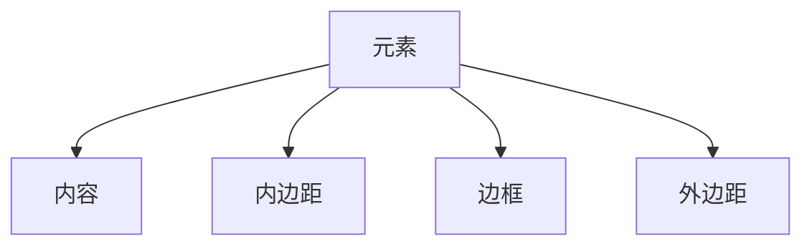

# WXSS布局方式

在小程序开发中，WXSS（WeiXin Style Sheets）是用于定义页面样式的语言。布局是页面设计中的核心部分，决定了元素在页面中的排列方式。WXSS支持多种布局方式，包括传统的盒模型布局、Flexbox布局以及Grid布局。本文将详细介绍这些布局方式，并通过实际案例帮助你掌握它们的使用。

## 1. 盒模型布局

盒模型是WXSS中最基础的布局方式。每个元素都被视为一个矩形盒子，包含内容（content）、内边距（padding）、边框（border）和外边距（margin）。

### 1.1 盒模型结构



### 1.2 示例代码

```css
.box {
    width: 200px;
    height: 100px;
    padding: 10px;
    border: 2px solid #000;
    margin: 20px;
}
```

:::note
**注意**：盒模型的总宽度 = 内容宽度 + 左右内边距 + 左右边框 + 左右外边距。
:::

## 2. Flexbox布局

Flexbox是一种一维布局模型，适合在单行或单列中排列元素。它提供了更灵活的布局方式，能够轻松实现对齐、分布和排序等功能。

### 2.1 Flexbox基本概念

- **容器（Container）**：应用 `display: flex;` 的元素。
- **项目（Item）**：容器内的子元素。

### 2.2 示例代码

```css
.container {
    display: flex;
    justify-content: space-between;
    align-items: center;
}

.item {
    flex: 1;
    margin: 10px;
}
```

:::tip
**提示**：`justify-content` 用于水平对齐，`align-items` 用于垂直对齐。
:::

### 2.3 实际案例

假设你需要在小程序中创建一个导航栏，可以使用Flexbox布局：

```css
.navbar {
    display: flex;
    justify-content: space-around;
    align-items: center;
    height: 50px;
    background-color: #f0f0f0;
}

.nav-item {
    flex: 1;
    text-align: center;
}
```

## 3. Grid布局

Grid布局是一种二维布局模型，适合在行和列中排列元素。它提供了更强大的布局能力，能够轻松实现复杂的网格结构。

### 3.1 Grid基本概念

- **容器（Container）**：应用 `display: grid;` 的元素。
- **项目（Item）**：容器内的子元素。
- **网格线（Grid Line）**：网格的行和列之间的线。
- **网格轨道（Grid Track）**：网格的行或列。
- **网格单元格（Grid Cell）**：网格的行和列交叉形成的区域。

### 3.2 示例代码

```css
.container {
    display: grid;
    grid-template-columns: repeat(3, 1fr);
    grid-gap: 10px;
}

.item {
    background-color: #ccc;
    padding: 20px;
    text-align: center;
}
```

:::caution
**注意**：`grid-template-columns` 定义了列的宽度，`grid-gap` 定义了行和列之间的间距。
:::

### 3.3 实际案例

假设你需要在小程序中创建一个图片画廊，可以使用Grid布局：

```css
.gallery {
    display: grid;
    grid-template-columns: repeat(3, 1fr);
    grid-gap: 10px;
}

.gallery-item {
    width: 100%;
    height: 100px;
    background-color: #f0f0f0;
}
```

## 4. 总结

WXSS提供了多种布局方式，包括盒模型、Flexbox和Grid布局。每种布局方式都有其独特的优势和适用场景。盒模型适合简单的布局，Flexbox适合一维布局，而Grid适合复杂的二维布局。通过掌握这些布局方式，你可以更灵活地设计小程序界面。

## 5. 附加资源

- [WXSS官方文档](https://developers.weixin.qq.com/miniprogram/dev/framework/view/wxss.html)
- [Flexbox布局指南](https://css-tricks.com/snippets/css/a-guide-to-flexbox/)
- [Grid布局指南](https://css-tricks.com/snippets/css/complete-guide-grid/)

## 6. 练习

1. 使用Flexbox布局创建一个简单的导航栏。
2. 使用Grid布局创建一个图片画廊。
3. 尝试结合Flexbox和Grid布局，设计一个复杂的页面布局。

通过练习，你将更好地掌握WXSS中的布局方式，并能够灵活运用它们来构建响应式的小程序界面。