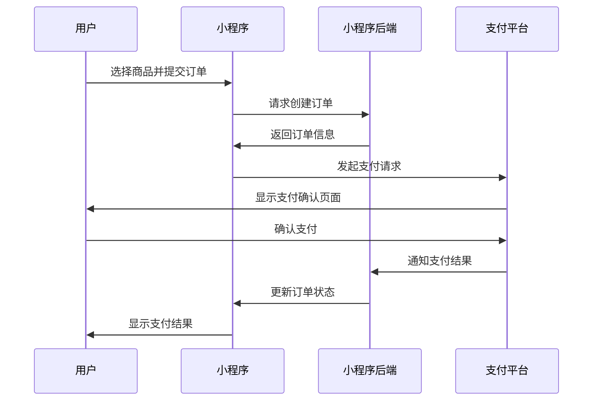

# 支付API

在现代小程序开发中，支付功能是不可或缺的一部分。无论是电商、服务预约还是内容付费，支付API都能帮助开发者轻松实现安全、便捷的支付流程。本文将详细介绍小程序支付API的使用方法，并通过实际案例帮助你快速上手。

## 什么是支付API？

支付API是小程序提供的一组接口，允许开发者在小程序中集成支付功能。通过调用这些API，用户可以在小程序内完成支付操作，而无需跳转到外部页面。支付API支持多种支付方式，包括微信支付、支付宝等。

## 支付API的基本流程

支付API的使用通常包括以下几个步骤：

1. **创建订单**：在小程序后端生成订单信息，包括订单号、金额、商品描述等。
2. **调用支付API**：将订单信息传递给支付API，获取支付参数。
3. **发起支付**：使用支付参数发起支付请求，用户确认支付。
4. **支付结果回调**：支付完成后，支付平台会通知小程序后端支付结果。

以下是一个简单的流程图，展示了支付API的基本流程：



## 支付API的使用步骤

### 1. 创建订单

在小程序后端，你需要生成一个订单，并返回订单信息给小程序前端。订单信息通常包括订单号、金额、商品描述等。

```javascript
// 小程序后端代码示例
const createOrder = (userId, productId, amount) => {
    const orderId = generateOrderId(); // 生成订单号
    const orderInfo = {
        orderId,
        userId,
        productId,
        amount,
        description: `购买商品：${productId}`,
        timestamp: Date.now()
    };
    return orderInfo;
};
```

### 2. 调用支付API

在小程序前端，你需要调用支付API，传递订单信息并获取支付参数。

```javascript
// 小程序前端代码示例
wx.requestPayment({
    timeStamp: orderInfo.timestamp,
    nonceStr: generateNonceStr(), // 生成随机字符串
    package: `prepay_id=${prepayId}`, // 预支付ID
    signType: 'MD5', // 签名类型
    paySign: generatePaySign(orderInfo), // 生成支付签名
    success(res) {
        console.log('支付成功', res);
    },
    fail(err) {
        console.error('支付失败', err);
    }
});
```

### 3. 支付结果回调

支付完成后，支付平台会通知小程序后端支付结果。你需要在后端处理支付结果，并更新订单状态。

```javascript
// 小程序后端代码示例
app.post('/payment/callback', (req, res) => {
    const { orderId, status } = req.body;
    updateOrderStatus(orderId, status); // 更新订单状态
    res.send('SUCCESS');
});
```

## 实际案例：电商小程序支付功能

假设你正在开发一个电商小程序，用户可以选择商品并完成支付。以下是一个简单的实现步骤：

1. **用户选择商品并提交订单**：用户在小程序中选择商品，点击“立即购买”按钮。
2. **小程序后端生成订单**：小程序后端生成订单信息，并返回给前端。
3. **前端调用支付API**：前端调用支付API，传递订单信息并获取支付参数。
4. **用户确认支付**：用户在小程序中确认支付，支付平台处理支付请求。
5. **支付结果回调**：支付平台通知小程序后端支付结果，后端更新订单状态。
6. **前端显示支付结果**：前端根据支付结果显示成功或失败页面。

```javascript
// 小程序前端代码示例
Page({
    data: {
        product: {},
        orderInfo: null
    },
    onLoad(options) {
        const productId = options.productId;
        this.setData({
            product: getProductById(productId)
        });
    },
    buyProduct() {
        const product = this.data.product;
        wx.request({
            url: 'https://your-backend.com/createOrder',
            method: 'POST',
            data: {
                userId: getUserId(),
                productId: product.id,
                amount: product.price
            },
            success(res) {
                const orderInfo = res.data;
                wx.requestPayment({
                    timeStamp: orderInfo.timestamp,
                    nonceStr: generateNonceStr(),
                    package: `prepay_id=${orderInfo.prepayId}`,
                    signType: 'MD5',
                    paySign: generatePaySign(orderInfo),
                    success(res) {
                        wx.showToast({
                            title: '支付成功',
                            icon: 'success'
                        });
                    },
                    fail(err) {
                        wx.showToast({
                            title: '支付失败',
                            icon: 'none'
                        });
                    }
                });
            }
        });
    }
});
```

## 总结

支付API是小程序开发中非常重要的一部分，它帮助开发者轻松实现安全、便捷的支付功能。通过本文的学习，你应该已经掌握了支付API的基本使用方法，并能够在实际项目中应用这些知识。

:::tip
在实际开发中，支付API的使用可能会涉及更多的细节，例如支付安全、订单状态管理等。建议你在开发过程中参考官方文档，并确保支付流程的安全性。
:::

## 附加资源与练习

- **官方文档**：阅读小程序支付API的[官方文档](https://developers.weixin.qq.com/miniprogram/dev/api/payment/wx.requestPayment.html)，了解更多细节。
- **练习**：尝试在自己的小程序项目中集成支付功能，并测试支付流程的完整性和安全性。

希望本文对你有所帮助，祝你在小程序开发的道路上越走越远！