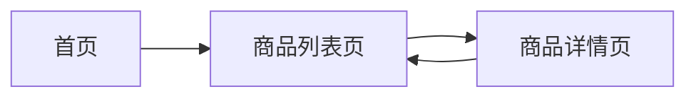

# 页面栈管理

在小程序开发中，页面栈管理是一个非常重要的概念。它决定了用户在小程序中如何从一个页面跳转到另一个页面，以及如何返回到之前的页面。理解页面栈管理对于构建流畅的用户体验至关重要。

## 什么是页面栈？

页面栈（Page Stack）是小程序中用于管理页面跳转和返回的机制。每当用户打开一个新页面时，这个页面就会被压入页面栈中；当用户返回上一个页面时，当前页面就会从页面栈中弹出。页面栈遵循“后进先出”（LIFO）的原则，即最后打开的页面会最先被关闭。

### 页面栈的基本操作

在小程序中，页面栈的基本操作包括：

1. **压入页面**：当用户通过 `wx.navigateTo` 或 `wx.redirectTo` 等 API 打开一个新页面时，该页面会被压入页面栈。
2. **弹出页面**：当用户通过 `wx.navigateBack` 返回上一个页面时，当前页面会从页面栈中弹出。
3. **替换页面**：当使用 `wx.redirectTo` 时，当前页面会被替换为新页面，页面栈的深度保持不变。

### 页面栈的深度

页面栈的深度是指当前页面栈中页面的数量。小程序对页面栈的深度有一定的限制，通常最多只能有 10 层页面。如果页面栈的深度超过这个限制，可能会导致页面无法正常跳转。

## 页面栈管理的 API

小程序提供了一些 API 来管理页面栈，以下是常用的几个：

- `wx.navigateTo`：打开一个新页面，并将该页面压入页面栈。
- `wx.redirectTo`：关闭当前页面，并打开一个新页面，页面栈深度不变。
- `wx.navigateBack`：返回上一个页面，当前页面从页面栈中弹出。
- `wx.reLaunch`：关闭所有页面，并打开一个新页面。

### 代码示例

以下是一个简单的代码示例，展示了如何使用这些 API 进行页面栈管理：

```javascript
// 打开一个新页面
wx.navigateTo({
  url: '/pages/pageA/pageA'
});

// 替换当前页面
wx.redirectTo({
  url: '/pages/pageB/pageB'
});

// 返回上一个页面
wx.navigateBack({
  delta: 1 // 返回的页面数
});

// 关闭所有页面并打开一个新页面
wx.reLaunch({
  url: '/pages/pageC/pageC'
});
```

## 页面栈的实际应用场景

### 场景 1：多级页面跳转

假设你正在开发一个电商小程序，用户从首页进入商品列表页，再从商品列表页进入商品详情页。这时，页面栈的深度为 3。如果用户从商品详情页返回到商品列表页，页面栈的深度会减少到 2。



### 场景 2：页面替换

在某些情况下，你可能希望用户无法返回到之前的页面。例如，在用户登录成功后，你可能希望替换当前页面为首页，而不是让用户返回到登录页面。

```javascript
wx.redirectTo({
  url: '/pages/index/index'
});
```

## 总结

页面栈管理是小程序开发中不可或缺的一部分。通过合理使用页面栈管理 API，你可以控制用户的页面跳转和返回行为，从而提供更好的用户体验。记住，页面栈的深度是有限的，因此在设计页面跳转逻辑时，要避免页面栈过深。

## 附加资源与练习

- **练习 1**：尝试在小程序中实现一个多级页面跳转的场景，并观察页面栈的变化。
- **练习 2**：使用 `wx.redirectTo` 和 `wx.reLaunch` 实现一个登录成功后跳转到首页的功能。

:::tip
在实际开发中，合理使用页面栈管理 API 可以避免页面栈过深的问题，同时也能提升用户体验。
:::